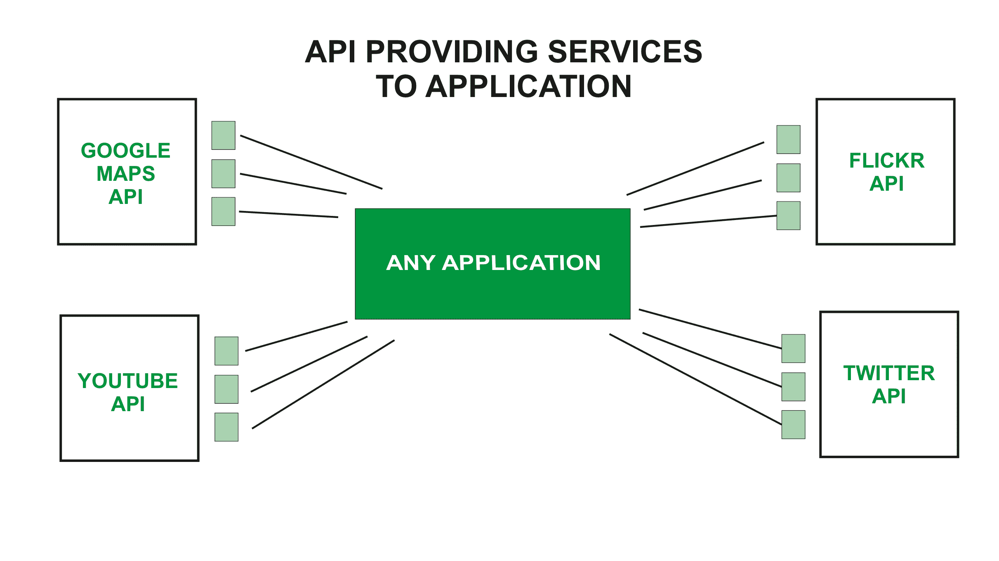

# 什么是 Web API，我们为什么要使用它？

> 原文:[https://www . geesforgeks . org/什么是 web-API-以及我们为什么要使用它/](https://www.geeksforgeeks.org/what-is-web-api-and-why-we-use-it/)

应用编程接口代表应用编程接口。API 实际上是某种具有一组功能的接口。这些函数集将允许程序员获取应用程序的某些特定特性或数据。

网络应用编程接口顾名思义就是一个应用编程接口，它可以使用 HTTP 协议通过网络访问。它是一个帮助您创建和开发基于 HTTP 的 RESTFUL 服务的框架。web API 可以通过使用不同的技术来开发，如 java、ASP.NET 等。网络应用编程接口用于网络服务器或网络浏览器。基本上，网络应用编程接口是一个网络开发概念。它仅限于网络应用程序的客户端，也不包括网络服务器或网络浏览器的详细信息。如果要在分布式系统上使用一个应用程序，并在不同的设备(如笔记本电脑、手机等)上提供服务，则使用网络应用编程接口服务。网络应用编程接口是网络应用程序的增强形式。

**ASP.NET Web API:**ASP.NET 代表主动服务器 Pages.NET。它主要用于创建网页和网络技术。它被认为是开发人员使用 C#和 Visual Basic 等语言构建动态网页的非常重要的工具。ASP.NET 网络应用编程接口是一个帮助您构建服务的框架，它使您可以轻松地访问各种客户端，包括浏览器、手机、平板电脑等。在 ASP.NET 的帮助下，您可以使用相同的框架和模式来创建网页和服务。

**在哪里使用 Web API？**

1.  Web APIs 在使用实现 RESTFUL web 服务时非常有用。NET 框架。
2.  网络应用编程接口有助于使 HTTP 服务的开发延伸到客户端实体，如浏览器、设备或平板电脑。
3.  ASP.NET 网络应用编程接口可以与 MVC 一起用于任何类型的应用程序。
4.  一个网络应用编程接口可以帮助你通过 AJAX 开发 ASP.NET 应用程序。
5.  因此，网络应用编程接口使开发人员更容易构建一个兼容任何浏览器和几乎任何设备的 ASP.NET 应用程序。

**为什么选择 Web API？**

*   与其他服务相比，网络应用编程接口服务更适合与不支持 SOAP 但需要网络服务的本地应用程序一起使用。
*   对于创建面向资源的服务，web API 服务是最好的选择。通过使用 HTTP 或 restful 服务，建立了这些服务。
*   如果您想要良好的性能和快速的服务开发，web API 服务非常有帮助。
*   对于开发轻量级和可维护的 web 服务，web API 服务确实有助于开发该服务。它支持任何文本模式，如 JSON、XML 等。
*   带宽紧张或带宽有限的设备，网络应用编程接口服务是这些设备的最佳选择。

**如何使用 Web API？**网络应用编程接口从不同类型的客户端设备(如移动设备、笔记本电脑等)接收请求，然后将这些请求发送到网络服务器以处理这些请求，并将所需的输出返回给客户端。网络应用编程接口是一种系统对系统的交互，在这种交互中，一个系统的数据或信息可以被另一个系统访问，在执行完成后，结果数据或者我们可以说是输出被显示给查看者。

API 向其程序员提供数据，这些数据可供外部用户使用。当程序员决定向公众公开他们的一些数据时，他们“公开端点”，这意味着他们发布了他们用来构建程序的语言的一部分。然后，其他程序员可以通过构建 URL 或使用 HTTP 客户端从这些端点请求数据来从应用程序中提取数据。

**服务器端:**服务器端 web API 是一个编程接口。它由一个或多个公开的端点组成。它定义了一个请求-响应消息系统。Mashup 是一个 web 应用程序，它是一个服务器端 API，结合了几个服务器端 API。Webhook 是一个服务器端 API，它将输入作为统一的资源标识符。

**客户端:**客户端 web APIs 以标准化的 JavaScript 绑定为目标。谷歌创建了他们的原生客户端架构，旨在用安全的原生沙盒扩展和应用程序替换原生插件。

**使用 Web API 的步骤:**

*   大多数应用编程接口都需要一个应用编程接口密钥。一旦你找到一个你想玩的应用编程接口，在文档中查找访问需求。大多数应用编程接口会要求您完成身份验证，比如使用您的谷歌帐户登录。当访问应用编程接口时，您将获得一个唯一的字母和数字字符串。
*   开始使用应用编程接口最简单的方法是在网上找到一个 HTTP 客户端，比如 REST-Client、Postman 或 Paw。这些现成的工具帮助您构建您的请求，以便使用您收到的应用编程接口密钥来访问现有的应用编程接口。您仍然需要了解文档中的一些语法，但是只需要很少的编码知识。
*   从应用编程接口获取数据的下一个最佳方法是从现有的应用编程接口文档中构建一个网址。

**热门 API 示例:**

1.  **谷歌地图 API 的:**谷歌地图 API 允许开发人员使用 JavaScript 或 Flash 界面在网页上使用谷歌地图。
2.  **YouTube 的 API:**谷歌的 API 让开发者可以将 YouTube 和功能集成到网站或应用程序中。YouTube APIs 包括 YouTube 分析 API、YouTube 数据 API、YouTube 直播流 API、YouTube 播放器 API 等。
3.  **Flickr API:**开发者用来访问 Flick 照片分享社区数据。
4.  **Twitter API:**Twitter 提供了两个 API，REST API 允许开发者访问核心的 Twitter 数据，搜索 API 为开发者提供了与 Twitter 搜索和趋势数据交互的方法。

