# 什么是 Web Forms 2.0？

> 原文:[https://www.geeksforgeeks.org/what-is-web-forms-2-0/](https://www.geeksforgeeks.org/what-is-web-forms-2-0/)

HTML 表单是网页的特殊部分，包含某些控件，包括标签、文本字段、密码字段、隐藏字段(由软件使用)、单选按钮、复选框、字段集、图例和提交按钮。在与这些表单交互的过程中，用户为服务器处理提供了所有必要的信息。目前，客户端脚本用于效果和简单的验证(通常使用 Javascript)，但 HTML5 将在不久的将来大大减少这种需求。

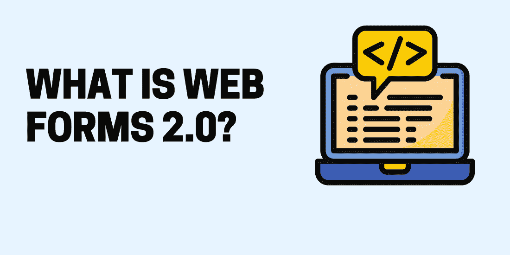

什么是网络表单 2.0

许多浏览器都支持 HTML5 表单元素，尽管其中一些在兼容性和显示功能上有所不同。本文探讨了 HTML5 网站表单的主要组件，以及那些旨在使 HTML 更加用户友好的新特性。

**HTML5 输入元素(文本):**

**电子邮件:**它将只接受电子邮件值。需要包含电子邮件地址的输入字段应该使用这种类型。当你试图提交一个简单的文本时，它只要求一个 email@example.com 格式的电子邮件地址。

**示例:**

## 超文本标记语言

```html
<form>
   <label for="myemail">Enter Email Address:</label>
   <input type="email" id="myemail" required>
</form>
```

**输出:**

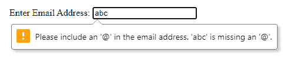

**数字:**此字段仅接受数值。step 属性指定精度，默认为 1。

**示例:**

## 超文本标记语言

```html
<form>
   <label for="mynumber">Enter a Number:</label>
   <input type="number" min="1" max="10" step="0.5" id="mynumber">
</form>
```

**输出:**

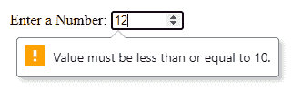

**时间:**时间(小时、分钟、秒、小数秒)根据 ISO 8601 编码。

**示例:**

## 超文本标记语言

```html
<form>
   <label for="mytime">Select Time:</label>
   <input type="time" id="mytime">
</form>
```

**输出:**

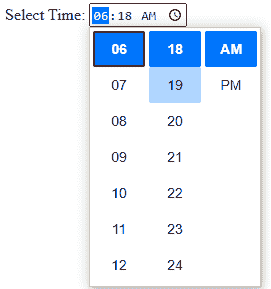

**周:**由一个工作日和一年组成的日期根据 ISO 8061 编码。

**示例:**

## 超文本标记语言

```html
<form>
   <label for="myweek">Select Week:</label>
   <input type="week" id="myweek">
</form>
```

**输出:**

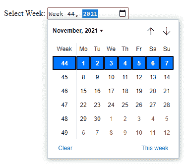

**月:**根据 ISO 8061 的说法，由一年和一个月组成的日期被编码。

**示例:**

## 超文本标记语言

```html
<form>
   <label for="mymonth">Select Month:</label>
   <input type="month" id="mymonth">
</form>
```

**输出:**

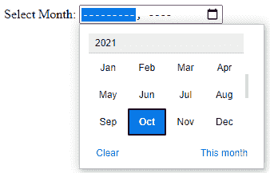

**日期:**使用 ISO 8601 标准对日期(年、月、日)进行编码。

**示例:**

## 超文本标记语言

```html
<form>
   <label for="mydate">Select Date:</label>
   <input type="date" value="2019-04-15" id="mydate">
</form>
```

**输出:**

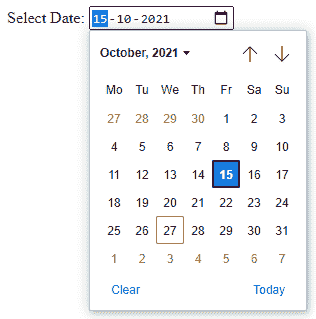

**日期时间-本地:**以 ISO 8601 编码的日期和时间(年、月、日、小时、分钟、秒、分之一秒)，没有时区信息。

**示例:**

## 超文本标记语言

```html
<form>
   <label for="mydatetime">Choose Date and Time:</label>
   <input type="datetime-local" id="mydatetime">
</form>
```

**输出:**

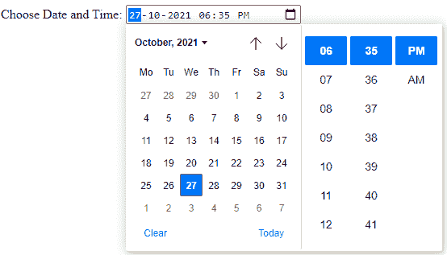

**周:**下拉日历让用户从周输入类型中选择一周和一年。

**示例:**

## 超文本标记语言

```html
<form>
   <label for="myweek">Select Week:</label>
   <input type="week" id="myweek">
</form>
```

**输出:**

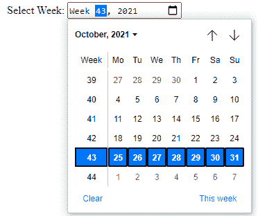

**范围:**对于输入字段，范围类型用于表示值的范围。

**示例:**

## 超文本标记语言

```html
<form>
   <label for="mynumber">Select a Number:</label>
   <input type="range" min="1" max="10" step="0.5" id="mynumber">    
</form>
```

**输出:**

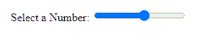

**URL:** 它只能接受 URL 值。在此类字段中，应输入网址。提交简单文本条目的用户必须指定网址，要么是 http://www.example.com，要么是 http://example.com

**示例:**

## 超文本标记语言

```html
<form>
   <label for="myurl">Enter Website URL:</label>
   <input type="url" id="myurl" required>
</form>
```

**输出:**

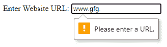

**将** [**<输出>**](https://www.geeksforgeeks.org/html-output-tag/) **元素:**

*   HTML5 引入了一个名为

    <output>的新元素来表示不同类型脚本的输出，就像脚本编写的那样。</output>

*   属性的输出元素用于指定该元素与文档中影响计算的其他元素之间的关系。
*   用空格分隔的其他元素的标识列表是该属性的值。

**示例:**

## 超文本标记语言

```html
<!DOCTYPE html>
<html lang="en">

<head>
    <title>Example of HTML output Tag</title>
</head>

<body>
    <form oninput=
"result.value=parseInt(a.value)+parseInt(b.value)">
        <input type="range" id="a" value="50"> +
        <input type="number" id="b" value="100"> =
        <output name="result" for="a b"></output>
    </form>
</body>

</html>
```

**输出:**

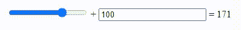

**Web Form2.0 属性:**

**1。占位符属性**

*   HTML5 引入了一个名为占位符的新属性。
*   通过<input>和<textarea>元素上的占位符属性，用户能够知道他们可以在字段中输入什么。</textarea>
*   占位符文本不能包含换行符或回车。

**示例:**

## 超文本标记语言

```html
<input type="text" name="search" 
    placeholder="search the internet"/>
```

**2。自动对焦属性**

*   这是一个简单的单步模式，一旦文档加载，就可以很容易地用 JavaScript 编程。当表单加载时，它会自动聚焦在文档中的特定字段上。

**示例:**

## 超文本标记语言

```html
<input type=“text” name=“search” autofocus/>
```

**3。必需属性:**

*   所需的属性用于代替 Javascript 验证。
*   由于这个属性，Javascript 现在只需要用于不能提交空文本框的客户端验证。

**示例:**

## 超文本标记语言

```html
<input type=“text” name=“search” required>
```