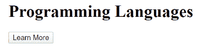

# 什么是 x-tmpl？

> 原文:[https://www.geeksforgeeks.org/what-is-x-tmpl/](https://www.geeksforgeeks.org/what-is-x-tmpl/)

**x-tmpl** 阻止浏览器解释脚本 JavaScript。为了使用 JQuery x-tmpl，我们需要 jquery-tmpl JavaScript 文件。jQuery.tmpl()方法将。附录。前置到，。在或之后插入。在方法之前插入。

**语法:**

```html
tmpl([data], [options])
```

**例如:**

```html
$("#myTemplate").tmpl(Data).appendTo("ul");
```

```html
$.tmpl(template, [data], [options])(string containing markup, 
HTML Element, or Name of named template)
```

**例如:**

```html
$.tmpl("namedTemplate", Data).appendTo("ul");
```

**示例:**

```html
$.tmpl( "<li>${Name}</li>", { "Name" : "GFG" }).appendTo( "#target" );

```

JQuery x-tmpl 用于模板合成。

**x-tmpl<u>(</u>客户端 <u>)</u> :** 用法

*   用 npm 安装 blueimp-tmpl 包:

```html
npm install blueimp-tmpl
```

*   在 HTML 标记中包含 JavaScript 模板脚本:

```html
<script src="js/tmpl.min.js"></script>
// Implementing them into the variables. 
var template = '<p>Hello!</p>' ;
```

*   添加类型为“text/x-tmpl”的脚本部分:

```html
<script type="text/x-tmpl" id="tmpl-demo">
  <h3>GFG}</h3>
  <h4>Features</h4>
 <ul>
 
     <li></li>
 
 </ul>
</script>

```

*   创建一个用于模板数据的 JavaScript 对象:

```html
var data = {
 title:  'GFG',
 geeky: {
   name: 'GFG',

 },
 features: ['more content', 'powerful', 'zero dependencies']
}

```

*   调用 tmpl()方法:

```html
document.getElementById('result').innerHTML = tmpl('tmpl-demo', data)
```

**x-tmpl<u>(</u>服务器端 <u>)</u> :** 用法

*   使用 NPM 安装 blueimp-tmpl 软件包:

```html
npm install blueimp-tmpl
```

*   添加文件模板. html:

```html
<!DOCTYPE HTML>
<title>GFG</title>
<h4>Features</h4>
<ul>

   <li></li>

</ul>

```

*   添加文件服务器. js:

```html
require('http')
 .createServer(function (req, res) {
   var fs = require('fs'),
    tmpl = require('./tmpl'),
   data = {
       title: 'JavaScript Templates',
       url: 'https://github.com/blueimp/JavaScript-Templates',
       features: ['more content', 'powerful', 'zero dependencies']
     }

   tmpl.load = function (id) {
     var filename = id + '.html'
     console.log('Loading ' + filename)
     return fs.readFileSync(filename, 'utf8')
   }
   res.writeHead(200, { 'Content-Type': 'text/x-tmpl' })

   res.end(tmpl('template', data))
 })
 .listen(8080, 'localhost')
console.log('Server running at http://localhost:8080/')

```

*   运行应用程序:

```html
node server.js
```

**示例:**x-tmpl 的一个简单示例。

```html
<script type='text/x-jquery-tmpl' id='person-template'>
 <div class='person'>
   <strong>Name: </strong> ${ Name } <br/>
   <strong>Age: </strong> ${ Age } <br/>
   <strong>Country: </strong> ${ Country } <br/>
 </div>
</script>

```

现在，让我们用所需的输出来实现上面的代码:

## 超文本标记语言

```html
<!DOCTYPE html>
<html>
    <head>
        <title>Page Title</title>
    </head>
    <body>
        <script src=
"http://ajax.microsoft.com/ajax/jquery.templates/beta1/jquery.tmpl.min.js">
        </script>

        <body>
            <h3>Employee Details</h3>
            <div class="emp-detais"></div>
        </body>

        <script type="text/x-jquery-tmpl" 
                id="emp-template">
            <div class='person'>
              <strong>Name:</strong> ${ Name } <br />
              <strong>Skills: </strong><br />
              {{each Skills}}
                ${Skill} <br />
              {{/each}}
            </div>
        </script>
    </body>
</html>
```

**例 2:**

## 超文本标记语言

```html
<!DOCTYPE html PUBLIC "-//W3C//DTD XHTML 1.0 
  Transitional//EN" "http://www.w3.org/TR
  /xhtml1/DTD/xhtml1-transitional.dtd">
<html xmlns="http://www.w3.org/1999/xhtml">
    <head>
        <title>Template Caching</title>
        <link href="6_Site.css" 
              rel="stylesheet" 
              type="text/css" />
    </head>
    <body>
        <h1>Products</h1>

        <div id="productContainer"></div>

        <button id="more">More</button>

        <script type="text/javascript" src=
"http://ajax.aspnetcdn.com/ajax/jQuery/jquery-1.4.4.js">
        </script>
        <script type="text/javascript" src=
"http://ajax.aspnetcdn.com/ajax/jquery.templates/beta1/jquery.tmpl.js">
        </script>

        <script type="text/javascript">
            // Globals
            var pageIndex = 0;

            // Create an array of products
            var products = [];
            for (var i = 0; i < 100; i++) {
                products.push({ name: "Product " + (i + 1) });
            }

            // Get the remote template
            $.get("ProductTemplate.htm", null, function (productTemplate) {
                // Compile and cache the template
                $.template("productTemplate", productTemplate);

                // Render the products
                renderProducts(0);
            });

            $("#more").click(function () {
                pageIndex++;
                renderProducts();
            });

            function renderProducts() {
                // Get page of products
                var pageOfProducts = 
                    products.slice(pageIndex * 5, pageIndex * 5 + 5);

                // Used cached productTemplate to render products
                $.tmpl("productTemplate", pageOfProducts)
                  .appendTo("#productContainer");
            }

            function formatPrice(price) {
                return "{content}quot; + price.toFixed(2);
            }
        </script>
    </body>
</html>
```

**输出:**

