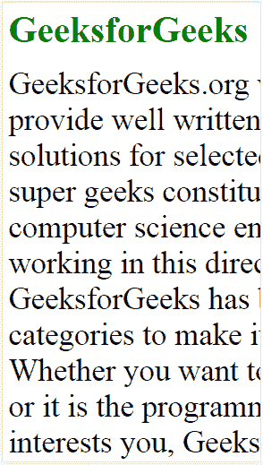
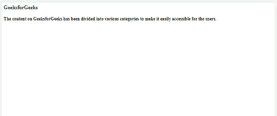
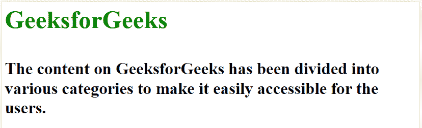
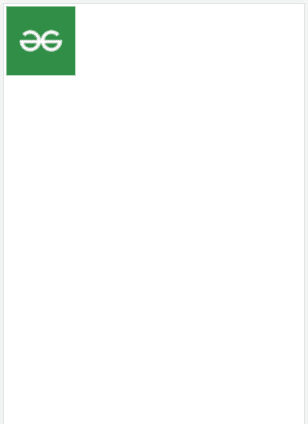
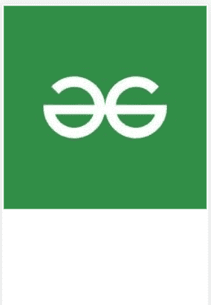
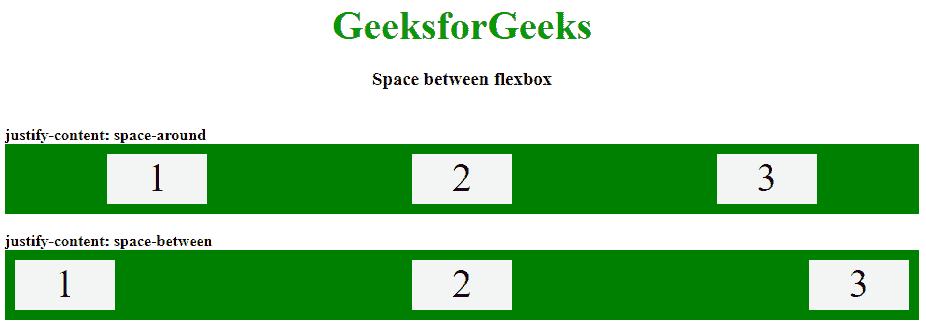

# 关于响应式网站需要了解什么？

> 原文:[https://www . geeksforgeeks . org/了解哪些响应网站/](https://www.geeksforgeeks.org/what-to-understand-about-responsive-websites/)

能够根据查看设备或屏幕动态改变外观的网站称为**响应网站**。它使用断点的概念来确定网站在不同屏幕上的外观。断点是根据设备浏览器的宽度指定的，这意味着所有屏幕上的体验都根据它们的宽度而不同，使其在所有设备上看起来都很好，使用相同的 HTML。

不同设备的常见浏览器尺寸如下:

*   **手机:** 360 x 640
*   **iPhone X:** 375 x 812
*   像素 2:411×731
*   **平板电脑:** 768 x 1024
*   **笔记本电脑:** 1366 x 768
*   **HDdesktop:** 1920 x 1080

响应式网站还解决了为不同设备设计不同网站的问题，因为内容可以相应调整，这与普通网站不同。

**geeks forgeeks 网站是一个响应性网站的很好的例子:**

*   **电话查看**


网站的电话视图

*   **平板视图**


网站的平板电脑视图

正如您在两张图片中看到的，所有内容都根据设备宽度和文本进行了调整，图像大小随着宽度的增加而增加，随着宽度的减小而减小。

**如何让网站反应灵敏？**

以下是创建响应性网站的方法:

**1。第一步是在代码的头标签中包含以下元标签。**

```
<meta name="viewport" content="width=device-width, initial-scale=1.0">
```

这将设置视口，根据设备的屏幕宽度调整内容，并将在浏览器中以初始缩放级别加载页面。

**示例:**带元标签和不带元标签的视图。



没有元标签


带有元标签

**2。使文本大小具有响应性:**响应性文本大小是根据浏览器大小而变化的大小，即宽度增加时放大，宽度减小时缩小。可以使用视口宽度属性(即 [**【大众】**](https://www.geeksforgeeks.org/css-units/) 单元)对文本进行响应。

```
<h3 style="font-size:6vw; color:green">
    GeeksforGeeks
<h3><br>

<h4 style="font-size:4vw">
    The content on GeeksforGeeks has been 
    divided into various to make it easily 
    accessible for the users.
</h3>
```

**示例:**响应和非响应文本大小:



无响应文本大小



响应文本大小

响应文本大小随着浏览器宽度的增加而增加，如第二张图片所示。

**3。使图像响应:**可以根据浏览器宽度改变尺寸的图像是响应图像。通过应用宽度的 CSS 属性并将其设置为 100%，可以使图像具有响应性，从而可以相应地放大或缩小。

```

```

**示例:**响应和非响应图像:



无响应图像



响应图像

与第二幅图像一样，响应图像根据设备宽度改变其比例。

**4。媒体查询可用于使网站具有响应性:**媒体查询是 CSS3 的一部分，除了使文本大小和图像具有响应性之外，它还提供了广泛的属性，使用这些属性可以使网站更具吸引力。

我们可以为不同的屏幕尺寸设置不同的属性。例如，当在手机上查看网站时，它会显示一朵玫瑰，当在平板电脑上查看时，它会显示一朵百合的图像。或者根据浏览器宽度改变背景颜色。

```
@media(max-width: 500px) {
    body {
        background-color:pink;
    }
}
@media(min-width: 501px) {
    body {
        background-color:black;
   }
}
```

**示例:**


宽度小于或等于 500 像素的器件


宽度超过 500 像素的设备

宽度小于或等于 500px 的设备浏览器具有粉色背景，宽度大于 500px 的设备具有黑色背景。这都是通过简单的媒体查询完成的，我们可以给网站添加更多这样的爆点。

**5。用于响应性网站的 Flexbox:**[Flexbox](https://www.geeksforgeeks.org/introduction-to-css-flexbox/)也是一个非常强大的 CSS 模块，有助于使网站具有响应性。它具有非常独特和有效的特性，甚至可以非常容易地执行复杂的任务。它也可以用于收缩或扩展容器中的元素，即使元素的大小未知。

**语法:**

```
.flex {
    justify-content: space-between;
}
```

**示例:**下图描绘了网站上不同属性的各种效果。还有更多这样的属性使网站看起来很好，并使访问者的体验令人愉快。

