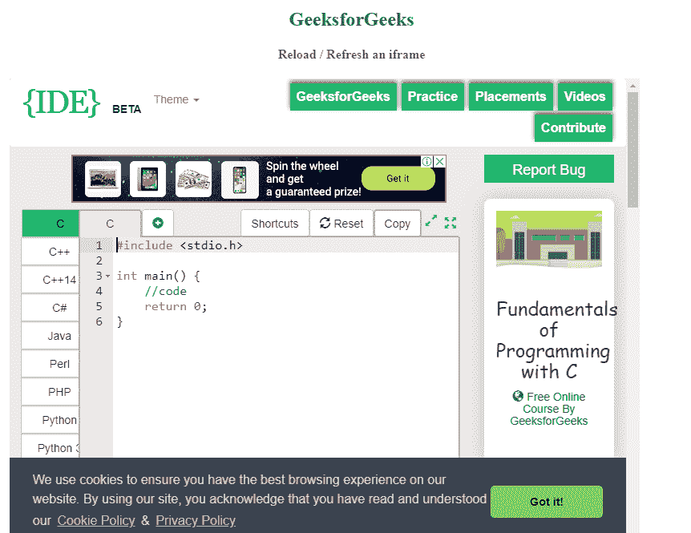
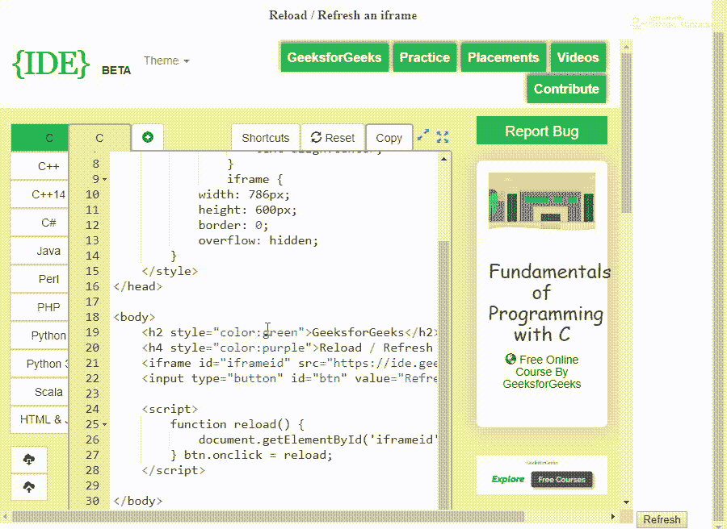
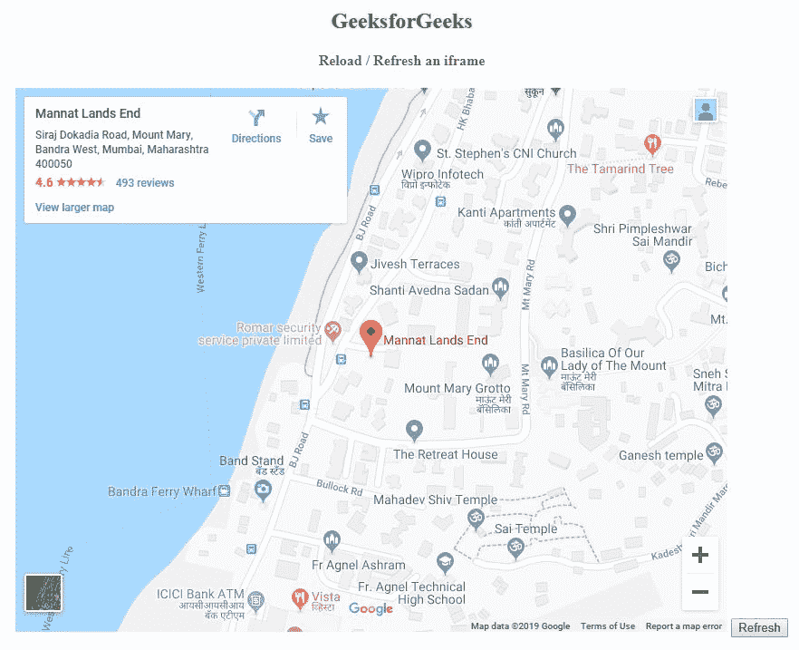
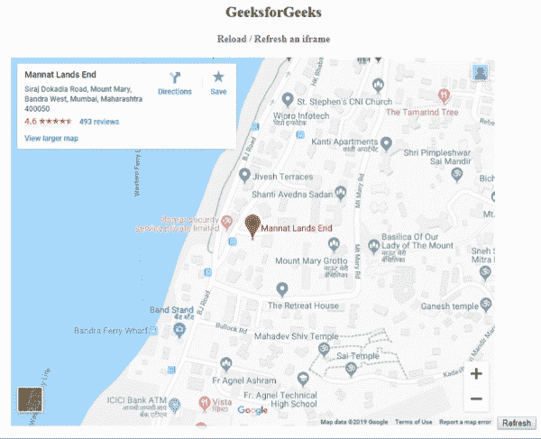

# 重新加载/刷新 iframe 的最佳方式是什么？

> 原文:[https://www . geesforgeks . org/什么是最好的重新加载刷新 iframe/](https://www.geeksforgeeks.org/whats-the-best-way-to-reload-refresh-an-iframe/)

假设用户创建了一个网页。现在他有了一个网页，其中包含一个 IFrame 和一个 Button。一旦用户按下按钮，他/她需要重新加载/刷新 IFrame。我们怎么才能让这成为可能？我们将在文章中找到它。

以下语法适用于两种情况，一种情况是从同一个域提供和加载 IFrame，另一种情况是 IFrame 不是来自同一个域。

**语法:**

```html
document.getElementById('YOUR IFRAME').contentDocument.location.reload(true);
```

**注意:**在 Firefox 中，如果你要使用 **window.frames[]** ，它可能不会被 id 索引。所以你必须通过索引或名字来索引它。

**例 1:**

```html
<!DOCTYPE html>
<html>

<head>
    <style>
        iframe {
            width: 786px;
            height: 600px;
            border: 0;
            overflow: hidden;
        }
    </style>
</head>

<body>
    <center>
        <h2 style="color:green">GeeksforGeeks</h2>
        <h4 style="color:purple">Reload / Refresh an iframe</h4>
        <iframe id="iframeid"
                src="https://ide.geeksforgeeks.org/" 
                width="600" 
                height="450"
                frameborder="0" 
                style="border:0" 
                allowfullscreen>
      </iframe>
        <input type="button"
               id="btn" 
               value="Refresh" />

        <script>
            function reload() {
                document.getElementById('iframeid').src += '';
            }
            btn.onclick = reload;
        </script>
    </center>

</body>

</html>
```

**输出:**
**刷新前:**


**刷新后:**


**例 2:**

```html
<!DOCTYPE html>
<html>

<head>
    <style>
        body {
            text-align: center;
        }

        iframe {
            width: 786px;
            height: 600px;
            border: 0;
            overflow: hidden;
        }
    </style>
</head>

<body>
    <h2 style="color:green">GeeksforGeeks</h2>
    <h4 style="color:purple">Reload / Refresh an iframe</h4>
    <iframe id="iframeid" 
            src="Map Source"
            width="600" 
            height="450" 
            frameborder="0"
            style="border:0" 
            allowfullscreen>
  </iframe>
    <input type="button" 
           id="btn" 
           value="Refresh" />

    <script>
        function reload() {
            document.getElementById('iframeid').src += '';
        }
        btn.onclick = reload;
    </script>

</body>

</html>
```

**输出:**
**当我们加载代码:**


**工作:**
