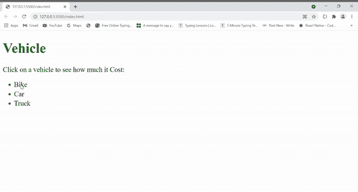

# 元素值和数据属性有什么区别？

> 原文:[https://www . geesforgeks . org/element-value-and-data-attribute/](https://www.geeksforgeeks.org/whats-the-difference-between-element-value-and-data-attribute/)有什么区别

元素值属性指定了 [HTML 元素](https://www.geeksforgeeks.org/html-elements/)的默认值，而[数据属性](https://www.geeksforgeeks.org/html-data-attributes/)允许您在没有其他 HTML 属性可以存储额外数据到 HTML 中的标签。

**元素值:** HTML 元素是开始和结束标记的集合，内容插入在它们之间。

**示例:**

## 超文本标记语言

```htmlhtml
<!DOCTYPE html>  
<html>
<body>
   <label>Website: </label>
   <input type=“text” 
          value="GeeksForGeeks"/>    
</body>
</html>
```

**输出:**


元素值

**数据属性:** 数据属性允许你在 HTML 中给标签添加自己的信息。尽管名字另有所指，但这些并不是 HTML5 特有的

**示例:**

## 超文本标记语言

```htmlhtml
<!DOCTYPE html>
<html>
<head>
<script>
   function showDetails(vehicle) {
     var vehiclePrice = 
         vehicle.getAttribute("data-vehicle-price");
     alert(vehicle.innerHTML 
           + " is of cost " +  vehiclePrice + ".");
   }
 </script>
 <style>
    h1{
      color:green;
    }
    li{
      margin-top:5px;
      cursor:pointer;
    }
  </style>
</head>
<body>
  <h1>Vehicle</h1> 

<p>Click on a vehicle to see how much it Cost:</p>

  <ul>
   <li onclick="showDetails(this)" 
       id="Bike" data-vehicle-price="Rs. 80,000">     
     Bike</li>
   <li onclick="showDetails(this)" 
       id="Car" data-vehicle-price="Rs. 7,00,000 ">
     Car</li>  
   <li onclick="showDetails(this)" 
       id="Truck" data-vehicle-price="Rs. 3,00,000 ">
     Truck</li>  
  </ul>
</body>
</html>                    
```

**输出:**



<figure class="table">

| 

#### Element value

 | 

#### data attribute

 |
| --- | --- |
| 元素值可以使用 HTML 元素 *<输入>、**<按钮>、<仪表>、< li 【T69* | Attributes can be used with all HTML elements. |
| 它对不同的元素有不同的用法。例如 *<按钮>、<输入>* 元素值指定元素的初始值。对于 *<参数>* 元素，value 属性指定参数的值。 | Used to define custom data attributes and store custom data, private to pages or applications. |
| We don't need any name for the element value. The value must be a string. | Attribute names cannot have any capital letters, and must be at least one character long and prefixed with "data-". |

</figure>