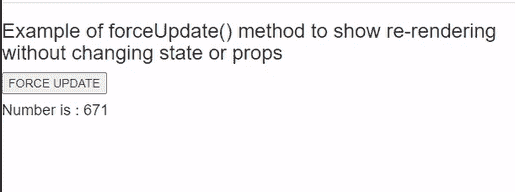

# 【forceUpdate 和 setState 有什么区别？

> 原文:[https://www . geesforgeeks . org/force update-vs-setstate/](https://www.geeksforgeeks.org/whats-the-difference-between-forceupdate-vs-setstate/)有何区别

forceUpdate()和 setState()的区别在于，如果组件的某些状态或道具发生了变化，则 setState()会重新呈现该组件。当我们调用 setState()时，生命周期方法 shouldComponentUpdate()方法会自动调用，决定组件是否应该重新呈现。如果没有重新呈现的理由，shouldComponentUpdate()方法将退出更新生命周期。

而 forceUpdate()方法在不改变状态或道具的情况下重新呈现组件。当我们调用 forceUpdate()时，它将重新呈现组件并跳过 shouldComponentUpdate()方法。

**注意:**渲染时尽量停止使用 forceUpdate()，从 *this.props* 和 *this.state* 中读取。

【forceUpdate vs setState 方法的区别有:

<figure class="table">

| **force update 方法**

 | **setState 方法** |
| 它重新渲染组件，甚至不改变状态或道具。 | 如果组件的某些状态或道具发生变化，它会重新渲染该组件。 |
| 它跳过了生命周期中的宜组件更新方法。 | 它调用了生命周期中的 shouldComponentUpdate 方法。 |
| 这个方法不推荐。 | 我们可以在想要更新状态的时候使用 setState。 |
| The method basically writes the data to *this.state* and then calls the render method. | The It method does not write data to *this.state, but* simply calls the render method. |

</figure>

**示例 1:使用设置状态方法**

**语法:**

```html
this.setState({ state: this.state });
```

**App.js:** 现在在 **App.js** 文件中写下以下代码。在这里，App 是我们编写代码的默认组件。

## App.js

```html
import React, { Component } from 'react';

class App extends Component {
  state = {
    name: '',
  }

  handleChange = (x) => {
    const { name, value } = x.target;
    this.setState({
      [name]: value,
    });
  }

  render() {
    return (
      <div >
        Name:
        <input type="text" name="name" onChange={this.handleChange} />
        <div>
          <h4> Hi, {this.state.name}!</h4>
        </div>
      </div>
    );
  }
}

export default App;
```

**运行应用程序的步骤:**从项目的根目录使用以下命令运行应用程序:

```html
npm start
```

**输出:**现在打开浏览器，转到***http://localhost:3000/***，会看到如下输出:


**解释:**从上面的代码中我们可以看到，当我们在文本框中输入时，setState()方法调用设置 name 的最新值，并在每次重新渲染组件。

**例 2。使用强制更新方法**

**语法:**

```html
this.forceUpdate()
```

**App.js:** 现在在 **App.js** 文件中写下以下代码。在这里，App 是我们编写代码的默认组件。

## App.js

```html
import React from 'react';
class App extends React.Component{

  handleForceUpdate = ()=>{
    this.forceUpdate();
  };

  render(){
    return(
      <div>
        <h3>Example of forceUpdate() method to show re-rendering <br></br>
        without changing state or props
        </h3>
        <button onClick= {this.handleForceUpdate} >
            FORCE UPDATE
        </button>
        <h4>Number is : 
           { Math.floor(Math.random() * (100000 - 1 + 1)) + 1 }
        </h4>
      </div>
    );
  }
}

export default App;
```

**运行应用程序的步骤:**从项目的根目录使用以下命令运行应用程序:

```html
npm start
```

**输出:**现在打开浏览器，转到***http://localhost:3000/***，会看到如下输出:



**解释:**从上面的例子中我们可以看到，由于 forceUpdate()方法的调用，组件在不改变道具或状态的情况下被重新渲染。当组件被重新渲染时，随机数被重新生成。