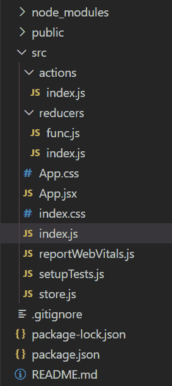
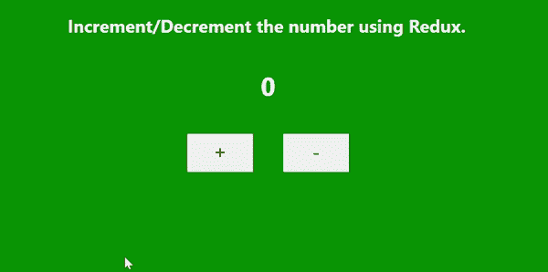

# 【useContext 和 Redux 有什么区别？

> 原文:[https://www . geeksforgeeks . org/usecontext-and-redux/](https://www.geeksforgeeks.org/whats-the-difference-between-usecontext-and-redux/)有何区别

**useContext:** useContext 是一个钩子，它提供了一种通过组件树传递数据的方法，而无需手动通过每个嵌套组件向下传递道具。

**语法:**

```html
const Context = useContext(initialValue);
```

**项目结构:**会是这样的。


**示例:**在本例中，App.js 正在 useContext 的帮助下向组件 ComC 发送数据。

**App.js**

## java 描述语言

```html
import React, { createContext } from 'react';
import "./index.css";
import ComB from './ComB';

const Data = createContext();

export default function App() {
  return (
    <div className="App">
      <Data.Provider value={"Welcome to GFG"}>
        <ComB />
      </Data.Provider>
    </div>
  );
}

export { Data };
```

**ComB.js**

## java 描述语言

```html
import React, { useState } from "react";
import ComC from "./ComC";

const ComB = () => {
  const [show, setShow] = useState(false);
  return (
    <>
      {show ? <ComC /> : null}
      <button onClick={() => setShow(!show)}>
        Click ME</button>
    </>
  );
}

export default ComB;
```

comc . js

## java 描述语言

```html
import React, { useContext } from 'react';
import { Data } from './App';

const ComC = ({ name }) => {
  const context = useContext(Data);
  return <h1>{context}</h1>
}

export default ComC;
```

**输出:**


**Redux:** Redux 是 JavaScript 应用中使用的状态管理库。它非常受欢迎的反应和反应原生。它只是管理应用程序的状态和数据。

**redux 的建筑部分:**

1.  行动
2.  还原剂
3.  商店

**项目结构:**会是这样的。



**示例:**在本例中，我们创建了两个按钮，一个将增加值，另一个将减少值。有了 Redux，我们正在管理国家。

**App.js**

## java 描述语言

```html
import React from 'react';
import './index.css';
import { useSelector, useDispatch } from 'react-redux';
import { incNum, decNum } from './actions/index';

function App() {

  const mystate = useSelector((state) => state.change);
  const dispatch = useDispatch();

  return (
    <>
      <h2>Increment/Decrement the number using Redux.</h2>
      <div className="app">
        <h1>{mystate}</h1>
        <button onClick={() => dispatch(incNum())}>+</button>
        <button onClick={() => dispatch(decNum())}>-</button>
      </div>
    </>
  );
}

export default App;
```

**index.js** (在 *src/actions* 文件夹中)

## java 描述语言

```html
export const incNum = () => {
   return{ type:"INCREMENT"}
}

export const decNum = () => {
   return{ type:"DECREMENT"}
}
```

func . js

## java 描述语言

```html
const initialState = 0;

const change = (state = initialState, action) => {
  switch (action.type) {
    case "INCREMENT": return state + 1;
    case "DECREMENT": return state - 1;
    default: return state;
  }
}

export default change;
```

**index.js** (在*src/减速器*文件夹中)

## java 描述语言

```html
import change from './func'
import {combineReducers}from 'redux';

const rootReducer = combineReducers({change});

export default rootReducer;
```

**store.js**

## java 描述语言

```html
import {createStore} from 'redux';
import rootReducer from './reducers/index';

const store = createStore(rootReducer,window.__REDUX_DEVTOOLS_EXTENSION__ && 
window.__REDUX_DEVTOOLS_EXTENSION__());

export default store;
```

**index.js** (在 *src* 文件夹中)

## java 描述语言

```html
import React from 'react';
import ReactDOM from 'react-dom';
import './index.css';
import App from './App.jsx'
import store from './store';
import { Provider } from 'react-redux';

ReactDOM.render(
  <Provider store={store}>
    <App />
  </Provider>
  , document.getElementById("root")
);
```

**输出:**



**useContext 与 Redux 的一些区别:**

<figure class="table">

| **useContext** | **Redux** |
| UseContext is a hook. | Redux is a national management library. |
| It is used to share data. | Used to manage data and status. |
| Use context values to make changes. | Make changes with pure function, i.e. reducer. |
| We can change the state in it. | Status is read-only. We can't change them directly. |
| As long as the provider's value channel has any updates, it will re-render all components. | It only re-renders the updated components. |
| Best used with small applications. | Very suitable for large-scale applications. |
| Simple and easy to understand, requiring less code. | It's quite complicated to understand. |

</figure>