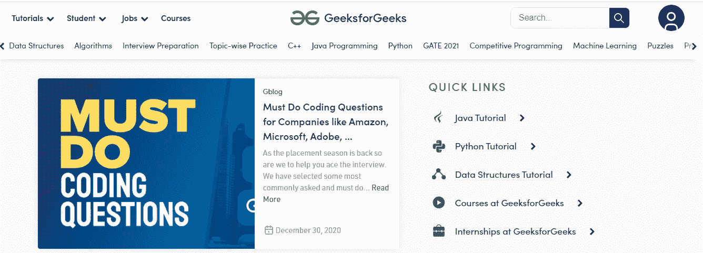

# 给点击事件监听器添加 return false 会有什么影响？

> 原文:[https://www . geeksforgeeks . org/添加-返回-false-to-click-event-listener/](https://www.geeksforgeeks.org/whats-the-effect-of-adding-return-false-to-a-click-event-listener/)

给定一个带有 onclick()事件和 return 语句的链接，任务是在单击事件后获得效果。下面是包含锚元素、onclick()事件和 return 语句的代码。

```html
<a href='https://www.google.com' 
    onclick='someFunc(3); 
    return false;'>
    Click here !
</a>
```

*返回假*对点击事件监听器有什么影响？

**说明:**你有没有在网站上遇到过要求任务/重定向许可的弹出提示？这些弹出窗口有两个选择*是*或*否*。如果有一个*返回假*语句，那么在该警报消息的事件监听器中，它可能对应于没有执行默认的指令集。

事件处理程序的返回值用于确定默认(期望的)浏览器行为是否应该发生。

**示例:**下面的 JavaScript 代码(tobrdeleted.js)，打印数字加 1。

## java 描述语言

```html
function someFunc(n) {
   console.log(n + 1);
}
```

假设我们使用下面的 HTML 代码来调用上面的函数。

## 超文本标记语言

```html
<!DOCTYPE html>
<html>

<head>
    <script src="tobrdeleted.js"></script>
</head>

<body>
    <a href='https://www.geeksforgeeks.org' 
        onclick='someFunc(3); return true;'>
        Click here !
    </a>
</body>

</html>
```



我们写*的时候还真；*然后点击“*点击这里！”*带我们到目标页面(在我们这里是*www.geeksforgeeks.org*)，函数 *someFunc(3)* 不被调用。

## 超文本标记语言

```html
<!DOCTYPE html>
<html>

<head>
    <script src="tobrdeleted.js"></script>
</head>

<body>
    <a href='https://www.geeksforgeeks.org' 
        onclick='someFunc(3); return false;'>
        Click here !
    </a>
</body>

</html>
```

当我们写*的时候返回 false*然后点击“*点击这里！”*不重定向到任何地方。相反，它执行函数 *someFunc(3)。*