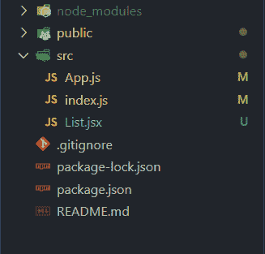
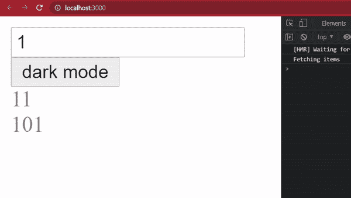
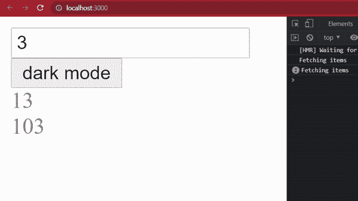
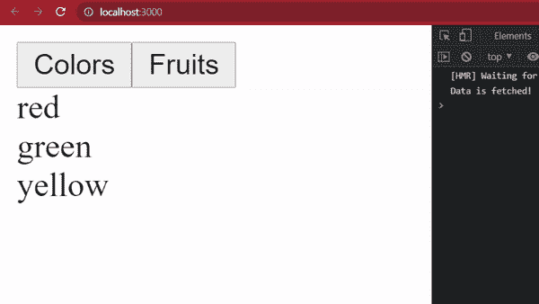
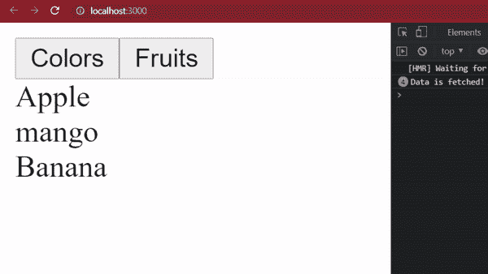

# 何时使用 useCallback、useMemo、useEffect？

> 原文:[https://www . geeksforgeeks . org/何时使用-使用回调-使用备忘录和使用效果/](https://www.geeksforgeeks.org/when-to-use-usecallback-usememo-and-useeffect/)

useCallback、useMemo 和 useEffect 是一种在重新呈现组件之间优化基于 React 的应用程序性能的方法。这些函数提供了基于类的组件的一些特性，比如通过呈现调用保持专用状态，以及生命周期函数来控制组件在其生命周期的各个阶段的外观。

要回答何时使用 useCallBack、useMemo 和 useEffect，我们应该知道它们的确切作用以及它们的不同之处。

1.  **[useCallback](https://www.geeksforgeeks.org/react-js-usecallback-hook/):**useCallback 是一个 react hook，当传递一个函数和一个依赖列表作为参数时，它会返回一个 memoized 回调。当组件向其子组件传递回调以防止呈现子组件时，这非常有用。它只在它的一个依赖项改变时才改变回调。

2.  **[useMemo](https://www.geeksforgeeks.org/react-js-usememo-hook/):**useMemo 类似于 useCallback hook，因为它接受一个函数和一个依赖列表，但是它返回由传递的函数返回的 memoized 值。只有当它的一个依赖项改变时，它才重新计算该值。当返回值不会改变时，避免每次渲染的昂贵计算是很有用的。

3.  **[使用效果](https://www.geeksforgeeks.org/reactjs-useeffect-hook/) :** 一个钩子，帮助我们在所有组件渲染完成后执行突变、订阅、定时器、日志记录和其他副作用。useEffect 接受一个本质上是必需的函数和一个依赖列表。当它的依赖关系改变时，它执行传递的函数。

**创建一个 react 应用程序来理解所有三个钩子:**

*   **步骤 1:** 使用以下命令创建一个反应应用程序:

    ```
    npx create-react-app usecallbackdemo
    ```

*   **步骤 2:** 创建项目文件夹(即文件夹名**)后，使用以下命令移动到该文件夹中:**

    ```
    cd usecallbackdemo
    ```

**项目结构:**如下图。



项目结构

现在让我们了解所有三个钩子的工作原理。

**1。usecallback:** 它依赖于引用相等。在 javascript 中，函数是一等公民，这意味着函数是一个常规对象。因此，两个函数对象即使共享相同的代码，也是两个不同的对象。请记住，函数对象在引用上只等于它自己。

让我们在下面的代码中看到这一点， **doubleFactory** 创建并返回一个函数:

## java 描述语言

```
function doubleFactory(){
    return (a) => 2*a;
}

const double1 = doubleFactory();
const double2 = doubleFactory();

double1(8); // gives 16
double2(8); // gives 16

double1 === double2;  // false
double1 === double1;  // true
```

**double 1**和 **double2** 将传递给它们的值加倍，并且由相同的工厂函数创建。这两个函数即使共享相同的代码，也不相等，这里( **double1 === double2)** 的计算结果为 false。

**何时使用 useCallback:** 在 React 中，组件通常会在其中创建一些回调函数。

## java 描述语言

```
function MyComponent(){

    // HandleChange is created on every render
    const handleChange = () => {...};

    return <> 
        ... 
        </>;
}
```

**这里的 handleChange** 函数对象在我的组件的每个渲染中都是不同的。有几种情况下，我们可能希望在多个渲染之间使用相同的功能对象。例如，当它是其他一些钩子(useEffect( …，callbackfunc))的依赖项时，或者当函数对象本身有一些我们需要维护的内部状态时。在这种情况下，useCallback 钩子就派上了用场。简单来说，**使用回调(callBackFun，deps )** 在渲染之间依赖值 **deps** 不变时返回记忆的回调。(这里的 memoized 指的是缓存对象以备将来使用)。

**让我们看一个使用项目的用例:**应用程序由一个输入字段、一个按钮和一个列表组成。列表是由两个数字组成的组件，第一个数字是输入加 10，第二个数字是输入+ 100。该按钮将组件从暗模式更改为亮模式，反之亦然。

将有两个组件应用程序和列表，应用程序是我们添加输入字段、按钮和列表的主要组件。列表组件用于根据输入字段打印项目列表。

## jsx 应用程序

```
import React, { useState} from "react"
import List from "./List"

function App(){

    {/* Initial states */}
    const [input, setInput] = useState(1);
    const [light, setLight] = useState(true);

    {/* getItems() returns a list of number which
    is number+10 and number + 100 */}
    const getItems = () => {
        return [input + 10, input + 100];
    }

    {/* Style for changing the theme */}
    const theme = {
        backgroundColor: light ? "White": "grey",
        color: light ? "grey" : "white"
    }

    return <>
        {/* set the theme in the parent div */}
        <div style={theme}>
            <input type="number"
            value={input}

            {/* When we input a number it is stored
            in our stateful variable */} 
            onChange={event => setInput(parseInt(event.target.value))} />

            {/* on click the button the theme is set to the 
            opposite mode, light to dark and vice versa*/}
            <button onClick={() => setLight(prevLight => !prevLight)}>
            {light ? "dark mode":"light mode"}
            </button>
            <List getItems={getItems} />
        </div>
    </>;
}

export default App;
```

## List.jsx

```
import React, { useEffect, useState } from "react"

function List({ getItems }){

    /* Initial state of the items */
    const [items, setItems] = useState([]);

    /* This hook sets the value of items if 
       getItems object changes */
    useEffect(() => {
        console.log("Fetching items");
        setItems(getItems());
    }, [getItems]);

    /* Maps the items to a list */
    return <div>
        {items.map(item => <div key={item}>{item}</div>)}
    </div>
}
export default List;
```

**解释:**列表组件获取 getItems 函数作为属性。每次 getItems 函数对象发生变化时，useEffect 都会调用 setItems 将函数对象返回的列表设置为有状态变量项，然后我们将这些项映射到 div 列表中。每次使用 useEffect 中的 getItems 提取项目时，我们都会打印“提取项目”来查看项目的提取频率**。**

**运行应用程序的步骤:**

```
npm start
```

**输出:**



**说明:**以下为用户在输入栏输入数字时的输出。从控制台日志中可以看到，第一次渲染 app 时，取项，打印“取项”。现在，如果我们输入一些不同的数字，我们会看到项目再次被提取。

现在奇怪的是，当我们按下按钮改变主题时，我们看到即使输入字段没有被修改，项目仍然被提取。



这种行为背后的原因是，当我们按下按钮时，应用程序组件被重新渲染，因此应用程序内部的函数 **getItems()** 被再次创建，我们知道两个对象在引用上是不同的。因此，在列表组件中，useEffect 钩子调用 setItems，并在依赖关系改变时打印“获取项”。

**上述问题的解决方案:**这里我们可以根据输入的数字，使用 useCallback 函数来调用 **getItems()** 函数。除非输入改变，否则我们不想重新创建函数，因此，在按下按钮(改变主题)时，不会提取项目。

## jsx 应用程序

```
import React, { useCallback, useState} from "react"
import List from "./List"

function App(){

    {/* Initial states */}
    const [input, setInput] = useState(1);
    const [light, setLight] = useState(true);

    {/* useCallback memoizes the getItems() which 
       returns a list of number which is number+10
       and number + 100 */}
    const getItems = useCallback(() => {
        return [input + 10, input + 100];
    }, [input]);

    {/* style for changing the theme */}
    const theme = {
        backgroundColor: light ? "White": "grey",
        color: light ? "grey" : "white"
    }

    return <>
        {/* set the theme in the parent div */}
        <div style={theme}>
            <input type="number"
            value={input}

            {/* When we input a number it is stored in
            our stateful variable */} 
            onChange={event => 
            setInput(parseInt(event.target.value))
            } />

            {/* on click the button the theme is set to 
            the opposite mode, light to dark and vice versa*/}
            <button onClick={() => 
            setLight(prevLight => 
            !prevLight)}>{light ? "dark mode":"light mode"}
            </button>
            <List getItems={getItems} />
        </div>
    </>;
}

export default App;
```

现在我们使用 useCallback 钩子来记住 getitems 函数，该函数接受该函数和一个依赖列表。在我们的例子中，依赖列表只包括输入。

**输出:**


**说明:**从输出可以看出，在 app 渲染的时候，项目只取一次，而不是我们通过按键改变主题的时候。不管我们翻转多少次主题，useEffect 都不会调用**设置项**，直到输入字段有了新的数字。

**2。useMemo:**useMemo 钩子在接受一个函数和一个依赖列表后返回一个 memoised 值。如果依赖关系不变，它将返回缓存值。否则，它将使用传递的函数重新计算该值。

****何时使用**备忘录:**

**有两种情况使用 useMemo 会有帮助:**

1.  当组件使用使用耗时函数计算的值时。

    ## MyComponent.jsx 文件

    ```
    function MyComponent(){
        const [data, setData] = useState(0);
        const number = verySlowFunction(data);
        return <div>{number}</div>;
    }

    function verySlowFunction(input){
        ...heavy work done here
        return value;
    }
    ```

    在这里，每次渲染 **MyComponent** 时都会调用慢速函数，这可能是因为某个有状态变量被更改或者某个其他组件导致了重新渲染。

    **解决方案:**通过使用 useMemo 钩子记住慢速函数的返回值，我们可以避免它可能导致的延迟。

    ## MyComponent.jsx 文件

    ```
    function MyComponent(){
        const [data, setData] = useState(0);
        const number = useMemo(() => {
            return verySlowFunction(data)}, [data]);

        return <div>{number}</div>;
    }

    function verySlowFunction(input){
        ...heavy work done here
        return value;
    }
    ```

    这里我们使用 useMemo 钩子来缓存返回值，依赖列表包含数据状态变量。现在，每次呈现组件时，如果数据变量没有改变，我们就可以获得 memoized 值，而无需调用 CPU 密集型函数。因此，它提高了性能。

2.  现在考虑另一个场景，当一些数据改变时，我们有一个组件做一些事情，例如，让我们使用钩子 useEffect，它记录一些依赖关系的改变。

    ## MyComponent.jsx 文件

    ```
    function MyComponent() {    
        const [number, setNumber] = useState(0);
        const data = {
            key: value
        };

        useEffect(() => {
            console.log('Hello world');
        }, [data]);
    }
    ```

    在上面的代码中，每次渲染组件时，“Hello world”都会打印在控制台上，因为存储在上一次渲染中的**数据**对象在下一次渲染中有所不同，因此 useEffect 钩子会运行 console.log 函数。在现实世界中，useEffect 可以包含一些我们不希望重复的功能，如果它的依赖关系没有改变的话。

    **解决方案:**我们可以使用 useMemo 钩子来记忆数据对象，这样组件的渲染就不会创建新的数据对象，因此 useEffect 也不会调用它的主体。

    ## MyComponent.jsx 文件

    ```
    function MyComponent(){

        const [number, setNumber] = useState(0);

        const data = useMemo( () => {
        return {
            key: value
        }}, number);

        useEffect(() => {
            console.log('Hello world');
        }, [data]);
    }
    ```

    现在，当组件第二次呈现时，如果 number 有状态变量没有被修改，那么 console.log()不会被执行。

**3。使用效果:**在 react 中，某些状态变化的副作用在功能部件中是不允许的。为了在渲染完成和一些状态改变后执行任务，我们可以使用 useEffect。这个钩子接受一个要执行的函数和一个依赖项列表，改变这个列表会导致钩子主体的执行。

了解它的正确用法。让我们看一个简单的例子:

**示例:**考虑一个场景，一旦组件被挂载，我们就必须从一些 API 中获取一些数据。在示例代码中，我们使用带有不同颜色和水果值的**数据**对象来模拟服务器。我们希望根据按下的按钮打印项目列表。因此，我们有两个状态变量**当前选择**和**项目**，通过按下按钮进行修改。当按下一个按钮时，它会改变**当前选择**，并调用 useEffect 的主体，使用地图打印当前选择的项目。现在，如果我们不使用 useEffect，每次按下按钮，即使选择不变，数据也会从服务器中取出。在这种情况下，这个钩子帮助我们不调用提取逻辑，除非我们的选择改变。

## jsx 应用程序

```
import React, { useEffect, useState} from "react"

function App(){

    /* Some data */
    const data = {
        Colors: ["red", "green", "yellow"],
        Fruits: ["Apple", "mango", "Banana"]
    }

    /* Initial states */
    const [currentChoice, setCurrentChoice] = useState("Colors");
    const [items, setItems] = useState([]);

    /* Using useEffect to set the data of currentchoice
       to items and console log the fetching... */
    useEffect(() => {
        setItems(data[currentChoice]);
        console.log("Data is fetched!");
    }, [currentChoice]);

    return <>
    <button onClick={() => setCurrentChoice("Colors")}>Colors</button>
    <button onClick={() => setCurrentChoice("Fruits")}>Fruits</button>    
        {items.map(item => {return <div key={item}>{item}</div>})}
    </>;
}

export default App;
```

**输出:**



**说明:**应用第一次加载的时候，数据是从我们的假服务器上取的。这可以在控制台的下图中看到。当我们按下水果按钮时，适当的数据再次从服务器中取出，我们可以看到“数据取出”再次打印在控制台中。但是如果我们再次按下水果按钮，我们就不必再次从服务器获取数据，因为我们的选择状态不会改变。

 **结论:**

因此，当我们想要记住一个回调函数时，应该使用一个 useCallback 钩子，为了避免昂贵的计算，我们可以使用 useMemo。useEffect 用于对某些状态变化产生副作用。有一点要记住，一个人不应该过度使用钩子。