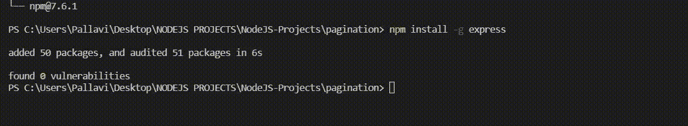
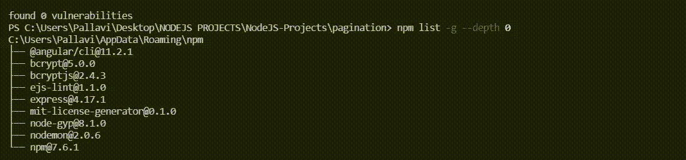
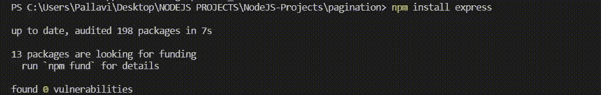

# NPM 在哪里安装软件包？

> 原文:[https://www . geesforgeks . org/NPM 在哪里安装软件包/](https://www.geeksforgeeks.org/where-does-npm-install-the-packages/)

[NPM](https://www.geeksforgeeks.org/node-js-npm-node-package-manager/) (节点包管理器)是 Node.js 的默认包管理器，完全用 Javascript 编写。在本文中，我们将看到 npm 在哪里安装软件包。

当我们使用 npm 安装软件包时，您可以执行两种类型的安装:

1.  **本地安装**
2.  **全球安装**

让我们详细了解它们。

**1。包的全局安装:**node . js 中依赖项的全局安装是将全局包放在系统中的一个位置，具体位置取决于您的设置，而不管您在哪里运行命令**NPM install-g<package-name>**来安装依赖项。

**语法:**

```html
run npm install -g <package-name>
```

这里 g 表示变量的全局模式。

**举例说明如何在系统中全局安装软件包。**

将此命令写入控制台。

```html
 npm install -g express
```

**输出:**



**全局包在系统中的路径:**全局模块在系统目录/usr/local/lib/node_modules 项目目录的根位置安装在标准系统中。

命令打印系统上安装所有全局模块的位置。

```html
npm root -g
```

**输出:**

```html
C:\Users\Pallavi\AppData\Roaming\npm\node_modules
```

**列出系统中所有全局包:**

```html
npm list -g --depth 0 
```

**输出:**



**2** 。**包的本地安装:**本地包安装在您运行 **npm install <包-名称>** 的目录中，它们放在该目录下的 node_modules 文件夹中。

**语法:**

```html
npm install <package-name>
```

**举例说明如何在系统中本地安装** **包。**

```html
npm install express
```

**输出:**



**系统中本地包的路径:**这些都是本地安装在项目的 **package.json** 文件中，如下图所示。

