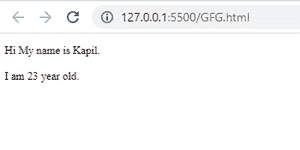
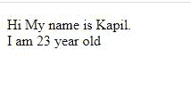
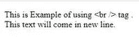

# 在哪里使用
、
和
？

> 原文:[https://www.geeksforgeeks.org/where-to-use-br-br-and-br/](https://www.geeksforgeeks.org/where-to-use-br-br-and-br/)

HTML 中的 [**< br >标签**](https://www.geeksforgeeks.org/html-brgt-tag/) 用来断线。在 HTML 中，首选< br >，但我们也可以使用< br/ >和< br / >。< br >是一个空标签，所以我们不需要关闭这个标签。我们可以用 **< br >** 或 **< /br >** 断线，两者都允许(但不能都用(< br > < /br >)因为会给我们双线断线。
在 [XHTML](https://www.geeksforgeeks.org/xhtml-introduction/) 中，< br / >为首选，但我们可以使用< br/ > 或 < br > < /br >，因为 XML 不允许让标签保持打开状态..过时的浏览器将 XHTML 解析为 HTML，并以< br/ >失败。

**注意:** XHTML 区分大小写，HTML 不区分大小写。

**我怎么用< br > :** 我们可以把< br >放在任何我们想要换行的位置。

## 超文本标记语言

```html
<!DOCTYPE html>
<html>

<head>
    <title>
        br example
    </title>
</head>

<body>

<p> Hi My name is Kapil. <br> I am 23 year old.</p>

</body>

</html>
```

**输出:**


从上面的代码中我们可以看到
标签换行，下一条语句打印在新的一行。

**如何使用< /br > :** 我们只需将< /br >放置在我们想要的任何位置，换行与< br >标签相同。

## 超文本标记语言

```html
<!DOCTYPE html>
<html>

<head>
    <title>
        br example
    </title>
</head>

<body>

<p> Hi My name is Kapil. </br> I am 23 year old.</p>

</body>

</html>
```

**输出:**


从上面的代码中我们可以看到，它给出了与
标签给出相同的输出。

**结论:**可以交替使用< br >和< /br >标签，但是如果我们同时使用这两个标签，那么我们将获得两个换行符，一个用于< br >，另一个用于< /br >。

**示例 1:** 同时使用< br >和< /br >(它给出了两个换行符)

## 超文本标记语言

```html
<!DOCTYPE html>
<html>

<head>
    <title>
        br example
    </title>
</head>

<body>

<p> Hi My name is Kapil. <br></br> I am 23 year old.</p>

</body>

</html>
```

**输出:**



**例 2:** < br/ >用于 XHTML 中断线。

## 超文本标记语言

```html
<!DOCTYPE html>
<html>
<head>
    <title>
        br example
    </title>
</head>
<body>

<p> Hi My name is Kapil. <br/> I am 23 year old.</p>

</body>
</html>
```

**输出:**



**例 3**

## 超文本标记语言

```html
<?xml version="1.0" encoding="UTF-8"?>
<!DOCTYPE html PUBLIC "-//W3C//DTD XHTML 1.0 Transitional//EN" 
"http://www.w3.org/TR/xhtml1/DTD/xhtml1-transitional.dtd">
<html xmlns="http://www.w3.org/1999/xhtml" 
      xml:lang="en" 
      lang="en">

<body>

<p> This is Example of using <br /> tag. <br />
        This text will come in new line.</p>

</body>

</html>
```

**输出:**

