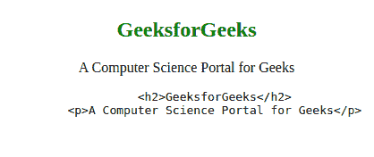

# 哪些字符应该在“pre”标签中转义？

> 原文:[https://www . geesforgeks . org/哪些字符应该在预标记内部转义/](https://www.geeksforgeeks.org/which-characters-should-be-escaped-inside-a-pre-tag/)

**<预>标签**定义预格式化文本。**<>前标签**元素中的所有内容(通常是文本和代码片段)都以固定宽度的字体显示，并保留其中的空格和换行符。换句话说，如果有人想在网页上显示他们的代码片段，他们可以简单地将他们的代码放在标签中。

但是有些事情是大多数人完全错过的。 **<前置>标签**中有一些保留字符。保留字符是指用于特定或保留目的的字符。这里列出了在编写代码时也应该转义的所有保留字符:

*   小于(
*   大于(>)
*   &符号(&)
*   单引号或撇号(')
*   双引号(")

如前所述，在 **<前>标签**中有一些保留字符。这些字符有特定的含义，如果我们将这些字符放入我们的 **< pre >标签**中，它会将它们视为保留字符，因此，我们需要对它们进行转义。

*   **小于(< ):** 保留在标签中使用(如< div > < /div >)。因此，这个角色只有这个特定的意义。要在 **<前>标记**标记中逃脱它们，我们需要使用**&lt；**为 HTML 实体名称或 **<** 为 HTML 实体编号作为替换。
*   **大于(> ):** 保留在标签中使用(如<正文></正文>)。因此，这个角色只有这个特定的意义。要在 **pre** 标签中逃脱它们，我们需要使用**&gt；**为 HTML 实体名称或 **>** 为 HTML 实体编号作为替换。
*   **和号(& ):** 保留给 **&等实体。**为非破空格的 HTML 实体名称。因此，它将在**前**标签中为整个文本保留该含义。要在 **pre** 标签中逃脱它们，我们需要使用**&amp；**为 HTML 实体名称或 **&** 为 HTML 实体编号作为替换。
*   **单引号或撇号('):**它是为属性定义值而保留的，例如<div float:“left”></div>，因此，仅在 **pre** 标签之间的整个代码中对应于该含义。要在 **pre** 标签中转义它们，我们需要使用 **'** 作为 HTML 实体编号的替换，因为它没有任何 HTML 实体名称。
*   **双引号("):**再次保留用于定义属性的值，如< div 类:“title”></div>，因此，仅在 **pre** 标签之间的整个代码中对应该含义。要在 **pre** 标签中逃脱它们，我们需要使用 **&为 HTML 实体名称或**“**为 HTML 实体编号作为替换。**

**示例:**

```htmlhtml
<!DOCTYPE html>
<html>

<head>
    <title>Page Title</title>
</head>

<body>
    <center>
        <h2 style="color: green;">GeeksforGeeks</h2>
        <p>A Computer Science Portal for Geeks</p>
        <pre>
    <h2>GeeksforGeeks</h2>
    <p>A Computer Science Portal for Geeks</p>
</pre>
    </center>
</body>

</html>
```

**输出:**


其他一些需要与其实体名称和实体编号一起转义的特殊符号有:

| 标志 | 实体名称 | 实体编号 |
| --- | --- | --- |
| 无间断空间( ) | `&nbsp;` |  |
| 注册商标( ) | `&reg;` | `®` |
| 版权所有( ) | `&copy;` | `©` |
| 欧元(€) | `&euro;` | `€` |
| 磅( ) | `&pound;` | `£` |
| 中心( ) | `&cent;` | `¢` |