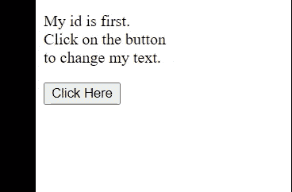

# document . getelementbyid(' txt name ')和$('#txtName ')哪个更快？

> 原文:[https://www . geesforgeks . org/哪个更快-document-getelementbyidtxtname-or-txtname/](https://www.geeksforgeeks.org/which-is-faster-document-getelementbyidtxtname-or-txtname/)

在本文中，我们将看到哪个是 fast document . getelementbyid(' txt name ')或$("#txtName ")。我们先来看看这些是什么，它们是做什么的。

**document . getelementbyid(' txt name)方法:**此方法用于获取具有指定值的 **ID** 属性的元素。

**语法:**

```
document.getElementById( elementID )
```

**参数:**想要获取的元素的 **ID** 。

**返回值:**如果找不到指定 id 的元素，则返回 null。

如果我们想要操作一个特定的元素或者你想要关于一个特定元素的信息，这个方法基本上被使用。一个标识在一个页面中应该是唯一的，否则如果两个元素具有相同的标识，那么这个方法将返回第一个元素。

**示例:**在本例中，我们将更改 id 匹配的元素的文本。

## 超文本标记语言

```
<!DOCTYPE html>
<html lang="en">

<head>
    <!-- using jquery library -->
    <script src=
"https://code.jquery.com/jquery-git.js">
    </script>
</head>

<body>
    <p id="first">My id is first. <br>
        Click on the button <br>
        to change my text.
    </p>

    <button onclick="FirstFunction()">Click Here</button>
    <script>
        FirstFunction = ()=>{
            document.getElementById("first")
            .innerHTML = "Hey! i am changed."
        }
    </script>
</body>

</html>
```

**输出:**



**$('#txtName)方法:**jQuery 的这个 id 选择器选择指定 id 的元素。像 id 这样的东西应该是唯一的，在这里也适用。

**语法:**

```
$("#id")
```

**参数:**传递想要获取的元素的 id。

基本上，我们使用这个方法选择一个元素，然后对所选元素执行各种操作，比如获取内部文本、更改 CSS 等。

**示例:**在本例中，我们将更改所选元素的 CSS。

## 超文本标记语言

```
<!DOCTYPE html>
<html lang="en">

<head>
    <!-- using jquery library -->
    <script src=
"https://code.jquery.com/jquery-git.js">
    </script>
</head>

<body>
    <p id="first">
        Click on button to <br>
        Change my look.
    </p>

    <button onclick="FirstFunction()">Click Here</button>

    <script>
        FirstFunction = ()=>{
            $("#first").css({
                "border": "2px solid red",
                "background-color": "pink",
                "width":"10%",
                "padding": "10px"
            })
        }
    </script>
</body>

</html>
```

**输出:**


**document . getelementbyid(' txt name ')和$('#txtName ')哪个方法更快:**这个问题真的很好问。为了回答这个问题，让我们回忆一下什么是 **jQuery** ？

JQuery 是一个 javascript 库，旨在简化代码。所以基本上 jQuery 是用 javascript 编写的。**document . getelementbyID(' txt name ')**用于选择一个 id 为 **txtName** 的元素，用原生 **javascript 编写。**反之， **$('#txtName')** 也用于选择 id 为 **txtName 的元素。**这是 jQuery 库中存在的一个函数。如果看一下这个函数的实现，它在内部对 **document.getElementByID()进行调用。**简单的答案是**document . getelementbyid(' txt name ')比$('#txtName')** 快，因为 jQuery 写在 javascript 之上。这意味着在内部，jQuery 只使用本机 javascript 代码。而原生 javascript 将永远快速。

**document . getelementbyid(' txt name ')和$('#txtName ')之间的区别。**

<figure class="table">

| 文档。getelementbyID(' txt name ')。 | $(' # txt 名称') |
| --- | --- |
| Select the element for the specified id. | Also used to select the element with the specified id. |
| This method is written in native javascript. | This method belongs to jQuery. JQuery is written in javascript. |
| The native method is always fast. | 与原生方法相比，jquery 中编写的方法速度更慢，因为在内部它们调用原生方法。 |

</figure>