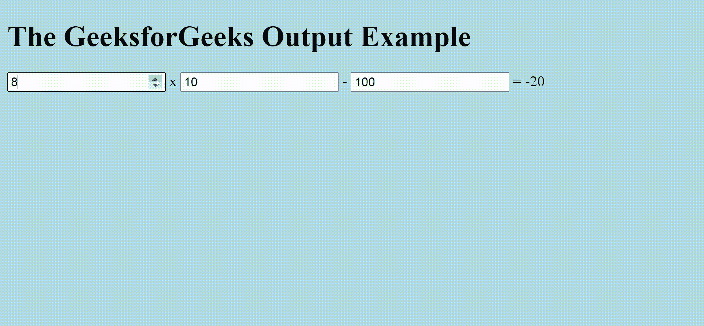
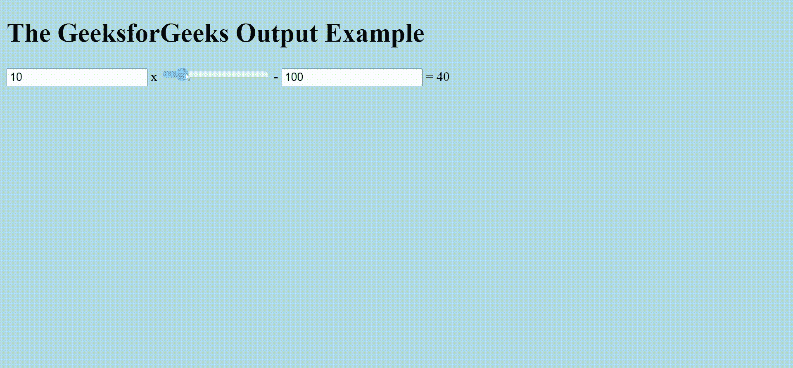

# 哪个标签用于表示计算结果？

> 原文:[https://www . geeksforgeeks . org/哪个标签用于表示计算结果/](https://www.geeksforgeeks.org/which-tag-is-used-for-representing-the-result-of-a-calculation/)

在本文中，我们将知道哪个标记对于呈现计算结果是有用的。主要问题是根据用户输入计算两个或更多的数字&相应地为计算呈现输出。为了显示输出，我们将使用 [<输出>标记](https://www.geeksforgeeks.org/html-output-tag/)，用于表示计算结果。该标签也可用于计算大型&复数。我们可以使用<号>标签以及<范围>标签。所有这些操作都将在 [<表单>标签](https://www.geeksforgeeks.org/html-form-tag/)中执行。

**使用的重要术语:**

*   [**oninput 事件**](https://www.geeksforgeeks.org/html-oninput-event-attribute/) :当一个元素获得用户输入时，只有 oninput 事件发生。我们通过使用<输入>标签从用户那里获取一些输入。当<输入>标签的输入发生变化时，只有该事件发生。oninput 属性在 HTML5 中是新的。
*   [**parsent()**函数](https://www.geeksforgeeks.org/javascript-parseint-function/):我们用 parsent()函数把字符串&的基数作为参数，那么它就会转换成整数。基数参数用于指定要使用的数字系统。如果字符串不包含数值，则返回 NaN，即不是数字。
*   [**<输出>标记**](https://www.geeksforgeeks.org/html-output-tag/#:~:text=The%20tag%20in%20HTML,Attention%20reader!):HTML 中的<输出>标记用来表示一次计算的结果。这个标签也用于计算大型计算。基本上，这个标签从用户那里获得两个或更多的输入&，然后显示输出的结果。

**进场:**

*   首先，我们将用浅蓝色给背景上色。该操作将在标签中完成。
*   然后初始化

    <form>标签。</form>

*   在

    <form>标记中，我们将总共进行三次输入。所有三个输入都将是<number>类型。同样，你也可以使用<range>标签。</range></number></form>

*   第一个输入数字将由 10 初始化。然后我们要乘以第二个插入的数字。它用 10 初始化。
*   然后从初始化 100 的总数中减去第三个数。
*   使用

    <output>标记并声明名称，并将值赋值为“sou”。</output>

*   那我们就得写

    <form oninput="”sou.value=parseInt(gfg.value)*parseInt(gho.value)-parseInt(ar.value)”">。这意味着前两个输入将被相乘&然后第三个将从总数中减去，然后结果被存储为“sou”。</form>

**示例 1:** 这里，我们只使用了作为数字类型的输入。

## 超文本标记语言

```html
<!DOCTYPE html>
<html>

<body bgcolor="lightblue">
    <h1>The GeeksforGeeks Output Example</h1>
    <form oninput=
"sou.value=parseInt(gfg.value)*parseInt(gho.value)-parseInt(ar.value)">
        <input type="number" id="gfg" value="10"> x
        <input type="number" id="gho" value="10"> -
        <input type="number" id="ar" value="100"> =
        <output name="sou" for="gfg gho ar"></output>
    </form>
</body>

</html>
```

**输出:**



HTML

<output>标签</output>

**例 2:** 这里，我们使用了两个输入作为数字类型&一个作为范围类型。这里，我们只改变了第二种输入类型作为范围。

## 超文本标记语言

```html
<!DOCTYPE html>
<html>

<body bgcolor="lightblue">
    <h1>The GeeksforGeeks Output Example</h1>
    <form oninput=
"sou.value=parseInt(gfg.value)*parseInt(gho.value)-parseInt(ar.value)">
        <input type="number" id="gfg" value="10"> x
        <input type="range" id="gho" value="10"> -
        <input type="number" id="ar" value="100"> =
        <output name="sou" for="gfg gho ar"></output>
    </form>
</body>

</html>
```

**输出:**



带范围值的 HTML <input>元素