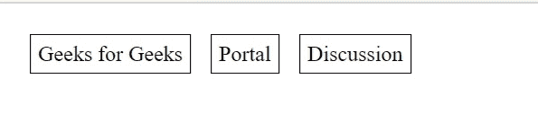

# 为什么 div 显示:表-行忽略边距？

> 原文:[https://www . geesforgeks . org/why-do-div-display table-row-ignore-margin/](https://www.geeksforgeeks.org/why-does-div-displaytable-row-ignore-margin/)

如果有 HTML [*div*](https://www.geeksforgeeks.org/div-tag-html/) 元素与*相邻显示:表格单元格；*如果你想在两者之间设置保证金，那么保证金是没有作用的。

**示例:**

## 超文本标记语言

```
<!DOCTYPE html>
<html>

<body>
    <div style="display: table-cell; 
                margin: 50px;
                background-color:blue;">
        10
    </div>

    <div style="display: table-cell; 
                margin: 50px; 
                background-color:blueviolet;">
        20
    </div>
</body>

</html>
```

**产量:**从上面的例子我们可以得出结论:*保证金*属性并没有影响我们的产量。


没有边际效应

margin 属性适用于除表格标题、表格和内联表格以外的表格显示类型的元素之外的所有元素。简单地说，我们可以说 margin 属性不适用于显示:表格单元格元素。当您进一步了解这一点时，您会知道 padding 属性不会在单元格的边缘之间创建空间。现在，问题将出现在我们的脑海中，我们将如何使用保证金财产？

我们可以用不同的方法在表中设置 margin 属性。

**示例:**我们可以使用[边框间距](https://www.geeksforgeeks.org/css-border-spacing-property/)属性来使用边距属性。请记住，它应该应用于具有显示:表格布局和边框折叠:分离的父元素。

## 超文本标记语言

```
<!DOCTYPE html>
<html>

<head>
    <style>
        .table {
            display: table;
            border-collapse: separate;
            border-spacing: 15px;
        }

        .row {
            display: table-row;
        }

        .cell {
            display: table-cell;
            padding: 5px;
            border: 1px solid black;
        }
    </style>
</head>

<body>
    <div class="table">
        <div class="row">
            <div class="cell">Geeks for Geeks</div>
            <div class="cell">Portal</div>
            <div class="cell">Discussion</div>
        </div>
    </div>
</body>

</html>
```

**输出:**从这个例子可以得出结论，可以通过这种方式设置边距属性。



边框间距和边框折叠

**示例:**第二种方法是在内部草皮中使用*边缘*属性。

## 超文本标记语言

```
<!DOCTYPE html>
<html>

<body>
    <div style="display: table-cell;">
        <div style="margin: 15px;
            background-color: yellow;">
            Geeks For Geeks
        </div>
    </div>
    <div style="display: table-cell; ">
        <div style="margin: 25px; 
            background-color: red;">
            Portal
        </div>
    </div>
</body>

</html>
```

**输出:**


内部 div 边距