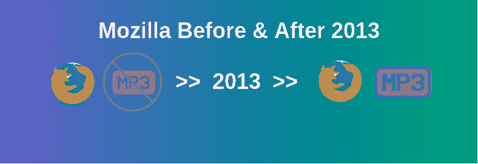

# 为什么 Firefox 不支持 2013 年之前的 MP3 文件格式？

> 原文:[https://www . geesforgeks . org/why-nots-Firefox-support-the-MP3-file-format-before-2013/](https://www.geeksforgeeks.org/why-doesnt-firefox-support-the-mp3-file-format-before-2013/)

在解释文章之前，你应该知道火狐从 2013 年就开始支持 **MP3 和 H.264 了，从**火狐-22** 开始。**

2008 年，第一版 **[HTML5](https://www.geeksforgeeks.org/html5-introduction/)** 向世界推出。这个版本的 HTML 带来了其首次实现的 **[<音频>](https://www.geeksforgeeks.org/html5-audio/)** 和 **[<视频>](https://www.geeksforgeeks.org/html5-video/)** 元素。这使得浏览器中的本地音频和视频播放成为可能。在此之前，像 Adobe Flash 这样的第三方插件必须用于音频或视频播放，尽管它仍然是不支持本机播放的浏览器的一个选项。随着浏览器支持音频或视频播放的出现，每个浏览器支持的代码也出现了差异。

在继续之前，需要对**容器格式**和**编解码器**做一个简短的背景介绍。

*   **容器格式:**简单来说，容器格式就像是将所有媒体内容打包成一个文件(文件扩展名通常对应于容器)，例如 **MPEG-4** 、 **AVI** 、 **Flash Video** 、 **Ogg** 等。每个容器格式大多包含相应的视频和音频编解码器。
*   **编解码器:**编解码器(编解码器)是用于压缩媒体文件的，主要是为了效率和减小大小。这里要讨论的两种重要的容器格式是 **MPEG-4** 和 **Ogg** 。
    *   **MPEG-4:** It 标准是目前最流行的，在全球范围内被广泛使用。该容器格式与 **H.264** 视频编解码器和 **MP3** 音频编解码器相关联。因为这里的上下文是音频，所以让我们关注 MP3。MP3 是由 MPEG(运动图像专家组)开发的，并且是**专利担保的**。这意味着实现该编解码器的算法获得了专利，因此任何想要使用该编解码器的人都必须向 MPEG LA(MPEG 编解码器的许可代理公司)支付许可费。这就是为什么任何现成的 Linux 系统都与 MP3 播放包不兼容的原因。
    *   **Ogg:** 这是一个开放标准、开源友好和**专利不受阻碍的**容器格式。它的视频编解码器叫做 **Theora** ，音频编解码器叫做 **Vorbis** 。所有主要的 Linux 发行版都支持 Ogg。

**Mozilla 不支持 MP3 的时间段和原因:**2010 年的 **Youtube** 和 **Vimeo** 宣布要迁移支持 **HTML5** 的新音视频元素，视频采用 **H.264 编解码**。随后，更多的公司也开始广泛采用 **MPEG-4** 。Mozilla 过去反对在其浏览器上支持 **MPEG-4** 格式，主要是因为这是一个专利软件，而专利软件带来了很多限制、安全性，最重要的是一笔有形的被许可方费用。2010 年 **H.264 的年授权费为 500 万美元**。当时谷歌 Chrome 和 Safari 支持 **MPEG-4** 格式。Mozilla 认为，许可费不仅影响浏览器开发商和分销商，而且对希望制作音频或视频内容的普通用户来说，它就像一个收费亭。因此，如果 **MPEG-4** 格式变得标准化，Mozilla 认为这将在开发社区中形成一个障碍，削弱对新开发人员的激励，他们会犹豫是否从带有价格标签的东西开始。Mozilla 显然没有办法按照涵盖其技术的其他用户(如 Linux 发行商)的条款许可 h . 264 或**MP3**。他们希望网络体验对世界各地的每个人来说都是无私和负担得起的。

如果操作系统支持这些格式，也有可能通过底层操作系统而不是浏览器本身来支持这些格式。这是火狐支持 MPEG-4 的一种间接方式，无需自己承担任务。但是 Mozilla 引用了一个不这样做的安全原因，他们说这可能会导致“任意编解码器暴露给恶意内容”。

**在 Mozilla 上支持 MP3 的时期:**然而，从他们 2013 年的一次夜间构建开始，Firefox 开始支持 **MP3** 和 **H.264** ，并且一直持续到现在。这发生在一种叫做 WebM 的新格式出现之后。最初， **H.264** 有一个条款，规定只有在 2015 年之前，免费广播才能免版税使用。但在 2010 年，谷歌提出了 WebM，并使其成为开源且终身免版税的。作为回应，MPEG LA 也将免费视频广播的免版税条款延长至终生。尽管如此，Mozilla 认为 WebM 竞争激烈，会提高人气和使用率，并会使 **H.264** 最终衰落。但恰恰相反的情况最终发生了， **WebM** 从未被采用， **H.264** 被更广泛地采用。因此 Mozilla 最终屈服于支持 **H.264** 。

**注意:**任何提到 H.264 的地方也包括 MP3 编解码器，因为它们几乎总是作为一个包协议一起实现和使用。