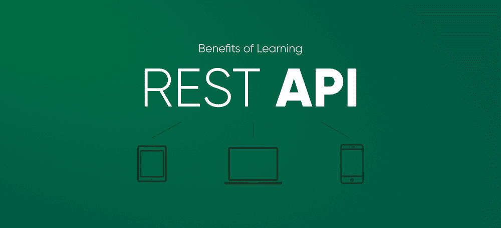

# 为什么 REST API 对学习很重要？

> 原文:[https://www . geesforgeks . org/why-rest-API-重要是学习/](https://www.geeksforgeeks.org/why-rest-api-is-important-to-learn/)

**API…** 作为一个开发者当你听这个词的时候首先想到的是什么…

***JSON、端点、邮差、CRUD、Curl、HTTP、状态码、请求、响应、认证*****或其他…**

**如果你熟悉上面这个词，那么你肯定已经在你的后端应用程序中处理过一些类型的 API(尤其是那些有经验的开发人员)。根据应用程序的类型和需求，可能是支付网关应用程序接口、谷歌地图应用程序接口、发送电子邮件应用程序接口或任何其他类型的应用程序接口。**

**如果你是一个初级开发人员，实现一个应用编程接口对你来说可能是一项艰巨的任务。您被要求实现一个 XYZ API，但是您不知道从哪里开始实现。为了完成工作，你到底需要遵循什么，需要做什么。当你开始研究它时，你会在应用编程接口中遇到很多不熟悉的概念。**

**在使用 API 的过程中，你会听到最流行和最常见的事情是…**

****REST API…****

**这是什么？为什么要用？为什么在实现一个 API 时，它是程序员的第一要务？当你开始研究 REST API 的时候，很多问题会在你的脑海中出现。**

**一旦你掌握了应用编程接口的概念，一旦你知道了使用它的好处以及如何使用它，实现它就很有趣了。在你的开发生涯中，你肯定会为 web 服务开发 REST APIs。**

**但是为什么是 REST 呢？你为什么选择 REST APIs 在你的项目中实现(如果你已经使用过)？你为什么为你的下一个项目选择它(如果你打算选择它)？为什么不使用其他 web 服务 API，比如 SOAP、XML-RPC 等。**

**因为它太受欢迎了？？因为大部分程序员都在用？**

**如果上面这条线是你的答案，那么我们肯定会在这里提出另一个问题……为什么 REST 如此受欢迎？它的特点或好处是什么？**

**永远记住，在软件开发中，你需要为你在项目中选择的任何东西找到一个理由。无论是框架、语言，还是特定的趋势。你会得到什么好处？将解决哪些问题？XYZ 科技将在你的项目中扮演什么角色？等等。**

**理解为什么你在学习一些东西或者为什么你在项目中使用一些东西真的很重要？在这个博客中，我们将讨论 REST APIs 的好处，正如我们已经讨论过的，在项目中实现 API 时，它在程序员中很受欢迎。我们来讨论一下 REST 能给餐桌带来什么…？？**

### **REST 简介**

**REST 代表代表状态转移。基本上，这是一种设计网络应用程序的架构风格。REST 依赖于无状态的客户端-服务器协议，几乎在所有情况下都是 HTTP。最初，程序员依赖 SOAP 在 web 服务中实现 API，但近年来，REST 由于其简单性和可扩展性成为程序员的选择。**

**REST 将服务器端的对象视为可以创建、更新和删除的资源。几乎任何编程语言都可以使用 REST。让我们讨论一下使用 REST 的好处。**

### **REST 最酷的地方是什么？**

**这里我们将讨论为什么学习 REST 很重要，为什么你应该关心它？在您的后端项目中实现它有什么好处。**

### **1.易于学习和实施**

**REST 使用 HTTP 方法进行通信，我们大多数人都熟悉 GET、POST、PUT 或 DELETE 等 HTTP 动词。**

**这些方法是不言自明的，它所做的事情(如果你不知道这些术语的话)使 REST 易于学习。**

**说到架构，REST 是基于客户端和服务器完全分离的客户端-服务器架构。这个最酷的特性允许开发人员的团队在两端独立工作，您不必担心客户端编码了什么或者服务器是如何组装的。这个特性提供了在几个与开发相关的项目中工作的机会。**

**REST API 负责两者之间的通信。开发人员在客户端显示信息，在服务器端存储或操作数据变得非常容易。这有助于提高开发人员的生产力。此外，团队工作效率更高。**

**因此，如果您熟悉 HTTP 和客户机-服务器体系结构，那么您就可以很容易地理解 REST API，并且可以很容易地在您的项目中实现它。**

### **2.可量测性**

**这是使 REST 与其他产品相比脱颖而出的最佳特性之一。REST 架构中客户机和服务器的分离使开发人员能够更容易地扩展应用程序。让我们再来看两个原因，如果你的应用程序使用 REST API，它们会使你的应用程序具有可伸缩性。**

****无状态:**这是 REST 的独特之处之一。它在服务器端是无状态的，这意味着服务器不存储任何以前的请求或响应。每个请求都将被独立处理和服务，它与前一个请求没有任何关系。**

**考虑一个应用程序的例子，其中您已经实现了一些身份验证功能。这个逻辑是在会话的概念上实现的。对于每个登录的用户，都会存储一个会话。如果会话数据开始占用服务器上的资源，它将很容易膨胀。**

**在无状态服务器的情况下，处理请求时不需要占用资源。一旦请求被处理，资源就会被释放。**

**如今，在大多数应用中，水平扩展(尤其是在云上)是首选。您的应用程序存储服务器端会话，这就产生了许多困难的问题。这使得您的应用程序难以扩展。**

**考虑一个例子，在您的应用程序中，负载平衡器后面有许多服务器。现在假设一个客户机为第一个请求占用了服务器 1。后来，由于服务器 1 上的负载，它占用了服务器 2 用于另一个请求。现在，服务器 2 对存储在服务器 1 上的先前会话数据一无所知。你不认为这会让你的应用程序难以扩展吗？当然是……希望你明白我们的观点，REST 如何帮助你高效地扩展应用程序。**

****更快的数据交换格式:**这是使用 REST 的另一大优势。在 REST APIs 中，使用 JSON 格式来交换数据。与 XML 相比，JSON 的尺寸更小，也更紧凑。此外，它可以比 XML 解析得更快。**

**REST APIs 也可以通过使用 Accept 头以不同的格式使用。**

### ****3。可缓存****

**我们都希望提高 web 应用程序的性能。缓存在向用户发回更快的响应方面起着至关重要的作用。如果您多次发出相同的请求，那么您不需要多次从服务器获取数据。您可以轻松地缓存数据，并从缓存中快速获得响应。**

**基本上，缓存为将来保存数据，以便将来客户端发出相同请求时可以更快地返回数据。缓存减少了服务器上的负载，这有助于减少平均响应时间。**

**REST 是无状态的，每个请求都是单独处理的。实现 REST API 使缓存变得更加容易。您可以轻松地缓存 GET 和 POST 请求。GET 通常返回相同的响应，POST 可以通过使用**缓存控制**和**过期**头进行缓存。**

### **4.灵活性和便携性**

**在 REST 中，随时更新数据库中的数据是很容易的。它可以灵活地回答许多客户端对不同数据类型(XML、JSON 等)的请求。您只需要使用 **Accept** 头请求数据类型。REST 将根据指定的数据类型返回响应。**

**此外，您可以轻松地将数据从一台服务器传输到另一台服务器。它还允许您在不同的服务器上托管后端和前端。**

**HATEOAS 是 REST API 的伟大机制之一，它为用户提供了很大的灵活性。在 REST 中使用 HATEOAS 可以灵活地更改端点。从链接 [**HATEOAS 和为什么在 RESTful API 中需要它来了解更多信息？**T3】](https://www.geeksforgeeks.org/hateoas-and-why-its-needed-in-restful-api/)**

**所有这些巨大的优势使得 REST 灵活便携。**

### ****最终想法****

**本文清楚地解释了为什么您应该赋予 REST APIs 价值。它涵盖了使用 REST API 最常见的优点，这足以理解为什么您应该在应用程序中使用 REST 标准。**

**REST 降低了应用程序的复杂性，对开发人员来说事情变得更容易了。您可以用很少的操作轻松管理资源。希望对你有帮助。**