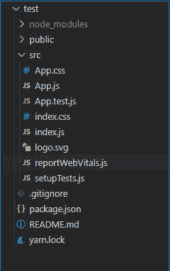
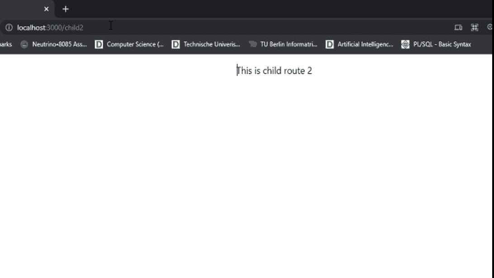

# 为什么会出现“路由器可能只有一个子元素”的警告？

> 原文:[https://www . geesforgeks . org/why-to-get-router-may-only-one-child-element-warning/](https://www.geeksforgeeks.org/why-to-get-router-may-have-only-one-child-element-warning/)

React Router Dom 是导航组件的集合，这些组件以声明方式与您的应用程序组合在一起。无论你想为你的网络应用程序提供可书签的网址，还是在 React Native 中提供一种可组合的导航方式，React Router Dom 都可以在这两个地方工作。我们将考虑现在可用的 React-router 的最新版本，即 react-router-dom v5.3.0。

**React-router-DOM 的特性:**

*   对 React 16 更好的支持和优化。
*   在***<>***中不显示任何警告。
*   引入新的上下文应用编程接口。
*   全自动发布。
*   向后兼容 react-router-v4。

**语法:**

```html
import { Route, Link, BrowserRouter as 
        Router } from 'react-router-dom'
<Router>
    <div>
        <Route path="/" component={App} /> </div>
</Router>

```

上面的代码片段表明了 react-router 是如何工作的。我们首先从 react-router-dom 依赖项中导入所需的标签。请注意，它是作为路由器写入浏览器的。这就是为什么我们可以使用标签 **<路由器>** 来表示 **<浏览器>** 。<路由器>标签是应用程序路由功能的起点。如果在<路由器>组件中声明了一条路径，那么该路径将作为我们可以导航到的 react 应用程序中的一个新页面变得可访问。为了指定 **<路由器>** 内部的路径，我们使用 **<路由** >组件，该组件接受一个名为 pat **h** 的参数，从上面的例子中可以看出。在这里，我们通过将路径参数传递给新网页来创建新网页的路径。组件参数用于构成网页在到达路径参数中指定的路径时将呈现的数据。

**注意:**路径“/”表示默认路径或 home，表示指定执行后，路由器会将我们路由到 app 的起点或 app 的主页。要创建一个自定义路径，只需将“/pathname”和一个新的路径放入应用程序中，就会创建一个新的网页，名称为“pathname”。

**反应路由器的优势:**

*   以标准化的结构查看声明有助于我们立即理解我们的应用视图是什么
*   代码的延迟加载。
*   使用 React-router 的 **useHistory** 钩子，我们可以向前和向后导航，甚至恢复我们应用的状态。
*   我们有能力在从一个页面导航到另一个页面时编写 CSS 转换代码。
*   提供标准化的应用程序结构。在与大型团队合作时非常有用。

**得到警告/错误的原因:**所以，来到本文的动机，新手开发者在使用 react-router 工作时经常会遇到一个非常流行的警告，简称为“ **Router 可能只有一个孩子**”。在知道如何解决这个问题之前，让我们先了解为什么会出现这个问题。通常，基于反应的环境中的导航用于整个应用程序。这就是为什么像**浏览器**或**路由器**这样的 React 组件期望只有顶级组件 ***<应用程序>*** 应该包含在其中。因此，当多个路由被列为子路由时，它们无法工作。

**解决方案:**然而，这个问题的解决方案相当简单。您只需将多条路线包含在一个***<>***标签或一个 ***<开关>*** 标签中。由于***<>***开关是唯一的，并且它能够专门渲染路线，因此<开关>标签在这两个标签中最受欢迎。

**创建反应应用程序:**

**步骤 1:** 要创建 react 项目，请打开命令提示符并编写以下命令:-

```html
npx create-react-app test
```

**步骤 2:** 现在通过键入以下命令导航到新创建的目录:

```html
cd test
```

**项目结构:**如下图。



项目结构

**第三步:**这里我们只修改 ***App.js*** 文件。这段代码将抛出错误，“**路由器可能只有一个子级**，因为您可以看到多个路由已经包含在单个 ***<路由器>*** 标记内，这是不支持的。

## App.js

```html
import React from 'react';
import './App.css';
import {
  BrowserRouter as Router,
  Switch,
  Route,
  Redirect
} from "react-router-dom";

function App() {
    return (
    <div className="App">
      <Router>
        <Route path='/child1'>
          <div>
            <p>This is child route 1</p>
          </div>
        </Route>
        <Route path='/child2'>
          <div>
            <p>This is child route 2</p>
          </div>
        </Route>
      </Router>
    </div>
    );
}

export default App;
```

**第 4 步:**这里我们做了一个重要的改变，即多条路线现在被包含在一个 ***<开关>*** 标签中，因此这段代码片段将完美运行。

## App.js

```html
import React from "react";
import "./App.css";
import {
  BrowserRouter as Router,
  Switch,
  Route,
  Redirect,
} from "react-router-dom";

function App() {
  return (
    <div className="App">
      <Router>
        <Switch>
          <Route path="/child1">
            <div>
              <p>This is child route 1</p>
            </div>
          </Route>
          <Route path="/child2">
            <div>
              <p>This is child route 2</p>
            </div>
          </Route>
        </Switch>
      </Router>
    </div>
  );
}

export default App;
```

**运行应用程序的步骤:**打开终端，键入以下命令。

```html
npm start
```

**输出:**



更改路线以显示新网页

这就是如何轻松解决“**路由器可能只有一个孩子**”的问题。