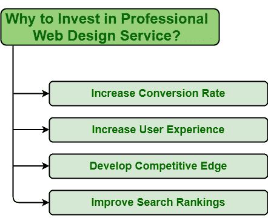

# 为什么要投资专业的网页设计服务？

> 原文:[https://www . geesforgeks . org/为什么要投资专业网页设计服务/](https://www.geeksforgeeks.org/why-to-invest-in-professional-web-design-services/)

网站是联系用户和客户的最好方式。对于企业和用户来说，拥有一个网站都是非常重要的。一段时间后，网站变得过时，远远落后于新的发展技术。每当有人开始在网上推广他们的公司时，给网站留下一个积极的印象是非常必要的。一个人必须为他们的业务创建一个专业的、用户友好的、功能强大的网站，这样他们才能取得更多的成功，并领先于他们的竞争对手。

网站是最重要的商业来源。投资专业的网页设计服务是最重要的。在下面，提到了为什么你应该投资专业的网页设计服务的一些原因。

**1。提高转化率:**转化率基本定义为用户访问网站并在网站上采取销售、购买等期望行为的总百分比。提升网站转化率应该是首要任务。是的，一个人可以很容易地吸引用户到他们的网站，但重要的是如何让他们转换？一个网站有多有效非常重要。专业的网页设计服务是提高转化率的最佳方式，因为它们提供了一些功能，例如提供正确的价值主张，使导航变得容易，向网站添加实时聊天，创建引人注目的标题等。

**2。增加用户体验:**用户体验真的很重要，因为它只会决定一个公司或企业的成长。在设计网站时，应该以提供积极的体验为目标，以保持用户对产品或品牌的忠诚。网站的用户体验越多，就越能为企业带来更大的投资回报。因此，要增加用户体验，必须投资专业网站。专业的网页设计服务通常会提高可视性和可读性，提高可用性，允许用户轻松访问信息，改善导航等。这反过来将提高用户体验。

**3。发展竞争优势:**竞争优势是区分公司与竞争对手的最佳方式。这应该是任何企业或公司最重要的目标，因为没有任何竞争优势，根本不可能生存。为了发展竞争优势，人们需要产生这样的属性，使他们比竞争对手表现得更好。这就是专业网站的作用。专业的网页设计服务通常会改善用户或客户的最初印象，并确保企业领先于其他竞争对手。它增加了业务价值，并导致业务增长。

**4。提高搜索排名:**每当我们想在网上寻找一些服务或产品时，我们所做的就是搜索。在平板电脑、笔记本电脑、手机等各种设备上。人们只会搜索以找到他们正在寻找的东西。因此，为了与更多的客户联系，你的网站应该在搜索引擎中排名靠前，应该在搜索结果的第一页排名。这就是专业的网页设计服务。借助这样的设计服务，人们可以确保网站排名靠前，也可以确保您的网站提供并改善更好的用户体验。