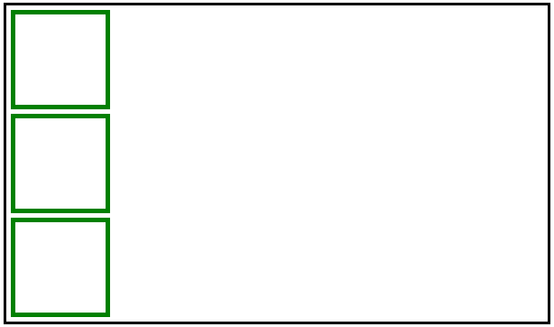
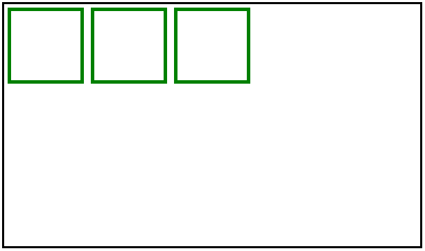
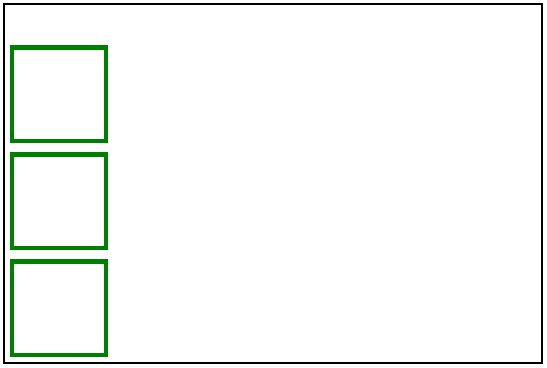
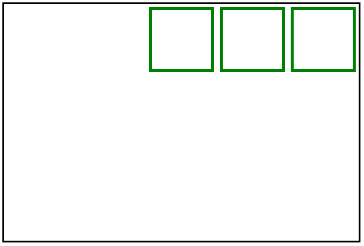
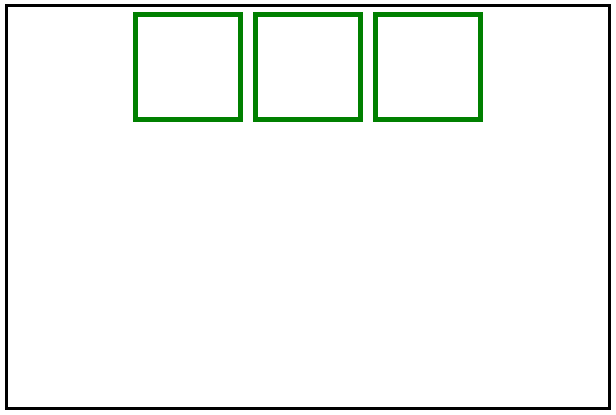
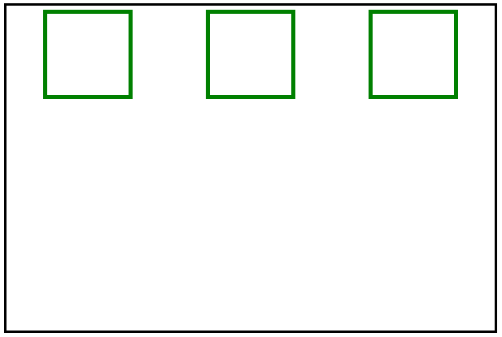
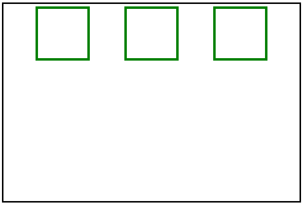
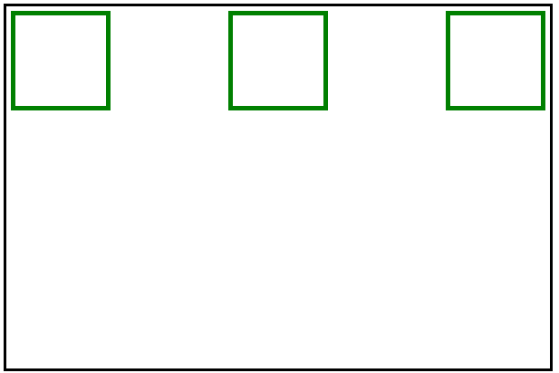

# 为什么要用 flexbox 而不是 floats？

> 原文:[https://www . geeksforgeeks . org/为什么要用 flexbox 代替 floats/](https://www.geeksforgeeks.org/why-would-you-use-flexbox-instead-of-floats/)

在我们深入研究 flexbox 和 float 之前，我们将了解 flexbox 和 float。

[**【Flexbox】**](https://www.geeksforgeeks.org/introduction-to-css-flexbox/)**是一个 css3 布局模型，提供了一种简单干净的方式来用容器排列项目。**

****以下是在彩车上使用 flexbox 的原因。****

1.  **使用 flexbox 定位子元素变得更加容易。**
2.  **Flexbox 反应灵敏，移动友好。**
3.  **Flex 容器的页边距不会随着其内容的页边距而折叠。**
4.  **我们可以很容易地改变网页上元素的顺序，甚至不用在 HTML 中做任何改变。**

****这些是 flexbox 模型的重要概念。****

1.  **Flexbox 是一个与方向无关的布局模型。**
2.  **Flexbox 能够改变项目的宽度和高度，使其最适合容器的可用空间。**
3.  **Flex 值适用于称为 flex container 的容器的*显示*属性以及容器的内容或 flex 子项。**
4.  **Flexbox 有一个用来制作灵活容器的重要属性列表。它们是*伸缩方向、伸缩包装、伸缩流动、对齐内容、对齐项目、对齐内容。***

****示例:**在本例中，我们将解释 flex 相对于 float 的优势。通过解释 flex 属性。**

## **超文本标记语言**

```
<!DOCTYPE html>
<html lang="en">
<head>
    <meta charset="UTF-8" />
    <meta http-equiv="X-UA-Compatible" 
          content="IE=edge" />
    <meta name="viewport"
          content="width=device-width, 
                   initial-scale=1.0" />

    <link rel="stylesheet" href="main.css" />
    <style>
    .flex-container {
        height: 350px;
        width: 600px;
        border: 3px solid black;

    }
    .flex-items{
        margin: 5px;
    }
    #one {
        height: 100px;
        width: 100px;
        border: 5px solid green;
    }
    #two{
        height: 100px;
        width: 100px;
        border: 5px solid green;

    }
    #three{
        height: 100px;
        width: 100px;
        border: 5px solid green;

    }
    </style>
</head>
<body>
    <div class="flex-container">
    <div id="one" 
         class="flex-items">
    </div>
    <div id="two" 
         class="flex-items">
    </div>
    <div id="three" 
         class="flex-items">
    </div>
    </div>
</body>
</html>
```

****输出:**在本例中，我们对较大的容器应用了 ***显示:flex*** 属性，使其具有灵活性。**

****

**在上面的代码中，我们可以更改类*的 CSS 代码。柔性容器*如下所示。**

****代码片段:****

## **半铸钢ˌ钢性铸铁(Cast Semi-Steel)**

```
.flex-container {
        display: flex;       
        height: 350px;
        width: 600px;
        border: 3px solid black;
      }
```

****输出:**所以我们可以看到，在应用*来伸缩*属性之后，它会自动在水平方向排列子容器，这是它的默认值。我们可以根据应用程序排列子项目的需要进行更改。**

****

**[**CSS 柔性方向属性:**](https://www.geeksforgeeks.org/css-flex-direction-property/)柔性方向属性是柔性盒布局模块的子属性。它确立了柔性物品的主轴。**

**Flex-direction 有一些值。**

*   **伸缩方向:列**
*   **伸缩方向:行**
*   **伸缩方向:列反转**
*   **弯曲方向:行反转**

****代码片段:**只需在上述 HTML 代码的 CSS 部分更改类 *flex-container* 的类属性。其他片段中也进行了类似的更改。**

## **半铸钢ˌ钢性铸铁(Cast Semi-Steel)**

```
.flex-container {
        display: flex; 
        flex-direction:column;      
        height: 400px;
        width: 600px;
        border: 3px solid black;
      }
```

****输出:****

****

****代码片段:****

## **半铸钢ˌ钢性铸铁(Cast Semi-Steel)**

```
.flex-container {
        display: flex; 
        flex-direction:row;      
        height: 400px;
        width: 600px;
        border: 3px solid black;
      }
```

****输出:****

****

****代码片段:****

## **半铸钢ˌ钢性铸铁(Cast Semi-Steel)**

```
.flex-container {
        display: flex; 
        flex-direction:column-reverse;      
        height: 400px;
        width: 600px;
        border: 3px solid black;
      }
```

****输出:****

****

****代码片段:****

## **半铸钢ˌ钢性铸铁(Cast Semi-Steel)**

```
.flex-container {
        display: flex; 
        flex-direction:row-reverse;      
        height: 400px;
        width: 600px;
        border: 3px solid black;
      }
```

****输出:****

****

**[**CSS Flex-wrap 属性:**](https://www.geeksforgeeks.org/css-flex-wrap-property/) Flex-wrap 属性用于根据所有元素的父容器对其进行包装，从上面的例子来看如果我们在不应用 wrap 属性的情况下减少父容器的宽度，那么它会挤压子元素的大小以保持容器的灵活性。**

**[**CSS 柔流属性:**](https://www.geeksforgeeks.org/css-flex-flow-property/) 柔流属性不是单一属性。在这种情况下，flex-direction 和 flex-wrap 是结合在一起的，或者我们可以说它是 flex-direction 和 flex-wrap 属性的简写属性。**

**[**CSS 正名-内容属性:**](https://www.geeksforgeeks.org/css-justify-content-property/) 正名-内容属性用于子元素的定位对齐。**

****调整-内容:开始:**从容器开始排列所有子元素**

****代码片段:**只更改第一个 HTML 代码中 CSS 部分的 *flex-container* 类。**

## **半铸钢ˌ钢性铸铁(Cast Semi-Steel)**

```
.flex-container {
        display: flex; 
        justify-content:start;
        height: 400px;
        width: 600px;
        border: 3px solid black;
      }
```

****输出:****

****

****对齐-内容:中心:**将所有子元素放置在容器的中心周围**

****代码片段:****

## **半铸钢ˌ钢性铸铁(Cast Semi-Steel)**

```
.flex-container {
        display: flex; 
        justify-content:center;
        height: 400px;
        width: 600px;
        border: 3px solid black;
      }
```

****输出:****

****

****对齐-内容:空格-环绕:**在子元素之间放置空格，并将它们分散到整个容器中。**

****代码片段:****

## **半铸钢ˌ钢性铸铁(Cast Semi-Steel)**

```
.flex-container {
        display: flex; 
        justify-content:space-around;
        height: 400px;
        width: 600px;
        border: 3px solid black;
      }
```

****输出:****

****

****alignment-content:space-equally:**排列所有子元素，它们之间的空间均匀分布，并保持在父容器的中心。**

****代码片段:****

## **半铸钢ˌ钢性铸铁(Cast Semi-Steel)**

```
.flex-container {
        display: flex; 
        justify-content:space-evenly;
        height: 400px;
        width: 600px;
        border: 3px solid black;
      }
```

****输出:****

****

****调整内容:间隔:**仅在子容器之间留出空间。**

****代码片段:****

## **半铸钢ˌ钢性铸铁(Cast Semi-Steel)**

```
.flex-container {
        display: flex; 
        justify-content:space-between;
        height: 400px;
        width: 600px;
        border: 3px solid black;
      }
```

****输出:****

****

****这些都是彩车的重要概念。****

1.  **Float 是一个定位布局模型。**
2.  **Float 只关注元素或项目如何在容器中浮动。**
3.  **Float 只能将项目放置在相应容器的右侧或左侧。**
4.  **如果显示是绝对的，则浮动不起作用。**
5.  **浮动最适合小布局定位。**
6.  **float 有一些属性，例如 float:right，float:left，float:none，float:inherit，float:inline-start，float:inline-end，float:initial，float:unset**

**总之，我们可以说 flexbox 和 floats 是实现良好布局模型的完全不同的功能。使用浮动，我们只能将物品放在左边或右边，但是使用 flexbox，我们可以在四个方向上修改我们的模型。Flexbox 是 CSS 中的一个新概念，利用 flexbox 的一些重要特性来实现一个响应性网页。我们应该在彩车上使用弹性箱。**