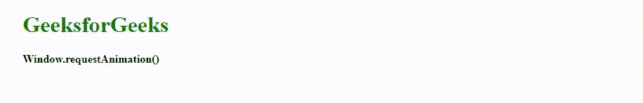

# Window | Window . requestanimationframe()方法

> 原文:[https://www . geesforgeks . org/window-window-requestanimationframe-method/](https://www.geeksforgeeks.org/window-window-requestanimationframe-method/)

如今，各种网络开发技术被引入来创建优雅的网页。在谈论优雅的网页时，我想到的最重要的事情之一是动画。有很多方法可以生成它们，现代 CSS 就是其中之一，但是 JavaScript 一直是一个强大的选项。

**requestAnimationFrame()** 是 JavaScript 中呈现的方法之一，可以在我们的项目中强有力地结合惊人而简单的动画。使用了早期的方法，如 [**setTimeout()** 或 **setInterval()**](https://www.geeksforgeeks.org/java-script-settimeout-setinterval-method/) ，这没问题，但它们会减慢整个过程。他们的主要问题是同步。过渡时间非常慢，与用户的系统不完全匹配。

这里 **requestAnimationFrame()** 进入画面。基本上， **requestAnimationFrame()** 方法很容易与浏览器计时同步，并在实际加载屏幕之前生成一个调用来执行特定的动画。此外，当动画实际上不在使用中时，它还会减慢其进程，从而节省资源。

**语法:**

```html
window.requestAnimationFrame( callback );
```

**参数:**该方法接受如上所述的单个参数，描述如下:

*   **回调:**除非你想让动画停止，否则你应该编写回调函数，这样它就会调用自己，从而请求下一帧。回调函数采用时间戳或简单的时间值，在这个时间值它应该开始执行。

**返回值:**该方法返回一个非零长整数值，作为回调函数中动画条目的唯一标识。

以下示例说明了网络应用编程接口中的**请求动画框架()**方法:

**例 1:**

```html
<!DOCTYPE html>
<html>
<head>
    <title>
        Window.requestAnimationFrame() Method
    </title>
</head>

<body>
    <div id="gfg">
        <h1 style="color:green;">GeeksforGeeks</h1>
        <h4>Window.requestAnimation()</h4>
    </div>

    <script type="text/javascript">

        // Setting the start point for animation
        var start = null; 
        var element = document.getElementById('gfg');

        function startAnim(timestamp) {

            // Timestamp is an integer that represents the number 
            // of seconds elapsed since January 1 1970.
            if (!start) start = timestamp;

            // Setting the difference between timestamp 
            // and the set start point as our progress
            var progress = timestamp - start;

            // Moving our div element
            element.style.transform = 
            'translateX(' + Math.min(progress / 10, 700) + 'px)';
            window.requestAnimationFrame(startAnim);
        }

        window.requestAnimationFrame(startAnim);
    </script>
</body>

</html>                    
```

**输出:**


**例 2:**

```html
<!DOCTYPE html>
<html>

<head>
    <style>
        div {
            position: absolute;
            left: 10px;
            top: 50px;
            padding: auto;
            color: white
        }
        h1 {
            color: green;
        }
    </style>
</head>

<body>
    <div id="gfg">
        <h1>GeeksforGeeks</h1></div>
    <center>
        <button onclick="start()">Start the animation</button>
    </center>
    <script type="text/javascript">
        var x = document.getElementById("gfg");

        // Initializing variables
        var requestId;
        var stopped;
        var starttime;

        function startAnim(time) {

            // Set left style to a function of time if it is not stopped
            if (!stopped) {

                // We use the difference between time returned 
                // by Data.now() and the animation starttime 
                x.style.left = ((Date.now() - starttime) / 10 % 700) + "px";
                requestId = window.requestAnimationFrame(startAnim);
            }
        }

        function start() {

            // Return the number of milliseconds since 1970/01/01:
            starttime = Date.now();

            // Starting point of animation
            requestId = window.requestAnimationFrame(startAnim);
            stopped = false; // Means animation will not stop 
        }
    </script>
</body>

</html>
```

**输出:**


**支持的浏览器:****window . requestanimationframe()方法**支持的浏览器如下:

*   谷歌 Chrome 23.0
*   Internet Explorer 10.0
*   Firefox 11.0
*   opera10.0
*   Safari 6.1