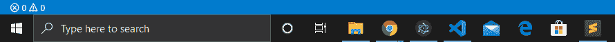
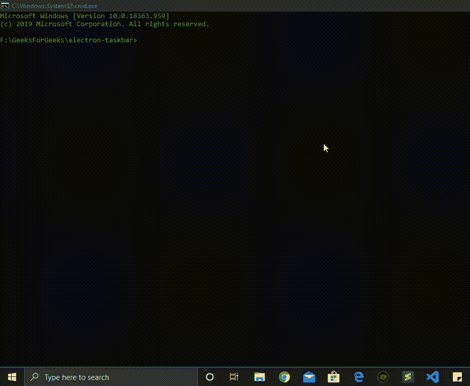

# 电子邮件中的窗口任务栏操作

> 原文:[https://www . geesforgeks . org/windows-任务栏-operations-in-electronijs/](https://www.geeksforgeeks.org/windows-taskbar-operations-in-electronjs/)

[**electronijs**](https://www.geeksforgeeks.org/introduction-to-electronjs/)是一个开源框架，用于使用能够在 Windows、macOS 和 Linux 操作系统上运行的 HTML、CSS 和 JavaScript 等网络技术构建跨平台的本机桌面应用程序。它将铬引擎和[T5 节点 T7】结合成一个单一的运行时。](https://www.geeksforgeeks.org/introduction-to-nodejs/)

根据官方定义，**任务栏**是位于屏幕底部的操作系统的一个元素。它允许我们通过**开始菜单**定位和启动程序，或者查看当前打开的任何程序。任务栏的右侧是**通知区**，允许我们查看日期和时间、后台运行的项目等。所有在*视窗*操作系统平台上支持的现代桌面应用程序都可以与这个视窗任务栏交互。一些更常见的任务栏操作包括在原始图标上显示覆盖图或闪烁应用程序的图标来通知用户。电子还为我们提供了一种方法，通过这种方法，我们可以使用**浏览器窗口**对象的实例方法与这个窗口任务栏进行交互。本教程将演示这些常见的 Windows 任务栏操作。有关电子如何与通知区域交互的更多信息，请参考文章: [**电子中的自定义通知**](https://www.geeksforgeeks.org/custom-notifications-in-electronjs/) 。更复杂的 Windows 任务栏操作，如为应用程序显示自定义缩略图工具栏等，将在单独的文章中介绍。

我们假设您熟悉上述链接中介绍的先决条件。电子要工作， [**节点**](https://www.geeksforgeeks.org/introduction-to-nodejs/) 和 [**npm**](https://www.geeksforgeeks.org/node-js-npm-node-package-manager/) 需要预装在系统中。

*   **项目结构:**


**示例:**按照 [**电子表格**](https://www.geeksforgeeks.org/desktop-operations-in-electronjs/) 中的桌面操作步骤设置基本的电子应用程序。复制文章中提供的 **main.js** 文件和**index.html**文件的样板代码。此外，对**包进行必要的更改，以启动电子应用程序。我们将继续使用相同的代码库构建我们的应用程序。设置电子应用程序所需的基本步骤保持不变。根据项目结构创建**资产**文件夹。该**资源的**文件夹将包含*image.png*文件，该文件将用作窗口任务栏的覆盖图像。在本教程中，我们使用了电子标志作为*image.png*文件。
T21**

```html
{
  "name": "electron-taskbar",
  "version": "1.0.0",
  "description": "Windows Taskbar Operations in Electron",
  "main": "main.js",
  "scripts": {
    "start": "electron ."
  },
  "keywords": [
    "electron"
  ],
  "author": "Radhesh Khanna",
  "license": "ISC",
  "dependencies": {
    "electron": "^8.3.0"
  }
}

```

**输出:**

[](https://media.geeksforgeeks.org/wp-content/uploads/20200512225834/Output-1105.png)

**Windows 任务栏电子操作:****浏览器窗口**实例是**主进程**的一部分。要在**渲染器进程**中导入和使用**浏览器窗口**，我们将使用电子**远程**模块。如上所述，最常见的两种 Windows 任务栏操作是图标覆盖和闪烁图标效果。我们将通过代码详细介绍这两种操作。

**窗口任务栏中的图标覆盖图**

*   **据官方 MSDN:**

> 图标覆盖用作状态的上下文通知，旨在消除对单独的通知区域状态图标的需要，以将该信息传达给用户。例如，当前显示在通知区域中的微软 Outlook 中的新邮件状态，现在可以通过任务栏按钮上的覆盖来指示。同样，您必须在开发周期中决定哪种方法最适合您的应用程序。叠加图标旨在提供重要的长期状态或通知，如网络状态、信使状态或新邮件。不应该向用户呈现不断变化的覆盖图或动画。”

在 electronic 中，我们可以使用一个小的覆盖图标来设置原始应用图标。这可用于显示应用程序状态，并可进行相应的更改。最初启动电子应用程序时，它会在 Windows 任务栏中显示一个应用程序图标，如下所示:

[](https://media.geeksforgeeks.org/wp-content/uploads/20200725143438/Output-1111.png)

*   **index.js** :在该文件中添加以下代码片段。

## java 描述语言

```html
const electron = require('electron')
const path = require('path');

// Import BrowserWindow using Electron remote
const BrowserWindow = electron.remote.BrowserWindow;
let win = BrowserWindow.getFocusedWindow();

win.setOverlayIcon(
      path.join(__dirname, '../assets/image.png'), 'Overlay Icon Description');

setTimeout(() => {
    win.setOverlayIcon(null, '');
}, 5000);
```

**说明:****win . setoverlayicon(叠加，描述)**实例方法**浏览器窗口**对象仅在 Windows OS 中受支持。这个实例方法在被调用时会在当前任务栏图标上设置一个 16 x 16 像素的覆盖图像。如上所述，它通常用于传达某种应用程序状态或被动通知用户。此实例方法没有返回类型。它采用以下参数:

*   **叠加:NativeImage** 此参数表示 [**NativeImage**](https://www.electronjs.org/docs/api/native-image) 图标显示在 Windows 任务栏中应用程序图标的右下角。如果该参数设置为**空**，覆盖图标被清除。 **NativeImage** 实例专门为电子应用程序设计，使用 **PNG** 或 **JPG** 文件创建系统托盘、坞站、任务栏和应用程序图标。
*   **描述:字符串**该参数提供了将提供给辅助功能屏幕阅读器的覆盖图标的描述。当从任务栏图标中清除覆盖时，一个**空的**字符串值可以传递给该参数。

在上面的代码中，我们使用了 NodeJS 路径模块的 [**path.join()**](https://www.geeksforgeeks.org/node-js-path-join-method/) 方法从 **assets** 文件夹中获取*image.png*文件。我们还使用了 [**setTimeout()**](https://www.geeksforgeeks.org/java-script-settimeout-setinterval-method/) 功能来模拟 **5s** 后从 Windows 任务栏移除覆盖图标。
**输出:**

[](https://media.geeksforgeeks.org/wp-content/uploads/20200725153540/Output-3-GIF.gif)

**Windows 任务栏中的闪帧效果**

*   **据官方 MSDN:**

> 通常，会闪烁一个窗口，通知用户该窗口需要注意，但当前没有键盘焦点

*   **index.js** :在 electronic 中，我们可以突出显示应用程序的任务栏图标，并使其闪烁以通知用户。图标的闪烁效果可以持续特定的时间间隔，也可以持续到特定的事件发生。如果通知是紧急的，我们甚至可以让图标闪烁，直到用户没有明确关注应用程序窗口。这类似于在 macOS 上弹出坞站图标。

## java 描述语言

```html
const electron = require('electron')
const path = require('path');

// Import BrowserWindow using Electron remote
const BrowserWindow = electron.remote.BrowserWindow;
let win = BrowserWindow.getFocusedWindow();

setTimeout(() => {
    win.flashFrame(true);
}, 5000)

win.once('focus', () => win.flashFrame(false));
```

**说明:****浏览器窗口**对象的 **win.flashFrame(标志)**实例方法根据提供的**标志:布尔**参数开始或停止窗口任务栏中应用程序图标的闪烁。这是吸引用户注意力的有效方法，在所有现代桌面应用程序中都有使用。此实例方法没有任何返回类型。在上面的代码中，我们已经使用了 [**setTimeout()**](https://www.geeksforgeeks.org/java-script-settimeout-setinterval-method/) 功能来模拟 Windows 任务栏中的闪烁图标效果。应用启动后 **5s** 会激活闪烁效果。

**注意:**如果在**标志**参数设置为**假**的情况下没有调用该实例方法，闪烁将无限持续。在上面的代码中，我们用**标志调用:当应用程序窗口进入**焦点**时，即当当前浏览器窗口实例上发出**焦点**事件时，为假**。关于获取当前**浏览器窗口**实例的 BrowserWindow.getFocusedWindow()静态方法的详细说明，请参考文章: [**电子 JS 中的仿真**](https://www.geeksforgeeks.org/emulation-in-electronjs/) 。
**输出:**

[](https://media.geeksforgeeks.org/wp-content/uploads/20200725154113/Output-4-GIF1.gif)