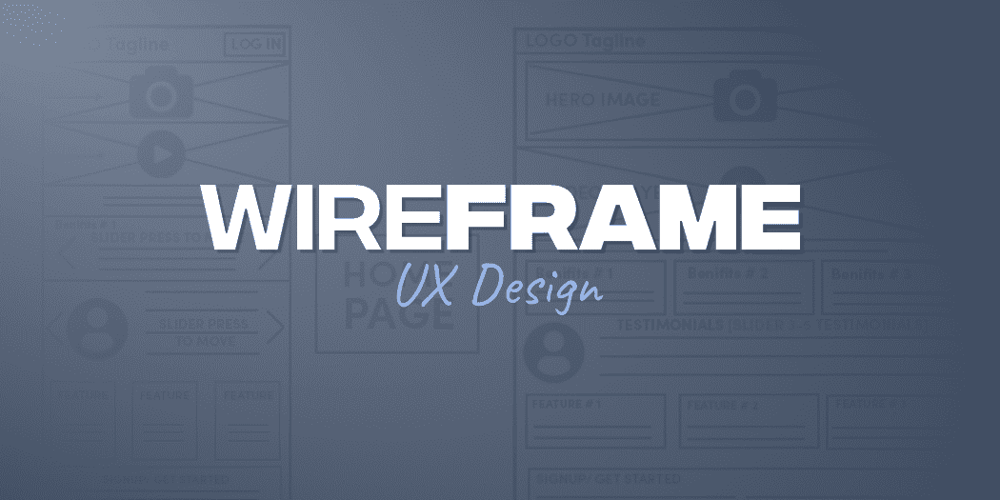
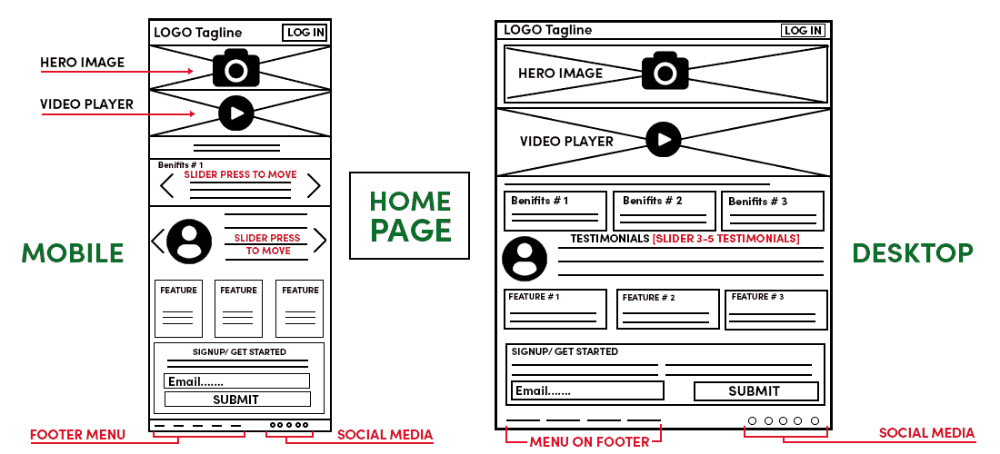
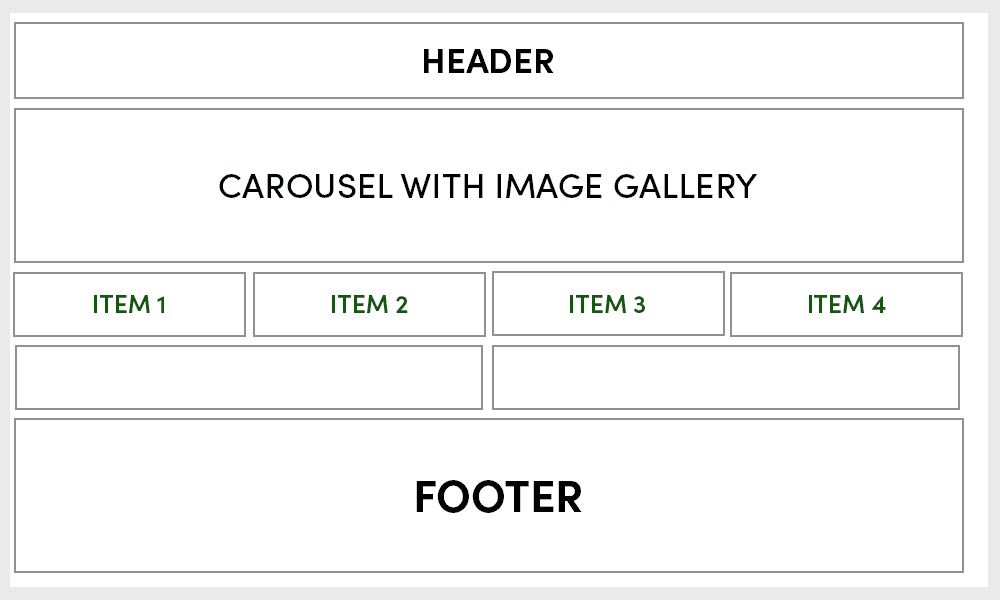
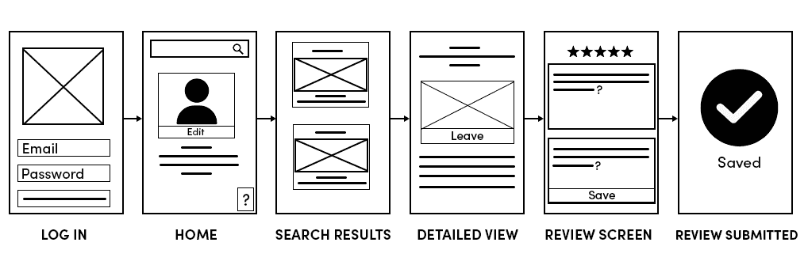
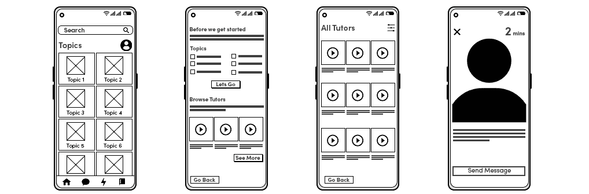
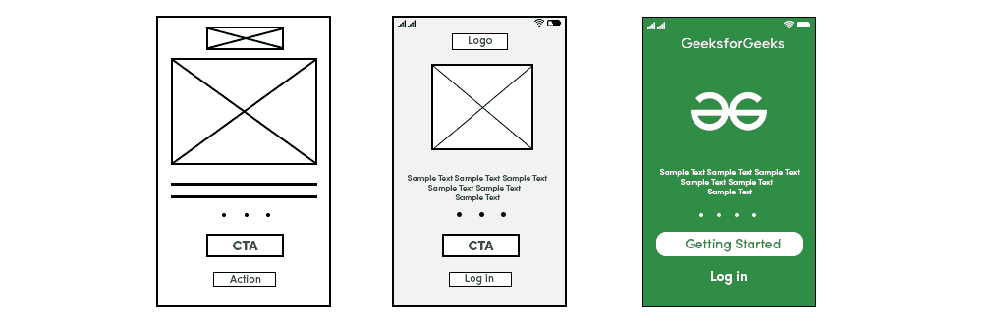

# UX 设计中的线框–初学者指南

> 原文:[https://www . geesforgeks . org/线框-in-UX-design-a-初学者指南/](https://www.geeksforgeeks.org/wireframe-in-ux-design-a-beginners-guide/)

如果你是 UX 设计师，那么我们想问你几个简单的问题…

如何决定网页导航栏中的组件或元素？

你如何决定你的网页需要四列网格还是三列网格？

你会如何决定你的手机应用需要选择一个可滚动的项目或一个固定高度的固定项目？

图像放在哪里？视频放在哪里？链接放在哪里？在哪里列出项目？

以上所有问题都需要在你构建应用的时候回答。对于一个小而简单的网站来说，这些东西是清晰的，也是可以忽略的，但是对于 Flipkart、Amazon 或者 Zomato 这样的大公司来说，这些东西是不能忽略的。

在这个博客中，我们将回答以上所有问题，我们将讨论这些东西是如何在谷歌、微软、优步、Flipkart 等大公司设计和生产的。

在 UX 的设计中有一个线框的概念，大多数设计师遵循这个概念在某个大公司工作或为大客户工作。如果你是一个初学者，或者你在一些小的创业公司工作，那么这可能是一个新的专业术语。所以让我们详细讨论这个话题，了解它到底是什么，为什么设计师要遵循它的概念。

### 什么是线框？

线框只是你希望数据如何显示在页面上的一个想法。它基本上是网页的蓝图或框架，代表你的产品应该是什么样子。

一个好的线框代表了网页的整体结构和这些页面上的导航流程。想象你正在设计一个移动应用。使用线框时，您需要为用户移动的每个屏幕创建一个线框。

线框用于定义和规划页面或屏幕上的信息层次。页面上的项目应该如何组织，哪些内容应该放在哪里，比如导航栏、图片、视频等。应该如何分配空间？有哪些功能？基本上在 Wireframing 中，您代表不同元素的定位，如按钮、菜单、图像、视频和标题。

线框是关于我们希望用户在第一端看到什么样的数据，称为主要数据，以及哪些数据可以移动到第二页，以便用户点击它并看到这些数据。

如果你看到一个黑白的二维页面界面图，那么很可能是一个线框。

在线框中，请记住，您的主要目标不是表示按钮应该是什么样子，或者需要使用什么颜色、图像、视频、段落或标语。

下面是一个线框的例子…

### 线框的优点

大公司在真正进入编码部分之前会创建线框，但是如果你是一个自由职业者，那么你肯定会面临很多问题。

想象一个场景，你正在开发一个产品，你在收集需求后开始构建它。如果你的客户要求你定期更换网页上的东西，你会有什么感觉？如果你的客户每次都嘲笑你在你的网页上到处移动东西怎么办？

以上所有案例，对 UX 设计师来说，真的是令人沮丧。在 UX 的设计过程中，定期改变不是一个好的做法。它增加了成本，你在开发阶段投入了更多的资金。

如果在移动到编码部分之前创建线框，就可以解决这些问题。你的客户也可以为你创建，他/她也可以展示网站应该是什么样子。这完全取决于你们俩。

线框是了解用户如何通过不同元素的定位与用户界面交互的好方法。它让你清楚你的最终产品应该是什么样子。线框让开发人员和设计人员更容易进入编码或开发阶段。

### 如何创建线框？

***“理论概念讲够了，开门见山让我们知道如何创建*** **一个** ***线框？如何实际使用？有哪些不同的方法来创建线框“***

我们知道你的大脑现在正在伤害阅读所有的线框架的概念，现在你想尖叫与上述声明。

***放松……让我们进入实际细节，了解不同的线框创建方式***

如果你在一些大公司工作，那么你肯定知道关于线框的一切，但是对编程或在一些初创公司工作不熟悉的人，需要了解创建线框的不同方法…

您可以选择下面给出的任何一个来为您的软件创建线框…

1.用纸和笔(*是的……你童年在学习上最好的朋友。老是金…*)

2.使用一些在线工具或软件。

手工绘制你的线框是保持事物基本的好方法，并且抵制迷失在不必要的细节中的诱惑。一旦你对你的手绘线框满意，你可以切换到数字线框。

为了创建数字线框，网上有很多软件和工具。 **Balsamiq 和 Invision** 是开发者中最受欢迎的软件。数字线框允许您跟踪线框的进度，并记录您在此过程中做出的某些决定。数字线框也更容易共享。

### 线框的类型

你知道如何创建线框。现在是时候研究更多的细节，了解线框的不同类别以及如何区分它们了。线框主要有三类，根据它们包含的细节数量，您可以区分每一类。让我们深入了解每一个细节…

#### 1.低保真度线框

软件的基本视觉结构用低保真度线框表示。这些基本上是你的应用程序网页的草图，它被认为是软件设计的起点。

不需要在低保真度线框中添加太多细节。仅添加简单的图像、块形状和基本元素，如标题、标签等。添加太多细节会分散注意力，所以尽量保持简单。您可以创建低保真度的线框，而不必太担心比例、网格或像素精度。

当您开始与涉众对话时，这些线框非常有用，您需要向客户提供应用程序的大致草图。你们两个决定基本布局，例如导航布局和映射用户流。

#### 2.高保真线框

中保真度线框比低保真度线框有一些详细和准确的描述。在三种线框中，中保真线框是设计者最常用的，因为它既不花太多时间来创建(像高保真度)，也不给涉众很少的细节(像低保真度)。这些线框与产品设计早期阶段的创建相关。

这些线框也避免了图像或排版等干扰。在中保真线框中，软件和功能的各种组件清晰可见，并且可以很容易地相互区分。不同的文本权重可用于将标题与正文内容分开。有时设计师会使用线框中的灰色阴影来突出其中的单个元素。这些线框可以使用软件 Sketch 或 Balsamiq 创建。

#### 3.高保真线框

高保真线框代表了比中保真线框更详细的描述。这些线框拥有像素特定的布局。在低保真度线框中，我们用一些伪拉丁文本填充符表示内容，对于图像，我们创建一些用“X”填充的灰色框。这不是高保真线框的情况。高保真线框可能包括实际的特色图像和相关的书面内容。

通过对高保真线框的详细描述，很容易理解和记录复杂的概念，如菜单系统或交互式地图。

### 最终想法

你可能已经理解了线框的大部分基本概念。作为一名 UX 设计师，了解这些概念很重要，尤其是如果你在一家初创公司工作，或者你是 UX 设计领域的新手。很多公司在职位描述中都提到了线框设计的知识。他们期望候选人具备这些技能。

在软件设计的初始阶段创建线框消除了你和涉众之间的大部分困惑。线框设计节省了大量的时间和金钱。此外，你阻止自己在软件设计中做各种改变。

当你的客户认可你的线框时，你自信地进入产品设计的下一步。