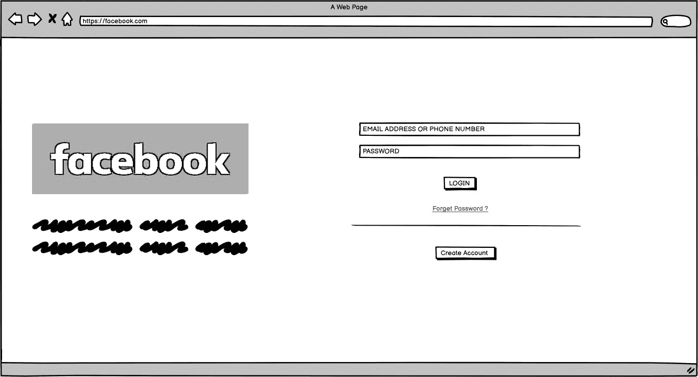

# 线框

> 原文:[https://www.geeksforgeeks.org/wireframing/](https://www.geeksforgeeks.org/wireframing/)

我们都知道，在建房子之前，我们想要一个蓝图，以平稳的方式建造它，同样，在建网站之前，我们也想要一个我们网站的蓝图，这个蓝图被称为**线框。**

换句话说，我们可以说线框是网站上元素的基本视觉表示，也可以说它是我们网站的草图。在结构层次上设计网站服务的过程称为线框架。线框在开发过程的早期用于在添加视觉设计和内容之前建立页面的基本结构。

**线框有两种设计方式–**

*   使用纸和笔
*   使用一些工具，如油漆和巴尔沙米。

使用纸笔设计线框有些过时，因为有许多工具可以帮助我们以更好的方式设计线框。但是，许多开发人员正在使用这种方式来设计他们的网站。

**为什么线框对任何项目都很重要？**

*   建造任何房子都需要一张蓝图，同样，线框也是任何节省大量时间的应用程序的蓝图。
*   线框有助于更精确地评估应用程序开发项目。
*   线框帮助开发人员理解他们必须使用特定的设计元素。
*   线框还有助于预测最终设计中的数据量。
*   线框提供了外观的清晰画面，这有助于防止我们的项目频繁变更。

**线框的一些示例–**

*   **facebook.com 线框**

*   **geeksforgeeks.org 线框**

**线框工具:**市面上有很多线框工具/软件。但是最常用的工具是–

1.  balsamiq–https://balsamiq . com/
2.  Wireframe.cc - https://wireframe.cc/
3.  figma–https://www . figma . com/
4.  Adobe Photoshop CC
5.  Adobe Illustrator 中

**结论:**建网站是一个过程。线框是网络开发过程中不应该被跳过的部分之一，就像我们不会建造没有蓝图的房子，或者住在没有装饰的房子里一样。最后，我们可以说线框对于设计一个好的移动/网络应用程序是必不可少的。