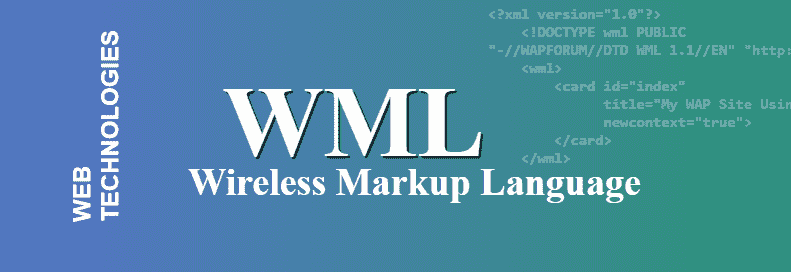
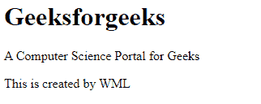

# WML |简介

> 原文:[https://www.geeksforgeeks.org/wml-introduction/](https://www.geeksforgeeks.org/wml-introduction/)



无线标记语言是基于超文本标记语言和 HDML 的无线标记语言。它被指定为一个 XML 文档类型。它是一种标记语言，用于为手机开发网站。在使用 WML 进行设计时，必须考虑无线设备的限制，例如小显示屏、有限的内存、低传输带宽和小资源。WAP(无线应用协议)网站不同于普通的 HTML 网站，因为它们是单色的(只有黑白)，简洁，屏幕空间非常小，因此 WAP 网站中的内容将是唯一重要的事情，就像过去电报是如何工作的一样。WML 遵循的概念是一副牌和一张牌的隐喻。WML 文档被认为是由许多卡片组成的。就像如何将卡片分组形成一副牌一样，一个 WAP 网站也有许多卡片。屏幕上将一次显示一张卡片，就像在 HTML 网站中一次显示一个页面一样。许多卡片可以插入到一个 WML 文档中，WML 卡片组由一个网址标识。要访问甲板，用户可以使用 WML 浏览器导航，该浏览器根据需要获取甲板。

**WML 的特点:**

*   **文本和图像:** WML 给出了如何将文本和图像呈现给用户的线索。最终呈现取决于用户。图片需要在 WBMP 格式，将是单色的。
*   **用户交互:** WML 支持密码输入、选项选择器、文本输入控制等不同的输入元素。用户可以自由选择按键或语音等输入。
*   **导航:** WML 提供超链接导航和浏览历史。
*   **上下文管理:**状态可以跨不同的甲板共享，也可以在不同的甲板之间保存。

**网络应用在移动和无线环境中使用时面临的问题:**

**1。HTTP:**

*   **带宽和延迟:** HTTP 不是为低带宽和高延迟的连接而做的。由于 HTTP 是未压缩的和无状态的，所以 HTTP 协议头很大并且是冗余的。
*   **缓存:**缓存被内容提供商禁用，因为如果在服务器和客户端之间放置缓存，客户端公司无法获得反馈。由于 HTTP 是无状态的，用户会遭受从服务器反复下载相同内容的痛苦。
*   **发帖:**从客户端向服务器发送一些内容，如果此时客户端断开连接，会产生额外的问题。

**2。超文本标记语言:**超文本标记语言是为创建万维网网页内容而设计的。它最初只用于桌面。因此，当用于手持设备时，会出现一些问题:

*   小显示器和低分辨率。
*   有限的用户界面。
*   低性能中央处理器。

**在无线环境中使用 HTML 所需的增强功能:**

*   图像缩放
*   内容转换:PDF 或 PPS 中的文档应该转换为纯文本，因为 PDF 占用更多内存。
*   内容提取:为了避免更长时间的等待，可以从文档中提取一些内容，如标题，并呈现给用户。这让用户决定哪些信息需要单独下载。

**在无线环境中使用 HTTP 所需的增强功能:**

*   **连接重用:**客户端和服务器可以使用同一个 TCP(传输控制协议)连接进行多个请求和响应。流水线可以用来提高性能。
*   **缓存增强功能:**缓存可以存储可缓存的响应，以减少响应时间和进一步响应的带宽。通过使用客户端代理，可以在移动客户端的网络浏览器中进行缓存。网络代理也可以用在网络端。
*   **带宽优化:** HTTP 支持压缩，也协商压缩参数和压缩方式。这将允许部分传输。

**WMLScript:** WMLScript 是无线应用协议(WAP)中 WML 的客户端脚本语言，其内容是静态的。它类似于 JavaScript。它针对低功耗设备进行了优化，是一种编译语言。WMLScript 的一些标准库是 Lang、Float、String、URL、WML 浏览器、Dialog 和 WMLScript 加密库。

**声明一个 WML 文档和卡片:**要创建一个 WML 文档，在记事本中键入它，就像对于 HTML 一样。第一行应该是这样的:

```html
<?xml version="1.0"?>
    <!DOCTYPE wml PUBLIC 
"-//WAPFORUM//DTD WML 1.1//EN" "http://www.wapforum.org/DTD/wml_1.1.xml">
    <wml>
        <card id="index" 
              title="My WAP Site Using WML" 
              newcontext="true">
        </card>
    </wml>
```

它告诉手机它将解释一个 WML 文档和 WML 标准。将生成一张带有身份证内容(用于链接)的卡片，屏幕顶部的输出将是。与 HTML 标签不同，关闭所有 WML 标签是极其重要的。如果不关闭 WML 标签，卡将根本不会打开。你必须关闭 **<卡>** 和 **< wml >** 标签。

**示例:**下面的代码显示了一个小 WAP 站点的 WML 编码示例，该站点有两张卡和一个指向外部网站的链接。

```html
<?xml version="1.0"?>
    <!DOCTYPE wml PUBLIC "-//WAPFORUM//DTD WML 1.2//EN"
"-//WAPFORUM//DTD WML 1.1//EN" "http://www.wapforum.org/DTD/wml_1.1.xml">

    <wml>

        <!-- This is first card-->
        <card id="one" title="First Card">
            <h1> Geeksforgeeks </h1>
            <p>
                A Computer Science Portal for Geeks
            </p>
        </card>

        <!-- This is second card-->
        <card id="two" title="Second Card">
            <p>
                This is created by WML
            </p>
        </card>

    </wml>
```

**输出:**


**WML 与 HTML 的对比:**

*   WML 只用于手机上的 WAP 站点，只能托管在支持 WML 的 WAP 主机上。HTML 可以由任何网络服务器托管。
*   WML 网站是单色的，不像 HTML 网站。
*   编码在很多方面都是相似的，但是一个编码糟糕的 WAP 网站肯定不会像一个编码糟糕的 HTML 网站那样运行。
*   与更宽松的 HTML 编码相比，必须关闭所有的 WML 标签。
*   在 WML 中没有像 **<中心>标签**那样的对齐标签，就像在 HTML 中一样。相反，必须使用 **< p align="center" >** 来对齐 WML 中的文本。
*   使用像 **< br >** 这样没有结束标签的旧 HTML 标签会有问题。为了在 WML 中避免这种情况，一些标签在末尾有一个“/”符号，如 **< br / >** 。
*   WML 只支持 WBMP 格式的单色图像，而在 HTML 中没有这样的限制。