# WordPress 备份&恢复

> 原文:[https://www.geeksforgeeks.org/wordpress-backup-restore/](https://www.geeksforgeeks.org/wordpress-backup-restore/)

[WordPress](https://www.geeksforgeeks.org/wordpress/) 是一个免费的开源内容管理系统(CMS)框架，即它是一个以最佳方式组织创建、存储和展示网络内容的整个过程的工具。WordPress 作为一个改进工具开始了它的旅程，以增强日常写作的常规排版。但是它被当作一个博客工具，当我们进入今年最后一个季度时，WordPress 已经成为 WCM 使用最多的系统，而且不仅仅是在博客社区。

在这篇文章中，我们将讨论如何对 WordPress 网站进行**备份**和**恢复**。

备份是将 WordPress 网站的附加副本存储在服务器上不同于网站的物理或虚拟位置的过程。通常，备份数据包括所有数据—文档、媒体文件、配置、插件、数据库等。需要在服务器上执行工作负载。

当任何类型的 WordPress 数据不再可读或已被恶意更改损坏时，需要进行数据恢复，通常称为恢复。或者万一，你想回到以前版本的 WordPress 网站。意外丢失或损坏后恢复数据的行为、过程或事件称为恢复。

**备份一个 WordPress 网站:**要备份一个 WordPress 网站，我们需要安装一个插件。你可以安装任何相关的插件，你想要的功能备份网站。我们将安装一个名为上升气流的插件。让我们看看步骤:

**第一步。**进入 WordPress 登录面板，输入用户名和密码登录 WordPress 仪表盘。您可以通过在网站网址的末尾添加/登录来访问登录面板。在我的例子中，它是–http://127 . 0 . 0 . 1/WordPress/WP-log in . PHP

WordPress 登录面板

登录后，您将看到类似如下的仪表板:

WordPress 仪表板

**第二步。**我们必须搜索名为上升气流的插件并安装它。为此:

在左侧，您将看到许多选项。转到**插件** **> >添加新的**。

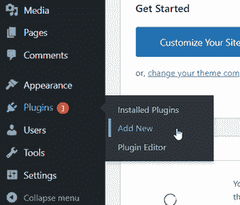

添加新插件

搜索一个名为**上升气流的插件。**这是我们将要用来备份我们的 WordPress 网站的插件。

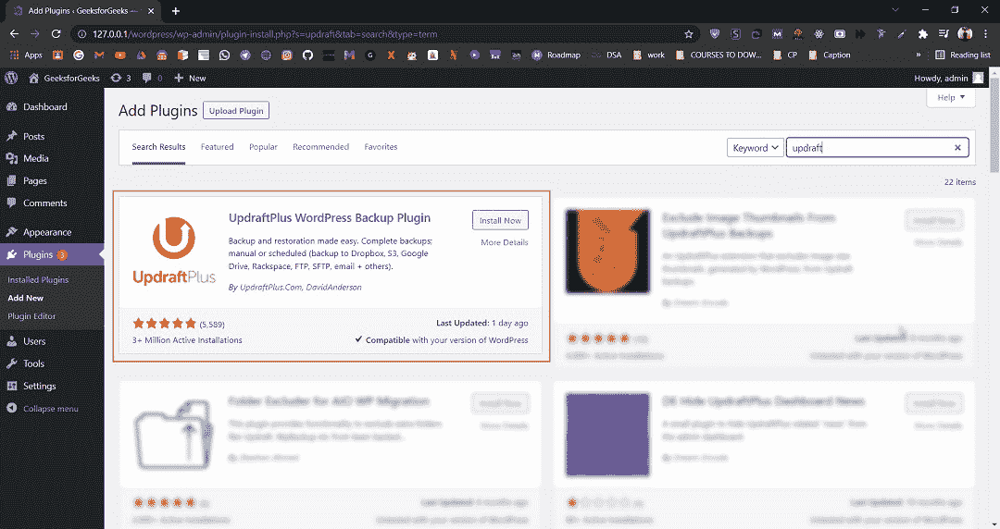

搜索插件

插件应该如下图所示。点击**立即安装。**根据您的系统配置，安装可能需要几秒钟。

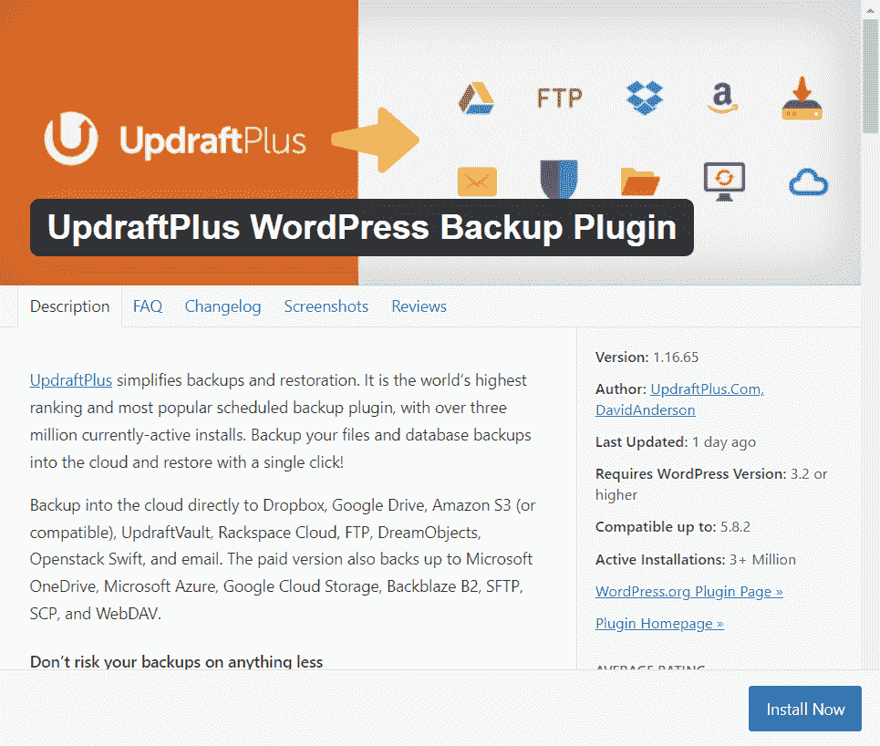

上升气流

**安装后激活**插件。

激活插件

您已经安装了所需的插件来备份 WordPress 网站。现在看下一步。

**第三步:**成功安装并激活插件后，您会在左侧的设置中发现一个名为**更新 Plus 备份的新选项。**点击那个。

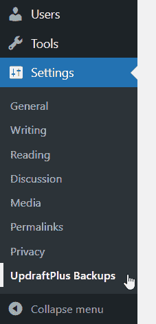

更新附加备份

**第 4 步:**点击**立即备份**。你会看到一个弹出窗口。

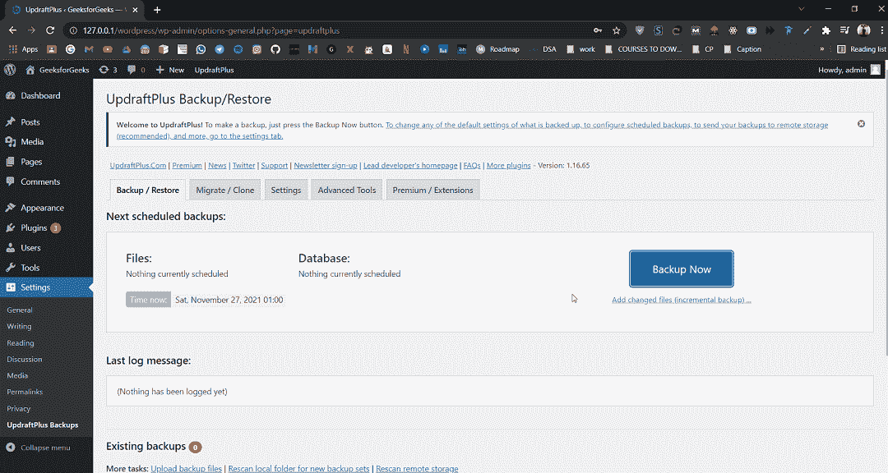

立即备份

确保所有选项都已选中，然后再次单击**立即备份**:

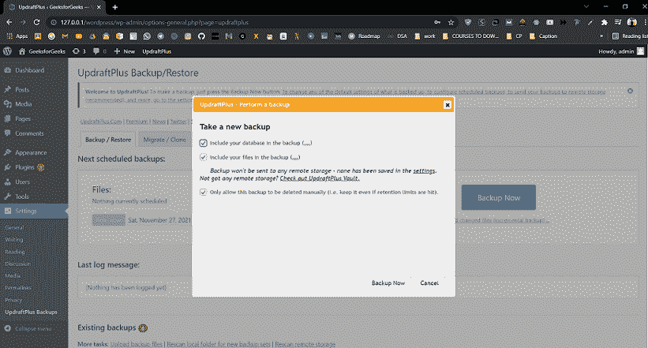

立即备份

它会开始备份。根据您网站的大小和服务器配置，此过程需要一段时间:

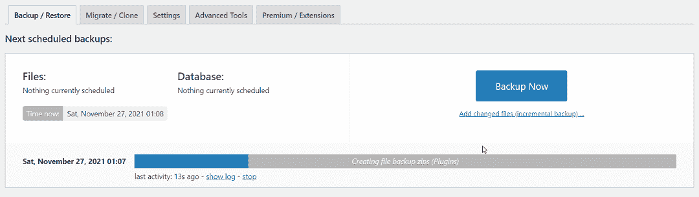

备份正在进行

就这样，你已经成功地备份了你的 WordPress 网站。

**恢复一个 WordPress 网站:**假设你让自己陷入了一个无法访问页面、功能或者整个网站的境地，你现在想要恢复网站:

**第一步:**点击左侧菜单栏中的**设置>T5】更新 Plus 备份**。

更新附加备份

**步骤 2:** 转到**现有备份**部分，在那里您会找到到目前为止所做的所有备份的列表。

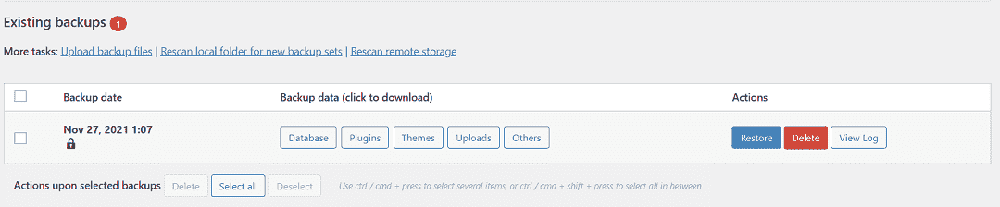

现有备份

选择其中要恢复的备份(如果有多个)，只需点击**恢复**按钮。

**第三步:**进入下一页，进入**选择要恢复的组件**，然后点击**下一步**，建议选择所有选项:

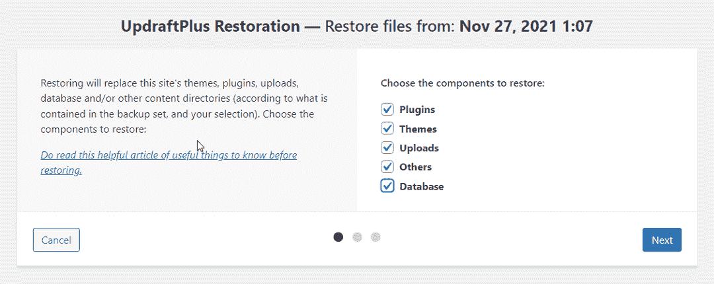

要恢复的组件

点击**恢复**按钮:

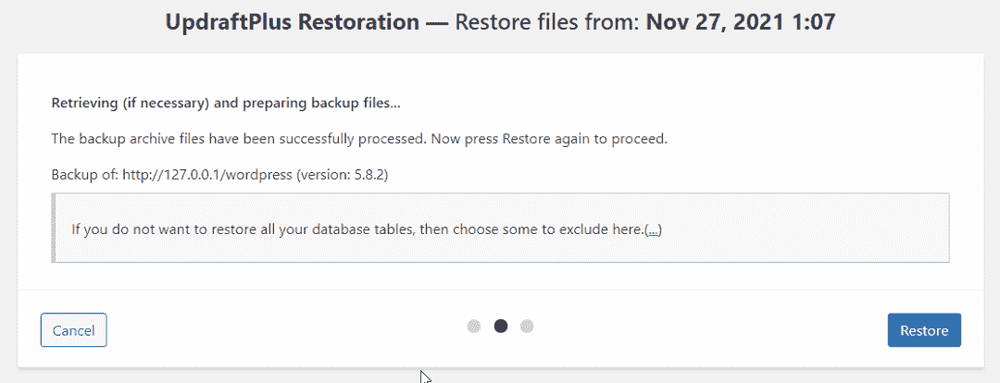

恢复

您的恢复将会进行**。根据您网站的大小和服务器配置，此过程需要一段时间:**

**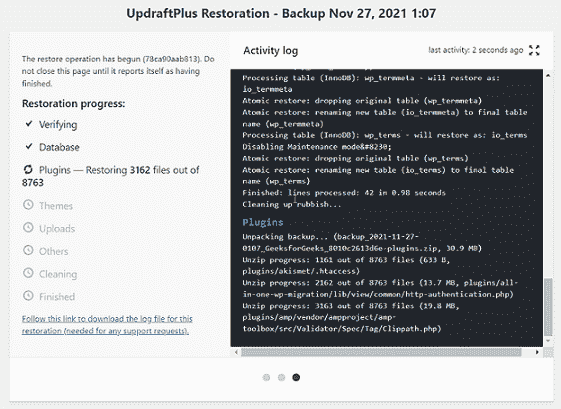

恢复进度** 

**你一会儿，你会看到**恢复成功的消息！****

**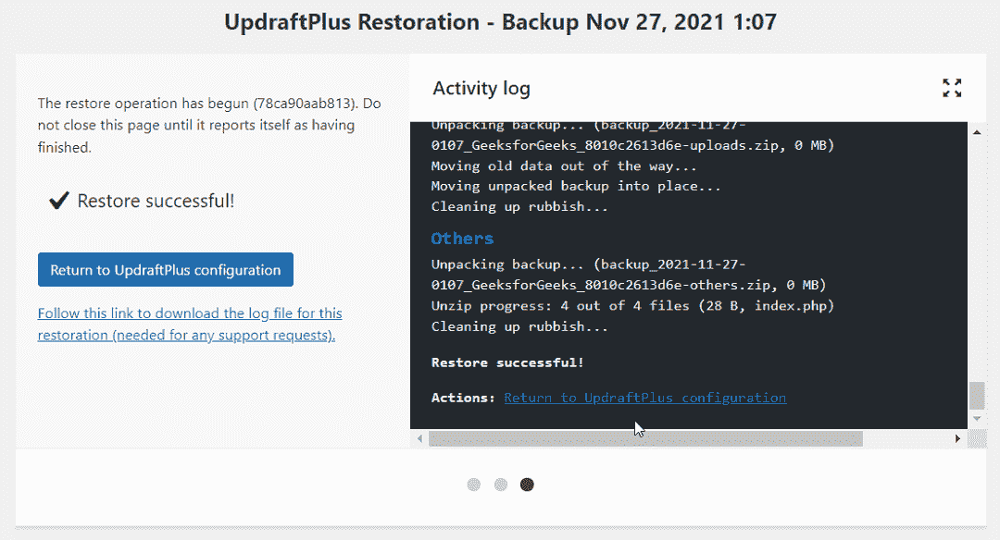

恢复成功** 

**就这样，你现在已经成功恢复了你的 WordPress 网站。**