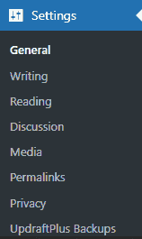
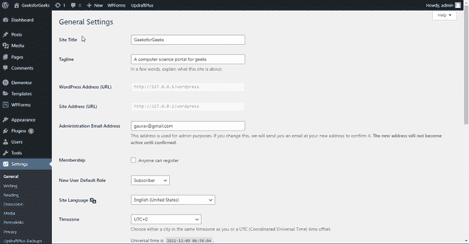

# WordPress 通用设置

> 原文:[https://www.geeksforgeeks.org/wordpress-general-setting/](https://www.geeksforgeeks.org/wordpress-general-setting/)

在本文中，我们将讨论 WordPress 常规设置。在进入 WordPress **通用设置**之前，我们应该了解一下什么是 WordPress！[**<u>WordPress</u>**](https://www.geeksforgeeks.org/introduction-wordpress/)是一个免费开源的内容管理系统(CMS)框架。它是最近使用最广泛的内容管理系统框架。

WordPress 为我们提供了如此多的定制，以至于我们可以通过仪表板根据我们的要求修改设置。我们可以改变 WordPress 网站的内容，主题、插件等的设置。设置可以从写字板的左面板进入。我们可以添加一个新的帖子，处理媒体部分，查看和修改评论，以及做许多其他事情。但所有这些都是与网站内容和用户界面相关的修改。要更改网站的其他设置，如标题、管理员权限等，可以通过 WordPress 仪表板中的**常规设置**进行修改。

您可以从仪表板的**设置> >常规**进入常规设置。

让我们看看常规设置中可用的选项:

*   网站标题
*   品牌理念;标签行
*   网址
*   网站地址
*   管理电子邮件地址
*   成员资格
*   新用户默认角色
*   网站语言
*   时区
*   日期格式
*   时间格式
*   一周开始于
*   使用跟踪

**注意:**确保点击保存更改按钮，将修改后的更改反映到直播网站上。

**一般设置简述:**

*   **站点标题:**此设置用于更改站点标题。网站标题是当我们打开网站时作为选项卡名称可见的标题。这与从 HTML 中给出<标题>标签中的标题相同。
*   **标语:**标语就像是三四个字对网站的简短描述。大多数品牌都有口号，帮助他们在市场上有所代表。此外，标语也是一样的，它显示在带有“-”分隔的“地点”瓷砖之后。
*   **WordPress (URL):** 这是可以通过它进入网站 WordPress 页面的 URL。
*   **网站地址(URL):** 这是任何人都可以访问您的网站的 URL。用户必须在浏览器的网址中输入该地址才能访问网站。默认情况下，WordPress 和站点地址是相同的。
*   **管理电子邮件地址:**这是用于管理目的的电子邮件地址字段。默认情况下，您会找到您在登录 WordPress 时使用的电子邮件。如果您对此进行更改，我们将在您的新地址向您发送电子邮件进行确认。新地址在确认之前不会生效。
*   **会员资格:**该选项有一个复选框，标签为“任何人都可以注册”。如果被选中，它将允许任何人谁是访问该网站可以成为获得该网站的会员计划。为了设置会员计划，我们集成了任何第三方插件。确保如果禁用，您没有任何会员资格。默认情况下，它被设置为未选中。
*   **新用户默认角色:**通过该选项，可以为新注册你的 WordPress 网站的用户设置默认角色。您可以从下拉列表中选择订阅者、投稿者、作者、编辑者和管理员选项。默认情况下，订阅服务器设置为。如果任何插件提供了额外的角色，那也将被添加到这个列表中。
*   **网站语言:**此选项代表网站的语言。您可以从包括几乎所有语言的可用选项中选择任何语言。
*   **时区:**时区是特定地区的标准时间。您可以通过此选项设置您所在地区的时区。如果你不知道你的时区，你可以简单地通过提及你的地区或者使用[这个](https://www.timeanddate.com/time/map/)网站来搜索它。
*   **日期格式:**你可能在不同的地方看到过不同格式的日期。您可以通过此设置为网站选择所需的日期格式。
*   **时间格式:**和日期格式一样，你可能也见过不同格式的时间。您可以通过此设置为网站选择所需的时间格式。
*   **周开始时间:**这将显示您的网站日期和日历的开始日期。你可以在周一到周日之间的任何时间选择它。默认情况下，它被设置为星期一，这意味着您的网站将把星期一算作一周的第一天。如果设置为周日，那么周日将是一周的第一天。

我们已经讨论了通用设置中所有可用的选项，希望您理解每个选项，现在可以根据您的要求使用它们。