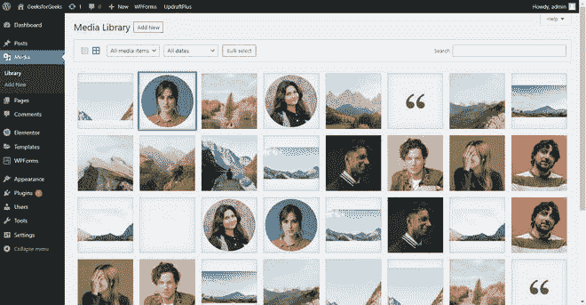
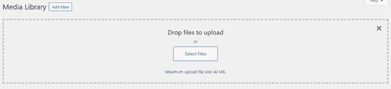
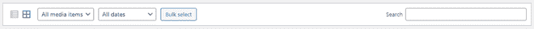
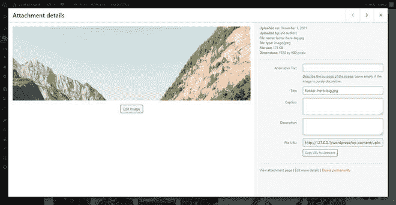

# WordPress 媒体库

> 原文:[https://www.geeksforgeeks.org/wordpress-media-library/](https://www.geeksforgeeks.org/wordpress-media-library/)

在这篇文章中，我们将研究关于 WordPress 媒体库。在**媒体库**前进之前，我们应该了解一下什么是 WordPress！[**<u>WordPress</u>**](https://www.geeksforgeeks.org/wordpress/)是一个免费开源的内容管理系统(CMS)框架。它是最近使用最广泛的内容管理系统框架。

WordPress 媒体包括图像、音频、视频、文档、电子表格和网站上使用的文件。我们首先必须上传占用服务器空间来存储文件和图像的媒体，然后我们可以在网站的任何地方插入来使用它。要看媒体库，我们必须去 **Media > > Library。**

媒体库屏幕使我们能够查看、删除和更改上传到网站的媒体的媒体文件名和信息。我们可以一次上传和删除多个媒体文件。媒体库在两种可用模式列表和网格中可见。我们可以使用过滤器选项来过滤图像、文档、视频、电子表格等之间的数据。通过在搜索收件箱中搜索媒体文件的名称，您可以从整个列表中找到所需的媒体。

如果您已经上传并安装了任何带有演示数据的主题，它的所有媒体都应该自动上传并在 WordPress 仪表板的媒体库中可见。您可以根据您的博客或网络应用程序从那里更改媒体。

**上传新媒体:**要在网站上上传新媒体文件，可以从媒体库部分找到一个名为**的选项“新增”。**点击“添加新媒体”按钮后，您有两种方式添加新媒体，或者简单地将文件拖放到“上传”部分(见下图)，或者点击“选择文件”从本地系统中选择一个文件。

**自定义媒体库:**在媒体库的顶部，您会发现包含查看模式、按项目过滤、按日期过滤、批量选择按钮和搜索收件箱等选项的栏。

*   **查看模式:**我们可以通过这个选项在列表和网格之间切换。在列表模式下，项目将显示在列表中，详细信息包括选择复选框、文件名、作者姓名、上传至、注释和日期。在网格模式下，文件将简单地显示为一个框。
*   **按项目过滤:**我们可以使用图像、音频、视频、文档、电子表格、档案、独立、我的和所有媒体内容等选项过滤媒体内容。
*   **按日期过滤:**顾名思义，可以按日期过滤内容。一年中的每个月都有可供选择的过滤选项。例如:2021 年 11 月、2021 年 12 月等。
*   **批量选择:**是一个按钮，允许用户一次选择多个元素。单击批量选择后，您将看到另一个名为永久删除的选项。选择不需要任何人释放服务器空间的元素，然后单击删除按钮。
*   **搜索:**可以用文件名搜索媒体文件。输入文件的名称，它将自动开始使用相关关键字搜索该文件。

**媒体详细信息:**要查看媒体文件的所有详细信息，请单击该图像或文件。它将弹出一个显示编辑图像选项的窗口，如下图所示:

在“附件详细信息”窗口的右侧，您可以看到所有详细信息，如“上传于”、“上传者”、“文件名”、“文件类型”、“文件大小”、“尺寸”以及更多编辑选项。

*   **上传时间:**显示文件上传到 WordPress 服务器的日期。
*   **上传人:**显示在 WordPress 服务器上传文件的作者姓名。
*   **文件名:**显示文件的名称。
*   **文件类型:**它有助于识别文件类型，如上图所示，它显示的是图像/jpeg。
*   **文件大小:**显示该文件在服务器上占用了多少空间。
*   **尺寸:**显示文件像素的细节，比如 1080×720 像素。

除此之外，用户还可以修改更多选项，以获得更好的结果，并帮助网站优化。选项有:

*   **备选文字:**描述图像的用途。这与在< img >标签的 HTML 代码中添加 alt 属性是一样的。
*   **标题:**您可以从该选项中查看和更改图像的标题。
*   **标题:**如果你想为图片添加任何标题，你可以通过这个选项来完成。
*   **描述:**为媒体库文件添加图像描述。
*   **文件 URL:** 你会从那里得到上传文件的 URL。您可以在任何浏览器中使用该网址直接看到该图像。你还会发现一个**复制网址到剪贴板**按钮直接复制完整的网址。

你可以看到在右边所有选项的正下方还有几个选项。查看附件页面、编辑更多详细信息和永久删除选项。