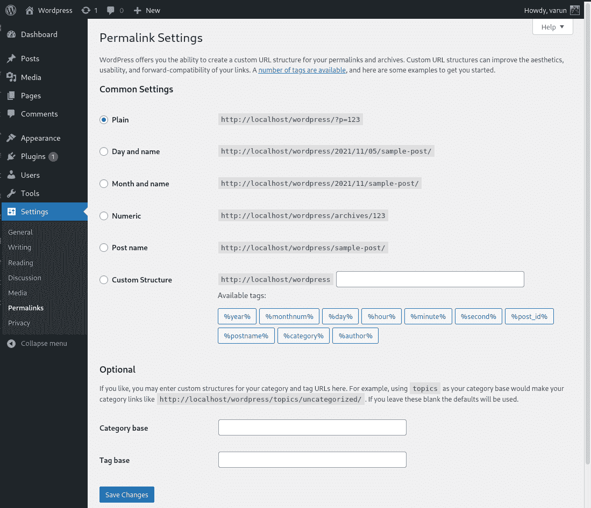
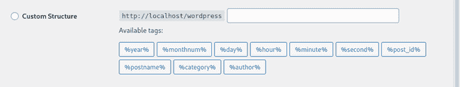

# WordPress 永久链接设置

> 原文:[https://www.geeksforgeeks.org/wordpress-permalink-setting/](https://www.geeksforgeeks.org/wordpress-permalink-setting/)

您可以通过转到**仪表板- >设置- >永久链接**导航到 WordPress 永久链接设置。它看起来像下图。(我的 WordPress 安装目录是 localhost 上的 WordPress)。

**常用设置:**这里第一部分是常用设置，可以设置你的 WordPress 网站的 URL 结构。

*   **普通–**你的网址看起来像*https://example.com/?p=123*
*   **日期和名称–**它根据帖子发布的日期和帖子的名称来设置你的帖子的 URL。示例:*https://example.com/2021/11/05/post-name/*
*   **月份和名称–**它根据帖子发布的月份和帖子的名称来设置你的帖子的 URL。示例:*https://example.com/2021/11/post-name/*
*   **数字–**它设置你的帖子的网址像:*https://example.com/archives/post-id/*这里*的帖子 id* 将是该帖子的数字 id。
*   **帖子名称–**它根据你的帖子名称设置你的帖子的 URL。示例:*https://example.com/post-name/*
*   **自定义结构–**在该选项中，可以根据自己的意愿设置 URL 结构。您可以使用*可用标签*下方的块来选择或取消选择修改器

**可选:**这些是您的类别和标签档案网址的自定义结构的可选设置。

*   **类别库–**我们在这里举个例子，你的默认类别 URL 就像:*https://example.com/category-name/*现在如果你在你的类别库中添加*书籍*，你的 URL 就会像:*https://example.com/books/category-name/*
*   **标签库–**这里可以添加与类别库相同的标签库。完成所有设置后，单击“保存更改”将设置应用到您的 WordPress 站点。