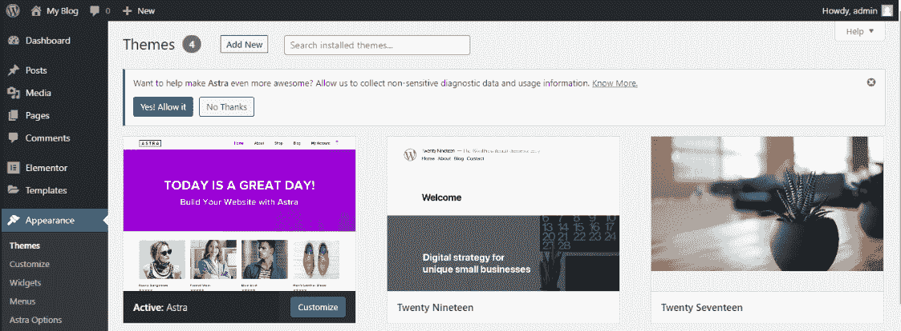
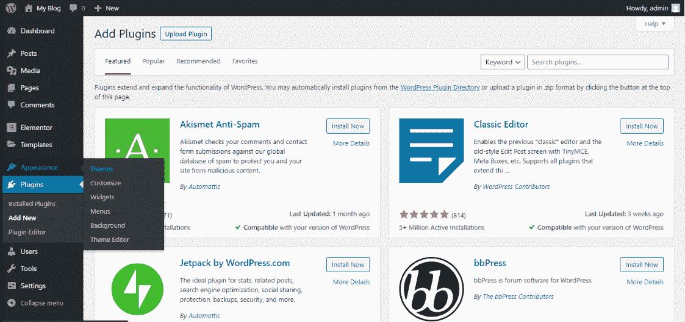
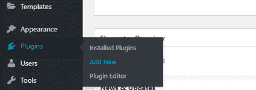

# WordPress 主题和插件

> 原文:[https://www.geeksforgeeks.org/wordpress-themes-and-plugins/](https://www.geeksforgeeks.org/wordpress-themes-and-plugins/)

在本文中，我们将研究什么是 WordPress 中的**主题**和**插件**以及一些常用的主题和插件。

在进入 WordPress **主题**和**插件**之前，我们应该了解一下什么是 WordPress！ [**WordPress**](https://www.geeksforgeeks.org/introduction-wordpress/) 是一个免费开源的内容管理系统(CMS)框架。它是最近使用最广泛的内容管理系统框架。

**WordPress 主题:**在 WordPress 中，主题是用于定义 WordPress 支持的网站的外观和显示的模板和样式表的集合。也可以称为网站的皮肤。它们可以在**外观主题**下的 WordPress 管理区进行更改、管理和添加。然后搜索您选择的主题，安装并激活主题。

要记住的主要一点是，根据用户的需求，WordPress 中有很多可用的主题。每一个都有不同的设计、布局和功能。用户需要选择适合自己口味和网站要求的网站。如果你是 WordPress 的初学者，那么从使用起来非常灵活的主题开始。某些选项可能会因为主题的选择而出现或消失。还有其他主题也可用，如电子商务、博客等。

**常用主题:**

*   **Astra**
*   **二十十九**
*   **二十十七**
*   **超**

WordPress 网站上有很多主题，但最常用的主题是阿斯特拉主题、迪维雅主题、Ultra 主题、斯潘塞主题等等。

**WordPress 插件:**插件是一款增加 WordPress 仪表盘功能的软件。超过 **50，000+** 插件在 WordPress 中可用。不过建议在单个网站上使用 **15-20 插件**。WordPress 插件是用 PHP 编程语言编写的，并与 WordPress 无缝集成。它们使用户在不知道一行代码的情况下更容易向他们的网站添加功能。虽然有插件可以完成你想让他们做的任务，但有些插件的质量要比其他插件高得多。为了选择最完美的，你应该问自己几个问题。最常用的插件是 Elementor。它实际上是一个页面构建器插件。

**常用插件:**

*   **接触形态:**忍者形态，WP 形态，接触形态 7
*   **聊天:** Tawk.to，WhatsApp。，信使
*   **备份:**一次 WP 迁移
*   **其他插件:**顶栏，弹出生成器，Yoast SEO

**安装插件**

*   表单仪表板(左侧可用)，转到插件，右键单击它并选择添加新项。
*   从那里选择要使用的插件。
*   添加安装并激活。
*   你的插件可以使用了，它会显示在仪表盘上

**主题和插件的区别:**在主题和插件中找到的特性之间的交叉是很常见的。然而，最佳实践是:

**主题:**

*   主题控制内容的呈现。一个主题基本上是关于网站的整体外观。你的主题决定了你的网站的外观。WordPress 中安装了默认主题。此外，主题可以根据您的使用情况进行选择。有些主题被称为“多用途”，有些被称为“利基”主题。要记住的一点是，我们一次只能使用一个主题。所以，你需要仔细决定你想要的主题。
*   您创建的任何主题都不应添加关键功能。这样做意味着，当用户更改他们的主题时，他们将无法访问该功能。例如，假设您构建了一个具有投资组合功能的主题。用你的功能建立投资组合的用户在改变主题时会失去它。

**插件:**

*   一个插件被用来控制你的 WordPress 站点的行为和特性。你可以在一个网站上使用任意多的插件。在上面的文章中，区别很明显。
*   通过将关键特性转移到插件，您可以改变网站的设计，而功能保持不变。

**结论:**主题和插件的区别现在已经非常明显了。主题改变了网站的整体布局，而插件则为其增加了功能。你需要选择哪个主题在你的网站上看起来最好，哪个插件可以增强它的功能。学习主题和插件最有效的方法是全部或大部分使用它们，这样你就知道了