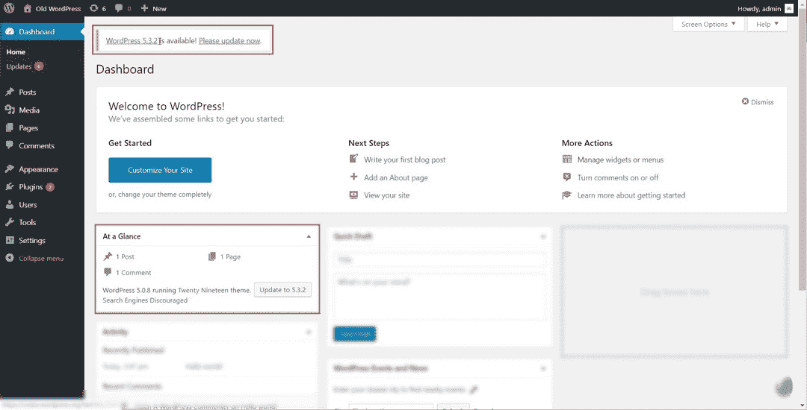
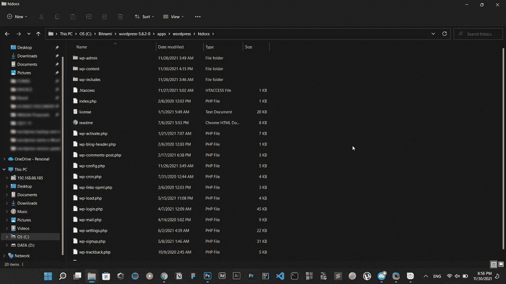
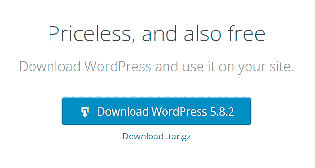
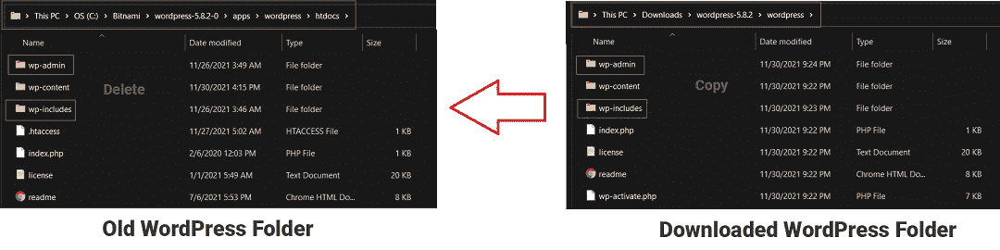
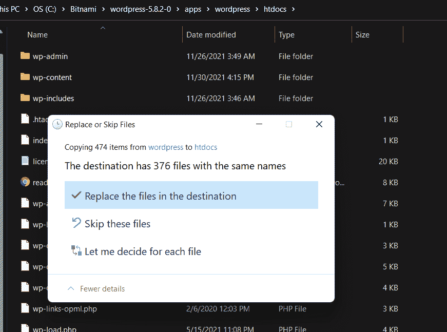
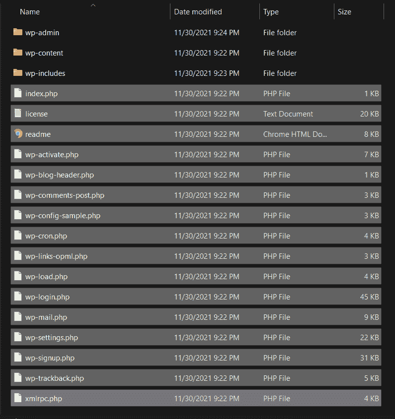
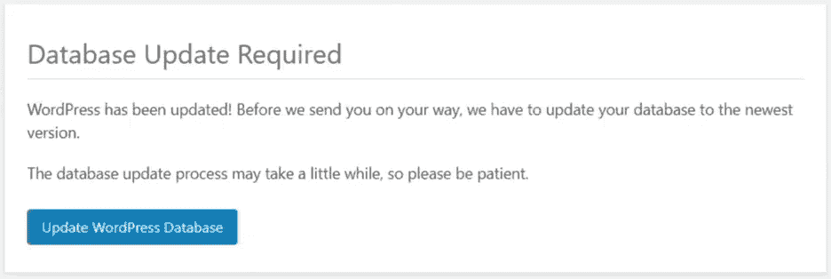

# WordPress 版本更新

> 原文:[https://www.geeksforgeeks.org/wordpress-version-update/](https://www.geeksforgeeks.org/wordpress-version-update/)

[WordPress](https://www.geeksforgeeks.org/wordpress/) 是一个内容管理系统(WCM)，即它是一个以最佳方式组织创建、存储和展示网络内容的整个过程的工具。WordPress 作为一个改进工具开始了它的旅程，以增强日常写作的常规排版。但是它被当作一个博客工具，当我们进入今年最后一个季度时，WordPress 已经成为 WCM 使用最多的系统，而且不仅仅是在博客社区。

WordPress 最初于 2003 年 5 月 25 日以“第七点测试”的名称推出。它在最初推出之前就已经发布测试了。然后，在 2003 年 6 月 25 日，发布了名为“WordPress 0.71 现在可用”的 0.71 版本，该版本具有 300%加速、安全修复、OPML 导入、更干净、管理更流畅等特性。你可以从官方网站:https://wordpress.org/news/category/releases/的发布页面获得更多关于所有版本的信息

WordPress 从它真正在市场上推出的时候就获得了很多更新，我非常确定它在未来也会获得更多的更新。在这种情况下，我们将会或可能会从最新版本的 WordPress 中过时，它必须是一个比前一个版本更安全、没有错误的版本。在本文中，我们将了解如何将 WordPress 更新到最新的可用版本，并保持更高的安全性。有两种可能的方法可以将您的 WordPress 从旧版本更新到最新版本，即自动更新和手动更新。

**警告:**更新 WordPress 会影响您当前在服务器或系统上安装的所有 WordPress 文件。在更新 WordPress 之前，确保备份完整的网站，包括文件和插件。以防更新后，你面临任何问题或任何插件可能无法正常工作。将网站恢复到以前的状态。

**自动更新:**这是一个更新 WordPress 网站的简单方法。打开**仪表盘> >主页，**你会发现本地系统的服务器上已经安装了当前版本的 WordPress，同时还有**更新**按钮。

仪表板>>主页

立即更新

它会自动更新到最新版本的 WordPress，你可以使用随之而来的所有功能。

**手动更新:**假设由于某种原因，您没有获得自动更新，但是最新版本可用，并且您想要安装最新版本的 WordPress。在这种情况下，您必须通过以下步骤进行手动更新:

**注意:**在继续之前，请确保停用安装在您的 WordPress 中的所有插件，以免导致任何错误和安全注意事项。

**第一步:**你需要从服务器的 Cpanel 中访问 WordPress 文件，然后转到 WordPress 文件夹。在我的例子中，我在本地使用 WordPress，所以我必须转到 WordPress 安装到我的系统的文件夹的本地目录。

在那里你会看到所有的文件，包括:

*   wp 管理员
*   wp-content
*   WP-内置

WordPress 文件

**第二步:**现在，你必须将最新版本的 WordPress 下载到你的本地计算机上。去 [WordPress](https://wordpress.org/) 网站点击获取 WordPress，然后[下载 WordPress](https://wordpress.org/download/) 。你会得到一个压缩文件到你的下载文件夹。

 

**第三步:**从旧的 WordPress 目录中删除 **wp-include** 和 **wp-admin** 文件夹，并按照上述步骤复制下载最新 WordPress 时获得的同名新文件夹。

**第四步:**将 **wp-content** 文件夹从下载的文件夹复制到旧文件夹(不删除旧文件夹)，如果需要，点击全部替换。

**第五步:**从下载的文件夹中复制剩下的文件，粘贴到安装好的 WordPress 文件夹的根目录下。

**第六步:**现在，去 WordPress 仪表盘刷新一下。您可能会收到一个弹出的数据库更新要求。如果是，只需点击**更新 WordPress 数据库**按钮，然后点击继续。

就是这样，你已经成功更新到最新版本的 WordPress。