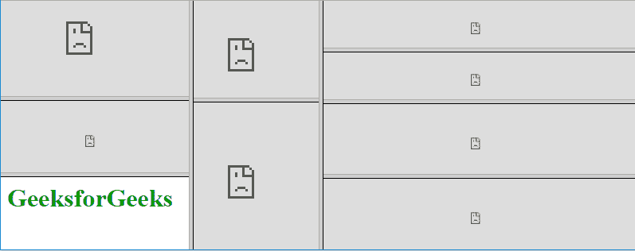

# XHTML |简介

> 原文:[https://www.geeksforgeeks.org/xhtml-introduction/](https://www.geeksforgeeks.org/xhtml-introduction/)

XHTML 代表可扩展超文本标记语言。这是互联网进化的下一步。XHTML 是由万维网联盟(W3C)开发的。它帮助网络开发人员从超文本标记语言过渡到可扩展标记语言。使用 XHTML，开发人员可以带着它的所有特性进入 XML 世界，并且他们仍然可以对内容的向后和未来兼容性保持信心。XHTML 1.0 是 XHTML 家族中的第一个文档类型，它是由 W3C 在 2000 年 1 月 26 日推荐的。XHTML 1.1 是 W3c 在 2001 年 5 月 31 日推荐的。XHTML5 是一个标准，用于开发 HTML5 规范的 XML 改编。
XHTML 文档包含三个部分，讨论如下:

*   **DOCTYPE:** 用于声明 DTD
*   **头:**头段用于声明标题等属性。
*   **body:**body 标签包含网页的内容。它由许多标签组成。

创建一个 XHTML 网页，需要包含 DTD(文档类型定义)声明。DTD 有三种类型，讨论如下:

*   过渡 DTD
*   严格数字孪生
*   框架集 DTD

**过渡 DTD:** 没有内置级联样式表支持的旧版浏览器支持。有几个属性包含了严格的 DTD 中不允许的主体标记。
**语法:**

```html
<!DOCTYPE html
PUBLIC "-//W3C//DTD XHTML 1.0 Transitional//EN"
"DTD/xhtml1-transitional.dtd">
<html xmlns="http://www.w3.org/1999/xhtml" xml:lang="en" lang="en">
```

**示例:**

```html
<?xml version="1.0" encoding="UTF-8"?>
<!DOCTYPE html
PUBLIC "-//W3C//DTD XHTML 1.0 Transitional//EN"
"DTD/xhtml1-transitional.dtd">
<html xmlns="http://www.w3.org/1999/xhtml" xml:lang="en" lang="en">
    <head>
        <title>Transitional DTD XHTML</title>
    </head>
    <body bgcolor="#dae1ed">
        <div style="color:#090;font-size:40px;
                font-weight:bold;text-align:center;
                margin-bottom:-25px;">GeeksforGeeks</div>
        <p style="text-align:center;font-size:20px;">
                A computer science portal</p>
        <p style="text-align:center;font-size:20px;">
        Option to choose month:
        <select name="month">
            <option selected="selected">January</option>
            <option>February</option>
            <option>March</option>
            <option>April</option>
            <option>May</option>
            <option>June</option>
            <option>July</option>
            <option>Augusy</option>
            <option>September</option>
            <option>October</option>
            <option>November</option>
            <option>December</option>
        </select>
        </p>
    </body>
</html>
```

**输出:**


**严格 DTD:** 当 XHTML 页面只包含标记语言时，使用严格 DTD。严格的 DTD 与级联样式表一起使用，因为该属性不允许在正文标记中使用 CSS 属性。
**语法:**

```html
<!DOCTYPE html
PUBLIC "-//W3C//DTD XHTML 1.0 Strict//EN"
"DTD/xhtml1-strict.dtd">
<html xmlns="http://www.w3.org/1999/xhtml" xml:lang="en" lang="en">
```

**示例:**

```html
<?xml version="1.0" encoding="UTF-8"?>
<!DOCTYPE html
PUBLIC "-//W3C//DTD XHTML 1.0 Strict//EN"
"DTD/xhtml1-strict.dtd">
<html xmlns="http://www.w3.org/1999/xhtml" xml:lang="en" lang="en">
    <head>
        <title>Strict DTD XHTML</title>
    </head>
    <body>
        <div style="color:#090;font-size:40px;
                font-weight:bold;text-align:center;
                margin-bottom:-25px;">GeeksforGeeks</div>
        <p style="text-align:center;font-size:20px;">
                A computer science portal</p>
        <p style="text-align:center;font-size:20px;">
        Option to choose month:
        <select name="month">
            <option selected="selected">January</option>
            <option>February</option>
            <option>March</option>
            <option>April</option>
            <option>May</option>
            <option>June</option>
            <option>July</option>
            <option>Augusy</option>
            <option>September</option>
            <option>October</option>
            <option>November</option>
            <option>December</option>
        </select>
        </p>
    </body>
</html>
```

**输出:**


**框架集 DTD:** 当 XHTML 页面包含框架时，使用框架集 DTD。
**语法:**

```html
<!DOCTYPE html
PUBLIC "-//W3C//DTD XHTML 1.0 Frameset//EN"
"DTD/xhtml1-frameset.dtd">
<html xmlns="http://www.w3.org/1999/xhtml" xml:lang="en" lang="en">
```

**示例:**

```html
<?xml version="1.0" encoding="UTF-8"?>
<!DOCTYPE html PUBLIC "-//W3C//DTD XHTML 1.0 Frameset//EN"
 "http://www.w3.org/TR/xhtml1/DTD/xhtml1-frameset.dtd">
<html xmlns="http://www.w3.org/1999/xhtml" xml:lang="en" lang="en">
<head>
<title>Frameset DTD XHTML</title>
</head>
<frameset cols="30%, 20%, *">
   <frameset rows="40%, 30%, *">
      <frame src="gfg.html" />
      <frame src="gfg1.html" />
      <frame src="geeks.html" />
   </frameset>
   <frameset rows="40%, 60%"> 
      <frame src="g4g.html" />
      <frame src="g4g1.html" />
   </frameset>
   <frameset rows="20%, 20%, 30%, *"> 
      <frame src="geeksforgeeks.html" />
      <frame src="geeksforgeeks1.html" />
      <frame src="geeksforgeeks2.html" />
      <frame src="geeksforgeeks3.html" />
   </frameset>
</frameset>
</html>
```

**输出:**


**为什么要用 XHTML？**

*   XHTML 文档使用标准的 XML 工具进行验证。
*   从长远来看，维护、转换、编辑文档很容易。
*   用于定义网页的质量标准。
*   XHTML 是 W3C 的一个官方标准，你的网站变得更加兼容和精确很多浏览器。

**XHTML 的好处:**

*   所有的 XHTML 标记都必须有结束标记，并且嵌套正确。这会生成更干净的代码。
*   XHTML 文档是精简的，这意味着它们使用更少的带宽。这降低了成本，特别是如果你的网站有 1000 页。
*   XHTML 文档格式良好，可以很容易地传输到无线设备、盲文阅读器和其他专门的网络环境中。
*   所有新的开发都将使用 XML(其中 XHTML 是一个应用程序)。
*   XHTML 与 CSS 协同工作，创建易于更新的网页。

**HTML 和 XHTML 的区别:**

| 超文本标记语言 | 可扩展的超文本标记语言 |
| --- | --- |
| 超文本标记语言是创建网页的主要标记语言 | XHTML(可扩展超文本标记语言)是一个 XML 标记语言家族，它反映或扩展了广泛使用的超文本标记语言(HTML)的版本 |
| 灵活的框架需要宽松的 HTML 特定解析器 | 需要用标准的 XML 解析器解析的 XML 的限制性子集 |
| 蒂姆·伯纳斯·李于 1987 年提出 | 万维网联盟 2000 年的建议。 |
| 标准通用标记语言的应用。 | XML 的应用 |
| 从 SGML 扩展而来。 | 从可扩展标记语言扩展而来 |