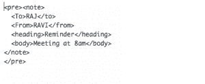
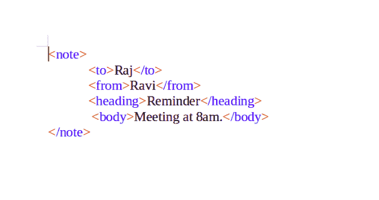
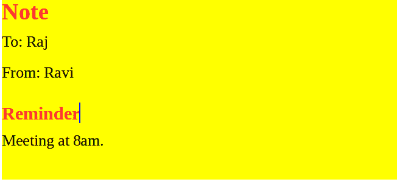
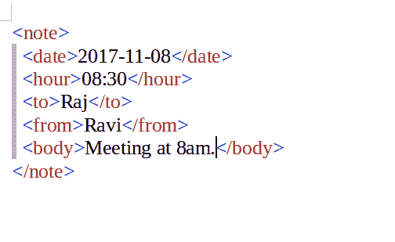
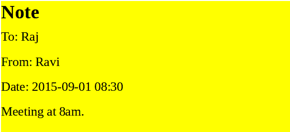

# XML |基础知识

> 原文:[https://www.geeksforgeeks.org/xml-basics/](https://www.geeksforgeeks.org/xml-basics/)

可扩展标记语言(XML)是一种标记语言，它定义了一组规则，用于以人类可读和机器可读的格式对文档进行编码。XML 的设计目标集中在互联网上的简单性、通用性和可用性。这是一种文本数据格式，通过 Unicode 为不同的人类语言提供了强大的支持。虽然 XML 的设计侧重于文档，但是该语言被广泛用于表示任意数据结构，例如 web 服务中使用的数据结构。

1.  XML 代表可扩展标记语言
2.  XML 是一种类似于 HTML 的标记语言
3.  XML 旨在存储和传输数据
4.  XML 是为自我描述而设计的

**XML 和 HTML 的区别**

XML 和 HTML 的设计目标不同:

*   XML 旨在承载强调数据类型的数据。
*   HTML 旨在显示强调数据外观的数据
*   XML 标签不像 HTML 标签那样是预定义的。
*   HTML 是一种标记语言，而 XML 提供了定义标记语言的框架。
*   HTML 是关于显示数据的，因此它是静态的，而 XML 是关于携带信息的，这使得它是动态的。

**示例:**
**注释的 XML 代码如下**



**笔记的 HTML 代码如下**

```
<!DOCTYPE html>
<html>
<h1>Note</h1>
<body>
<p>To:RAJ
<br>
From:RAVI
</p>
<h1>Reminder</h1>
<p>Meeting at 8am</p>
</body>
</html>
```

**输出:**T2】

**注意:**这两种情况下的输出是相同的，但是在使用 HTML 时，我们使用了预定义的标签，如 p 标签和 h1 标签，而在使用 XML 时，我们使用了自定义标签，如“至”标签和“自”标签。

**另一个例子:**
上面的 XML 非常自我描述:

*   它有发送者信息。
*   它有接收者信息。
*   它有一个标题。
*   它有一个消息正文。
*   以下示例中的标签没有在任何 XML 标准中定义。这些标签是由 XML 的作者“发明”的，document.HTML 使用预定义的标签，如 p 标签、h1 标签等。而在 XML 中，作者必须定义标签和文档结构。

**输入:**


**输出:**


基本上上面的 XML 什么也做不了。XML 只是用标签包装的信息。用户必须需要一个软件来发送、接收、存储或显示它。

**XML 使 web 开发变得用户友好:**许多计算机系统包含不兼容格式的数据。对于 web 开发人员来说，在不兼容的系统或升级的系统之间交换数据是一项耗时的任务。必须转换大量数据，不兼容的数据经常会丢失。XML 以纯文本格式存储数据。这提供了一种独立于软件和硬件的存储、传输和共享数据的方式。

**XML 是可扩展的:**即使数据被编辑，即添加或删除，XML 应用程序也将按预期工作。**示例:**通过添加日期标签和小时标签，并删除标题标签，将上述注释编辑为新版本。
T5】旧版

 **新版本**

[HTML 和 XML 测验](https://www.geeksforgeeks.org/html-and-xml-gq/)

本文由 [**舒布罗迪普·班纳吉**](https://auth.geeksforgeeks.org/profile.php?user=Shubrodeep Banerjee) 供稿。如果你喜欢 GeeksforGeeks 并想投稿，你也可以使用[contribute.geeksforgeeks.org](http://www.contribute.geeksforgeeks.org)写一篇文章或者把你的文章邮寄到 contribute@geeksforgeeks.org。看到你的文章出现在极客博客主页上，帮助其他极客。

如果你发现任何不正确的地方，或者你想分享更多关于上面讨论的话题的信息，请写评论。