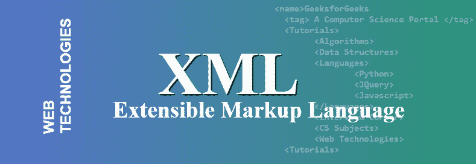

# XML 完整形式

> 原文:[https://www.geeksforgeeks.org/xml-full-form/](https://www.geeksforgeeks.org/xml-full-form/)

**XML** 代表可扩展标记语言，用于编码人类和机器都能理解的文档。数据以易于理解和修改的 XML 格式存储。这种格式旨在以特定的格式传输和存储数据。当您使用 XML 时，有三件主要的事情必须牢记在心–**简单性**、**一般性**和**可用性**。XML 包含一些你必须遵守的规则，比如开始和结束标记。XML 发明于 1998 年，之后在 2006 年和 2008 年进行了修改，这是 XML 的最新标准版本。

**XML 中很少有关键术语:**

*   **字符:** XML 是一个字符串，可以覆盖每一个 Unicode 字符。
*   **标记和内容:**如果字符串构成标记，则以 **<** 开始，以 **>** 结束。如果构成内容的字符串以 **&** 开头，以**结尾；**
*   **标记:**标记标记以 **<标记>** 开始，以**</标记>** 和空元素标记 **<换行/ >** 结束
*   **元素:**放置在开始标记和结束标记之间的元素，如 **<标记>元素</标记>**
*   **属性:**放置在起始标签内的属性，如 **<标签属性=“值”>元素</标签>** 。它用于保存元素的行为。

**XML 的特点:**

*   **结构:** XML 是一种结构化格式，我们可以在其中决定如何在文件中排列数据。我们可以随心所欲地构建，将任何数据放在任何地方。
*   **descripted:**XML 数据格式是一种描述性更强的格式，如果你熟悉 HTML，那么你就可以很容易地理解 XML，它在你看来就是一个普通的文本。
*   **Validated:** Validation 出现在脑海中当您必须遵循数据的某些特定结构时，您可以准确描述 XML 数据文件在另一个 XML 文件中应该如何结构化。
*   **可发现的:**任何语言都可以很容易地从一个 XML 数据中发现数据，并且可以创建另一个也将遵循验证的 XML 数据。
*   **强格式:**应用程序可以检查模式定义，以识别要导入的数据类型。

**XML 的优势:**

*   XML 很容易读写，正常人都能理解。
*   向后和向前的兼容性很容易维护。
*   它有一个标准，即国际标准意味着任何语言都可以轻松地与 XML 协作。
*   它是独立于平台的，这意味着技术的阻力变化。
*   XML 可以增量升级。

**XML 的劣势:**

*   命名空间支持可能很难在 XML 解析器中正确实现。
*   当您试图手动构造大量数据时，XML 会变得复杂。
*   与 JSON 相比，它需要如此多的标签来构造数据。
*   XML 节点关系需要额外的努力。
*   XML 鼓励非关系数据库。