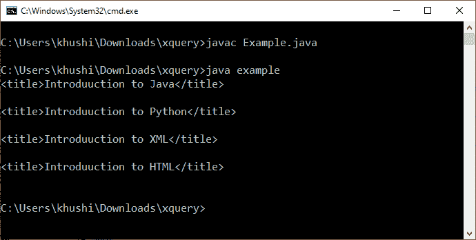

# XQuery |安装及示例

> 原文:[https://www . geesforgeks . org/XQuery-安装和示例/](https://www.geeksforgeeks.org/xquery-installation-and-example/)

**XQuery:** XQuery 是查询 XML 数据的**语言。它用于检索以 XML 格式存储的信息。XML 的 XQuery 类似于数据库的 SQL。它可以用于 XML 数据库、包含 XML 格式数据的关系数据库或 XML 文档。XQuery 是由 W3C 设计的，最早出现在 2007 年。这是 2014 年 4 月 8 日 **W3C 的建议**，得到了所有主要数据库的支持。**

**Xquery 的用途:**

*   从数据库中提取信息，用于像 SoapUI 这样的网络服务。
*   从数据库接收数据，用于应用程序集成。
*   生成摘要报告。
*   从 XML 文件中检索相关信息。

**安装及示例:**

1.  下载 [Saxon jar](https://github.com/khushi-15/xquery/raw/master/SaxonHE10-0J.zip) 文件。
2.  提取 zip 文件并将所有 jar 文件复制到 java_base_path/JRE/lib/ext。
3.  现在用下面的代码创建一个 XML 文件，并将其命名为“article.xml”。

    ```html
    <?xml version="1.0" encoding="UTF-8"?>
    <articles>

       <article category="JAVA">
          <title>Introduuction to Java</title>
          <writer>Khushi</writer>
          <date>05/11/2010</date>
       </article>

       <article category="Python">
          <title>Introduuction to Python</title>
          <writer>Suman</writer>
          <date>10/10/2011</date>
       </article>

       <article category="XML">
          <title>Introduuction to XML</title>
          <writer>KR</writer>
          <date>06/09/2012</date>
       </article>

       <article category="HTML">
          <title>Introduuction to HTML</title>
          <writer>Bijay</writer>
          <date>03/04/2015</date>
       </article>

    </articles>
    ```

4.  Now create a java file with any name of your choice(example.java in my case) and add the following code in the same.

    ```html
    import java.io.File;
    import java.io.FileInputStream;
    import java.io.FileNotFoundException;
    import java.io.InputStream;

    import javax.xml.xquery.XQConnection;
    import javax.xml.xquery.XQDataSource;
    import javax.xml.xquery.XQException;
    import javax.xml.xquery.XQPreparedExpression;
    import javax.xml.xquery.XQResultSequence;

    import com.saxonica.xqj.SaxonXQDataSource;

    class example {
        public static void main(String[] args)
        {
            try {
                solve();
            }
            catch (Exception e) {
                e.printStackTrace();
            }
        }
        private static void solve() throws
                FileNotFoundException, XQException {
            InputStream inputStream = 
                new FileInputStream(new File("articles.xqy"));

            XQDataSource ds = new SaxonXQDataSource();
            XQConnection conn = ds.getConnection();
            XQPreparedExpression exp = 
                conn.prepareExpression(inputStream);

            XQResultSequence result = exp.executeQuery();

            while (result.next()) {
                System.out.println(result.getItemAsString(null));
            }
        }
    }
    ```

    **注意:**用保存文件。java 扩展与 article.xml 在同一个目录中。

5.  用下面的代码创建一个名为“articles.xqy”的 XQuery 文件，并将其保存在与 article.xml 相同的目录中。

    ```html
    for $x in doc("article.xml")/articles/article
    return $x/title

    ```

6.  Now open Command prompt in the same folder where article.xml is located and enter the following command there.

    ```html
    javac example.java
    java example

    ```

    
    从输出中可以看出，它将打印存储在 XML 文件中的所有文章数据的标题。

现在，您已经成功执行了第一个 XQuery 代码。