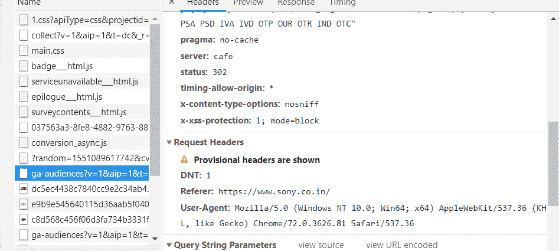

# XSS 预防:不写单行代码

> 原文:[https://www . geeksforgeeks . org/XSS-防-不写-单行代码/](https://www.geeksforgeeks.org/xss-prevention-without-writing-single-line-of-code/)

什么是 XSS？

XSS(跨站脚本)是一种网络威胁，攻击者在网页中插入恶意客户端代码。这些攻击利用了 XSS 漏洞，最终会导致数据丢失、用户会话失控等等。

XSS 攻击是如何工作的？

像 SQL 注入、密码攻击等最著名的网络攻击主要攻击应用程序的核心或服务器，但跨站点脚本攻击却不是这样，因为它们主要针对应用程序用户。这些攻击通过向 web 应用程序中注入代码(通常是客户端脚本，如 Javascript)来工作。攻击者可以利用许多注入字段来插入这些攻击，如搜索字段、反馈表单、cookies 和表单。Cookies 是最有针对性的一种，因为它们经常被错误地用于存储信息，如会话标识、用户首选项或登录信息。这些攻击利用 DOM 操作来更改表单值或切换表单操作，以将提交的数据发布到攻击者的站点。

现在让我们看看如何在不改变整个源代码的情况下防止 XSS。

1.安全标头

X-XSS 保护头旨在防止 XSS 攻击过滤器通常出现在各种现代浏览器中，但您需要强制使用它。它得到了 Internet Explorer 8+、Chrome 和 Firefox 等的支持。

事情是这样的:

> x-XSS-保护:1；模式=块

这是它的外观检查你可以使用`**Ctrl + Shift + I --> go to network tab --> reload the page --> click on any HTML link**`

现在，这个标题有很多变化！

`X-XSS-保护:0
X-XSS-保护:1
X-XSS-保护:1；模式=区块
X-XSS-保护:1；报告=`

`0:表示禁用
1:表示启用
模式=阻止表示过滤开启，浏览器不会对页面进行消毒，而是会进行攻击。
报告= URI 如果检测到 XSS，它将发送检测到攻击的网址。`

`2.内容安全策略`

`要启用 CSP，您需要配置您的 web 服务器以返回内容-安全-策略 HTTP 头(有时您会看到提到 X-内容-安全-策略头，但这是一个旧版本，您不再需要指定它)。`

`从高级角度来看，CSP 本质上所做的是，它只允许脚本从白名单中的域执行，因此，如果脚本从不在白名单域中的条目执行，它将被阻止。如果你想让规则更严格一点，那么你可以选择不允许脚本执行。`

`事情是这样的:`

> `内容-安全-策略:策略`

`现在，为了实现这一点，您还需要定义一个策略，根据这个策略，您的 CSP 将会工作。`

> `内容-安全性-策略:默认-自我`

`此设置意味着您只允许该人来自原始域，甚至不允许其来自子域。`

> `内容-安全-策略:默认-src 'self' * .`

`此设置意味着您希望允许父域* .trusted.com 下的每个域。`

> `内容-安全-策略:默认-https://somebank.com src`

`该服务器仅允许通过单一来源 somebank.com 访问专门在 HTTPS 装载的文件。`

`显然，CSP 并不是万无一失的，可以绕过它，但是它使利用变得非常困难。当你被问及除了传统的用户输入验证之外如何防止 XSS 时，这些是你可以在下次面试中回答的一些方法。`