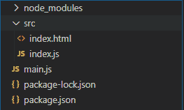
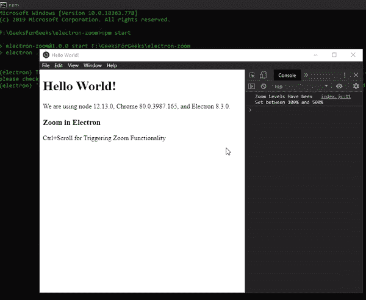

# 电子表格中的缩放功能

> 原文:[https://www . geesforgeks . org/zoom-functional-in-electronijs/](https://www.geeksforgeeks.org/zoom-functionality-in-electronjs/)

[**electronijs**](https://www.geeksforgeeks.org/introduction-to-electronjs/)是一个开源框架，用于使用能够在 Windows、macOS 和 Linux 操作系统上运行的 HTML、CSS 和 JavaScript 等网络技术构建跨平台的本机桌面应用程序。它将铬引擎和[T5 节点 T7】结合成一个单一的运行时。](https://www.geeksforgeeks.org/introduction-to-nodejs/)

所有传统的网络浏览器都内置了缩放功能。用户可以通过滚动鼠标滚轮简单地放大/缩小以分别增加/减小网页内容的大小。默认情况下，电子不会为其**浏览器窗口**实例启用缩放功能。然而，Electron 确实提供了一种方法，通过这种方法，我们可以使用内置的**浏览器窗口**对象和**网站内容**属性的实例方法、事件和属性向页面内容添加缩放功能。 **webContents** 属性为我们提供了特定的 Instance 事件和方法，通过这些事件和方法，我们可以设置网页的默认缩放、网页的最大和最小缩放以及使用鼠标滚动来放大/缩放网页的内容。本教程将演示电子中的缩放功能。

我们假设您熟悉上述链接中介绍的先决条件。电子要工作， [**节点**](https://www.geeksforgeeks.org/introduction-to-nodejs/) 和 [**npm**](https://www.geeksforgeeks.org/node-js-npm-node-package-manager/) 需要预装在系统中。

*   **项目结构:**



**示例:**按照 [**中的步骤在电子表格**](https://www.geeksforgeeks.org/printing-in-electronjs/) 中打印，以设置基本的电子应用程序。复制文章中提供的 **main.js** 文件和**index.html**文件的样板代码。还要对**包. json** 文件进行必要的更改，以启动电子应用程序。我们将继续使用相同的代码库构建我们的应用程序。设置电子应用程序所需的基本步骤保持不变。
**package.json:**

```html
{
  "name": "electron-zoom",
  "version": "1.0.0",
  "description": "Zoom in Electron",
  "main": "main.js",
  "scripts": {
    "start": "electron ."
  },
  "keywords": [
    "electron"
  ],
  "author": "Radhesh Khanna",
  "license": "ISC",
  "dependencies": {
    "electron": "^8.3.0"
  }
}

```

**输出:**此时，我们的基本电子应用程序设置完毕。启动应用程序后，我们应该会看到以下输出:

[](https://media.geeksforgeeks.org/wp-content/uploads/20200512225834/Output-1105.png)

**电子中的缩放功能:****浏览器窗口**实例和**网站内容**属性是**主进程**的一部分。要在**渲染器进程**中导入和使用浏览器窗口，我们将使用电子**远程**模块。

*   **index.html**:在该文件中添加以下片段。

## 超文本标记语言

```html
<h3>Zoom in Electron</h3>
<div>Ctrl+Scroll for Triggering Zoom Functionality</div>
```

*   **index.js** :在该文件中添加以下代码片段。

## java 描述语言

```html
const electron = require("electron");

// Import BrowserWindow using Electron remote
const BrowserWindow = electron.remote.BrowserWindow;
let win = BrowserWindow.getFocusedWindow();

// let win = BrowserWindow.getAllWindows()[0];

// If reduced below Minimum value
// Error - 'zoomFactor' must be a double greater than 0.0
win.webContents.setZoomFactor(1.0);

// Upper Limit is working of 500 %
win.webContents
    .setVisualZoomLevelLimits(1, 5)
    .then(console.log("Zoom Levels Have been Set between 100% and 500%"))
    .catch((err) => console.log(err));

win.webContents.on("zoom-changed", (event, zoomDirection) => {
    console.log(zoomDirection);
    var currentZoom = win.webContents.getZoomFactor();
    console.log("Current Zoom Factor - ", currentZoom);
    // console.log('Current Zoom Level at - '
    // , win.webContents.getZoomLevel());
    console.log("Current Zoom Level at - ", win.webContents.zoomLevel);

    if (zoomDirection === "in") {

        // win.webContents.setZoomFactor(currentZoom + 0.20);
        win.webContents.zoomFactor = currentZoom + 0.2;

        console.log("Zoom Factor Increased to - "
                    , win.webContents.zoomFactor * 100, "%");
    }
    if (zoomDirection === "out") {

        // win.webContents.setZoomFactor(currentZoom - 0.20);
        win.webContents.zoomFactor = currentZoom - 0.2;

        console.log("Zoom Factor Decreased to - "
                    , win.webContents.zoomFactor * 100, "%");
    }
});
```

下面给出了代码中使用的所有实例事件、方法和属性的详细解释:

*   **缩放-已更改:事件****网页内容**属性的此实例事件在用户通过滚动鼠标滚轮请求更改网页的**缩放**级别时发出。在*窗口*上，这是由*Ctrl+滚动*组合键触发的。默认情况下，电子没有启用缩放，需要显式添加此事件才能知道缩放级别的更改是否被触发。此事件返回以下参数。
    *   **事件:**全局事件对象。
    *   **缩放方向:字符串**该参数表示鼠标滚轮上的滚动是向上开始表示放大还是向下开始表示缩小。该参数只能保存两个值，即中的**或**中的**。**
*   **网站内容.设置缩放因子(因子)**这个**网站内容**属性的实例方法将网页的缩放因子更改为指定的因子。这个实例方法决定了网页应该放大还是缩小的因素。缩放因子是缩放百分比除以 **100** 。因此，如果缩放百分比是 **100%** ，则缩放因子–**1.0**。它接受以下参数。在上面的代码中，我们为每一个 **0.2** 发出的**缩放改变的**实例事件增加/减少**缩放因子**，这意味着 **20%** 放大或缩小。
    *   **因子:双倍**双倍缩放因子。默认情况下，该值设置为 **1.0** 。因子值必须始终大于 **0.0** 。如果在缩放操作期间，该值低于 **0.0** ，则会触发一个错误并显示在控制台中，并且不会对网页的缩放进行进一步的更改。
*   **网络内容属性的这个实例方法返回一个表示网页当前缩放因子的**整数**值。返回的值将始终大于 **0.0** 。
    **注**–即使在官方电子文档中没有规定，从**电子 8.3.0** 开始，该方法代表**不推荐使用**。如果使用这种方法，即使它仍然有效，它也会在控制台中显示一条警告消息。我们应该使用 **webContents.zoomFactor** 实例属性来获取和操作网页的缩放因子。代码中已经演示了这一点，并在下面进行了解释。**
*   **网站内容.设置缩放级别(级别)**这个**网站内容**属性的实例方法将网页的缩放级别更改为指定级别。这个实例方法决定了网页应该放大还是缩小到什么级别。根据官方电子文档，原始尺寸为 **0** ，高于或低于的每一个增量分别代表缩放 **20%** 至原始尺寸的默认限制 **300%** 和 **50%** 。其公式为**刻度:= 1.2 ^级**。
    **注意**–该实例方法和**webcontents . setzoomfactor()**实例方法对电子版中网页内容的缩放都执行相同的操作。这些实例方法只是根据分别提供的**因子**和**水平**取不同的值。还有**webcontents . setzoomfactor()**方法更容易管理和控制。在上面的代码中，我们已经显示了每次发出实例事件时的缩放因子和缩放级别。网页的缩放级别也可以是负值。
    **注**–即使在官方电子文档中没有规定，从**电子 8.3.0** 开始，该方法代表**不推荐使用**。如果使用这种方法，即使它仍然有效，它也会在控制台中显示一条警告消息。我们应该使用**网页内容缩放级别**实例属性来获取和操作网页的缩放级别。
*   **网络内容属性的这个实例方法返回一个表示网页当前缩放级别的**整数**值。返回值也可以是负值。
    **注**–即使官方电子文档中没有规定，从**电子 8.3.0** 开始，该方法仍然适用**弃用**。如果使用这种方法，即使它仍然有效，它也会在控制台中显示一条警告消息。我们应该使用**网页内容缩放级别**实例属性来获取和操作网页的缩放级别。**
*   **win . webContents . setvisualzoomlevelmits(最小，最大)**这个 **webContents** 属性的实例方法设置缩放级别的最小和最大限制。如上所述，默认情况下，电子版禁用缩放功能。为了启用它，使用了这个实例方法。它返回一个**承诺**，当网页的最小和最大缩放设置成功时，它被解析。它接受以下参数。
    *   **最小值:整数**设置网页允许的最小缩放。该值是缩放百分比除以 **100** 。因此缩放百分比–**100%**转换为在该参数中设置的 **1** 。
    *   **最大值:整数**设置网页允许的最大缩放。该值是缩放百分比除以 **100** 。因此缩放百分比–**500%**转换为在该参数中设置的 **5** 。
*   **网络内容.缩放因子**这个**网络内容**属性的实例属性将网页的缩放因子更改为指定的因子。这个实例属性决定了网页应该放大还是缩小的因素。缩放因子是缩放百分比除以 **100** 。在上面的代码中，我们为每一个由 **0.2** 发出的**缩放改变的**实例事件增加/减少**缩放因子**，这意味着 **20%** 放大或缩小。
*   **网络内容.缩放级别**这个**网络内容**属性的实例属性将网页的缩放级别更改为指定的级别。此实例属性决定了网页应该放大还是缩小到什么级别。根据官方电子文档，原始尺寸为 **0** ，高于或低于的每一个增量分别代表缩放 **20%** 至原始尺寸的默认限制 **300%** 和 **50%** 。其公式为**刻度:= 1.2 ^级**。

要在**渲染器进程**中获取当前**浏览器窗口**实例，我们可以使用**浏览器窗口**对象提供的一些*静态*方法。

*   **BrowserWindow . getallwindow():**此方法返回一个活动/打开的 BrowserWindow 实例数组。在这个应用程序中，我们只有一个活动的**浏览器窗口**实例，它可以直接从数组中引用，如代码所示。
*   **浏览器窗口. getFocusedWindow():** 此方法返回在应用程序中聚焦的**浏览器窗口**实例。如果没有找到当前浏览器窗口实例，则返回**空值**。在这个应用程序中，我们只有一个活动的**浏览器窗口**实例，可以使用这个方法直接引用它，如代码所示。

在这一点上，我们应该能够成功地放大和缩小电子中**浏览器窗口**的内容。
T3】输出:

[](https://media.geeksforgeeks.org/wp-content/uploads/20200614135158/Output-1-GIF8.gif)